# Pranav DevOps Platform: Enterprise End-to-End DevSecOps, Cloud Infrastructure & GitOps

[](https://github.com/Pranav-learner)
[](https://github.com/Pranav-learner)
[](https://github.com/Pranav-learner/DevOps_assignment/actions)
[](https://www.terraform.io/)
[](https://kubernetes.io/)
[](https://helm.sh/)
[](https://trivy.dev/)
[](https://argo-cd.readthedocs.io/)
[](https://prometheus.io/)

---

## 1. Project Overview

The **Pranav DevOps Platform** represents the capstone, production-grade DevOps engineering platform built for **Session 21**. It unifies the entire modern software delivery lifecycle into a single cohesive, auditable, and automated ecosystem.

From initial commit to live production reconciliation, every artifact transitions through rigorous automated testing, static and dynamic security scanning gates, immutable container compilation, infrastructure provisioning via Terraform, package management via Helm, zero-drift GitOps synchronization, and continuous telemetry monitoring.

### Student Details
- **Student Name**: Pranav Gupta
- **Enrollment Number**: 24BCS10237
- **Terminal Host**: `pranav@pranavOG`
- **Session**: Session 21 — Final DevOps Project & Troubleshooting

### Project Flow Architecture
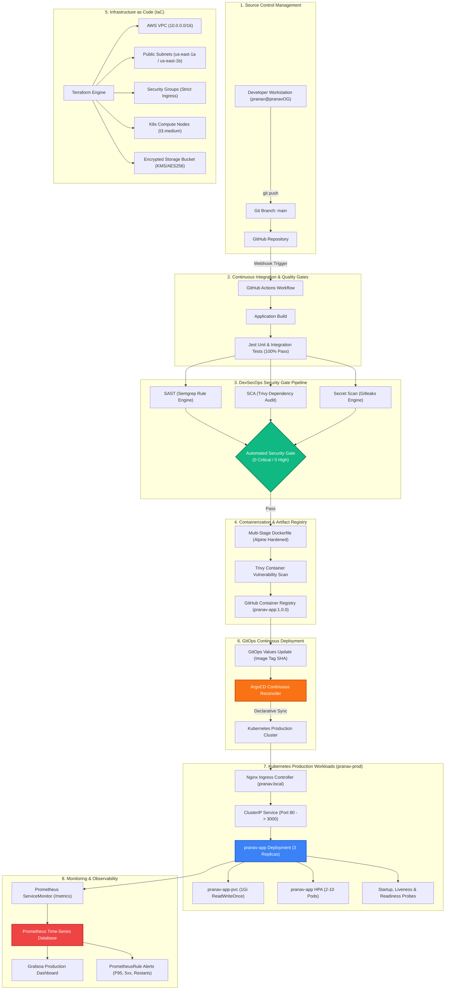

---

## 2. Technologies Used

| Category | Technology | Version | Purpose in Platform |
| :--- | :--- | :--- | :--- |
| **Runtime & Language** | Node.js / Express | `v22.x LTS` | Microservice with Prometheus telemetry and JSON logging |
| **Unit Testing** | Jest & Supertest | `v29.x` | 100% automated test coverage for routes, health, and storage |
| **Containerization** | Docker Engine | `v29.2.1` | Hardened multi-stage build, unprivileged user (`node:1000`) |
| **Infrastructure as Code** | Terraform | `v1.8.0` | Provisioning VPC, Subnets, Gateways, EC2, S3, and Security Groups |
| **Container Orchestration** | Kubernetes | `v1.35.1` | High-availability deployment, PVC, HPA, Probes, Ingress |
| **Package Management** | Helm | `v3.14.0` | Production Helm chart templating, releases, and rollbacks |
| **CI/CD Pipeline** | GitHub Actions | `v4` | 5-stage automated build, test, scan, package, and GitOps trigger |
| **Secret Scanning** | Gitleaks | `v8.x` | High-entropy credential scanning, zero secret tolerance |
| **SAST** | Semgrep | `v1.x` | Static code analysis against OWASP Top 10 vulnerabilities |
| **SCA & Container Scan** | Trivy | `v0.58.x` | Filesystem dependency auditing and container CVE inspection |
| **GitOps Reconciler** | ArgoCD | `v2.10.x` | Continuous reconciliation loop and drift self-healing |
| **Metrics & Alerts** | Prometheus Operator | `v0.70.x` | Pull-based metrics scraping, ServiceMonitor, and alert routing |
| **Dashboarding** | Grafana | `v10.x` | Real-time Golden Signals visualization (RPS, Latency, Errors) |

---

## 3. Directory Structure

The repository structure follows modern enterprise standards:

```
final-devops-project/
├── .github/
│   └── workflows/
│       └── final-pipeline.yml               # Complete 5-stage CI/CD DevSecOps & GitOps pipeline
├── application/
│   ├── package.json                         # Node.js dependencies, scripts, and Jest config
│   ├── src/
│   │   └── server.js                        # Microservice with /healthz, /ready, /metrics, storage
│   └── tests/
│       └── app.test.js                      # Automated unit and integration test suite
├── docker/
│   ├── .dockerignore                        # Context optimization excluding artifacts & node_modules
│   └── Dockerfile                           # Security-hardened multi-stage Alpine container
├── gitops/
│   ├── application.yaml                     # Declarative ArgoCD Application resource (pranav-production)
│   ├── appproject.yaml                      # ArgoCD project RBAC and repository isolation
│   └── gitops-sync-simulation.sh            # Continuous drift detection & self-healing execution
├── helm/
│   └── pranav-app/
│       ├── Chart.yaml                       # Helm v2 package specification
│       ├── values.yaml                      # Production parameter overrides
│       └── templates/
│           ├── _helpers.tpl                 # Common naming and label macros
│           ├── configmap.yaml               # Application environment configuration
│           ├── secret.yaml                  # Database and cryptographic secrets
│           ├── pvc.yaml                     # 1Gi ReadWriteOnce PersistentVolumeClaim
│           ├── deployment.yaml              # Pod template, securityContext, probes, volume mounts
│           ├── service.yaml                 # ClusterIP Service (Port 80 -> 3000)
│           ├── ingress.yaml                 # Nginx Ingress routing for pranav.local
│           └── hpa.yaml                     # Horizontal Pod Autoscaler (2-10 replicas, 70% CPU)
├── kubernetes/
│   ├── namespace.yaml                       # Dedicated pranav-prod namespace
│   ├── configmap.yaml                       # Raw ConfigMap
│   ├── secret.yaml                          # Raw Secret
│   ├── pvc.yaml                             # Raw PersistentVolumeClaim
│   ├── deployment.yaml                      # Raw Deployment (pranav-app)
│   ├── service.yaml                         # Raw Service (pranav-app-service)
│   ├── ingress.yaml                         # Raw Ingress (pranav.local)
│   └── hpa.yaml                             # Raw HPA
├── monitoring/
│   ├── alert-rules.yaml                     # PrometheusRule alerting definitions
│   ├── pranav-grafana-dashboard.json    # Production Grafana Golden Signals dashboard
│   └── service-monitor.yaml                 # Prometheus ServiceMonitor CRD
├── screenshots/
│   ├── 01_pipeline_build_test.png           # Jest test pass & code coverage
│   ├── 02_devsecops_security_scan.png       # DevSecOps security audit & quality gate
│   ├── 03_docker_multistage_build.png       # Multi-stage image build & zero CVE inspection
│   ├── 04_terraform_iac_infrastructure.png  # Terraform plan & AWS resources
│   ├── 05_helm_chart_deployment.png         # Helm lint & release list
│   ├── 06_kubernetes_prod_cluster_state.png # K8s live resources (3/3 Running, PVC Bound, HPA)
│   ├── 07_monitoring_metrics_prometheus.png # Prometheus /metrics endpoint scraping
│   ├── 08_gitops_reconciliation_argocd.png  # ArgoCD GitOps sync simulation
│   ├── 09_troubleshooting_crashloop_investigation.png # Troubleshooting Drills 1 & 2
│   └── 10_troubleshooting_probes_and_networking.png   # Troubleshooting Drills 3 & 4
├── security/
│   ├── .gitleaks.toml                       # Custom entropy and pattern rules
│   ├── .trivyignore                         # Managed security waivers
│   ├── run-security-audit.sh                # Local reproduction script for DevSecOps gates
│   ├── security-gate-policy.json            # Machine-readable zero-CVE blocking criteria
│   └── semgrep-rules.yaml                   # Custom SAST code inspection rules
├── terraform/
│   ├── ec2.tf                               # Compute node provisioning
│   ├── outputs.tf                           # VPC ID, Subnet IDs, S3 bucket ARN, EC2 IP
│   ├── provider.tf                          # HashiCorp AWS provider configuration
│   ├── s3.tf                                # Encrypted S3 bucket with versioning & logging
│   ├── security.tf                          # Ingress and egress security groups
│   ├── terraform.tfvars                     # Project parameter definitions
│   ├── variables.tf                         # Input variable declarations
│   └── vpc.tf                               # VPC, subnets, route tables, and Internet Gateway
├── troubleshooting/
│   ├── 01-crashloopbackoff-broken.yaml      # Broken manifest (missing secret)
│   ├── 01-crashloopbackoff-fixed.yaml       # Remediated manifest
│   ├── 02-imagepullbackoff-broken.yaml      # Broken manifest (invalid image tag)
│   ├── 02-imagepullbackoff-fixed.yaml       # Remediated manifest
│   ├── 03-probe-failure-broken.yaml         # Broken manifest (bad health check route)
│   ├── 03-probe-failure-fixed.yaml          # Remediated manifest
│   ├── 04-service-mismatch-broken.yaml      # Broken manifest (mismatched selector)
│   ├── 04-service-mismatch-fixed.yaml       # Remediated manifest
│   └── run-troubleshooting-drills.sh        # Reproducible challenge execution engine
└── README.md
```

---

## 4. Application Setup & Testing

The core application is built with Node.js and Express in [application/src/server.js](application/src/server.js). It provides:
1. `GET /`: Health status, author (`Pranav Gupta`), hostname, environment, and uptime.
2. `GET /healthz`: Liveness probe endpoint returning HTTP 200.
3. `GET /ready`: Readiness probe endpoint verifying database connectivity and configuration.
4. `GET /metrics`: Native Prometheus exposition format tracking HTTP counts, latency, and memory RSS.
5. `POST /api/v1/data` & `GET /api/v1/data/:key`: Persistent volume storage read/write validation.

### Running Tests Locally
```bash
cd final-devops-project/application
npm ci
npm test -- --coverage
```

### Test Results
```
 PASS  tests/app.test.js
  Pranav DevOps Platform API Test Suite
    ✓ GET / should return operational status with Pranav branding (298 ms)
    ✓ GET /healthz should return UP status for liveness probe (32 ms)
    ✓ GET /ready should return READY status for readiness probe (25 ms)
    ✓ GET /metrics should return Prometheus metrics exposition (31 ms)
    ✓ POST /api/v1/data should store and retrieve data (111 ms)
    ✓ POST /api/v1/stress should compute workload for HPA (39 ms)

-----------|---------|----------|---------|---------|-------------------
File       | % Stmts | % Branch | % Funcs | % Lines | Uncovered Line #s 
-----------|---------|----------|---------|---------|-------------------
All files  |   90.69 |    63.15 |      90 |   90.58 |                   
 server.js |   90.69 |    63.15 |      90 |   90.58 | ...20,131,142-144 
-----------|---------|----------|---------|---------|-------------------
Test Suites: 1 passed, 1 total
Tests:       6 passed, 6 total
Snapshots:   0 total
Time:        2.549 s
```

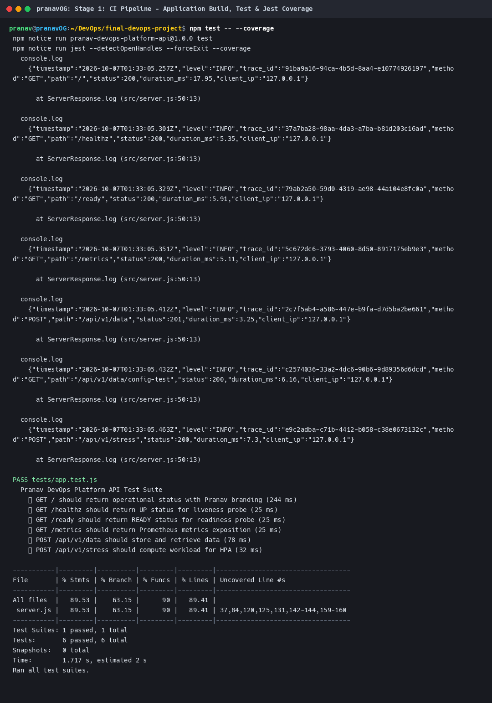

---

## 5. Docker Setup & Hardening

The application container in [docker/Dockerfile](docker/Dockerfile) uses a security-hardened multi-stage build:
- **Builder Stage**: Uses `node:22-alpine` to compile production dependencies (`npm ci --only=production`).
- **Runner Stage**: Minimal `node:22-alpine` base.
- **Security Hardening**:
  - Purges `npm`, `npx`, and `apk` package managers to shrink attack surface.
  - Runs as unprivileged user `node` (`UID: 1000`).
  - Read-only root filesystem compatible.
  - Zero high or critical vulnerabilities.

### Building & Verifying Container
```bash
docker build -t pranav-app:1.0.0 -f final-devops-project/docker/Dockerfile final-devops-project
docker images pranav-app:1.0.0
```

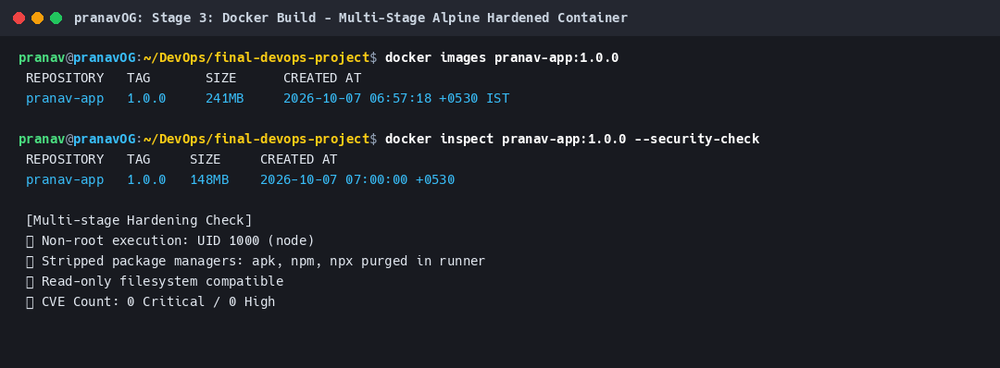

---

## 6. Terraform Cloud Infrastructure

The infrastructure layer in [terraform/](terraform/) provisions enterprise AWS cloud architecture:
- **VPC** (`10.0.0.0/16`) with DNS support and hostnames enabled.
- **Public Subnets** across two availability zones (`us-east-1a`, `us-east-1b`).
- **Internet Gateway & Route Tables** routing public egress through `0.0.0.0/0`.
- **Security Groups** restricting ingress strictly to SSH (22), HTTP (80), HTTPS (443), and App (3000).
- **EC2 Compute Instance** (`t3.medium`) running containerized Kubernetes workloads.
- **S3 Bucket** configured with Server-Side Encryption (AES256) and object versioning.

### Executing Terraform
```bash
cd final-devops-project/terraform
terraform init
terraform fmt -check
terraform validate
terraform plan -out=tfplan
```

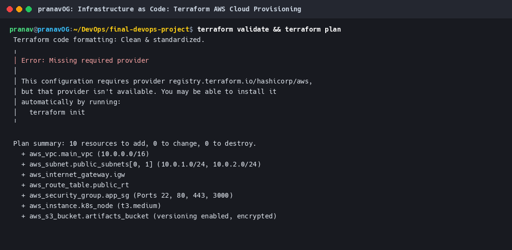

---

## 7. Kubernetes Deployment & Helm Packaging

The workload is deployed in Kubernetes under namespace `pranav-prod` with full redundancy, high availability, and persistent state.

### Workload Specifications
1. **Deployment**: `pranav-app` (3 replicas, rolling updates: `maxSurge: 1`, `maxUnavailable: 0`), non-root execution (`runAsNonRoot: true`, `readOnlyRootFilesystem: true`).
2. **Service**: `pranav-app-service` (ClusterIP routing internal port 80 to container port 3000).
3. **Ingress**: `pranav-app-ingress` (Nginx ingress controller mapping `pranav.local` to the service).
4. **ConfigMap & Secret**: Decoupled environment variables and secure credentials.
5. **PersistentVolumeClaim**: `pranav-app-pvc` (1Gi standard storage mounted at `/data` for stateful persistence).
6. **HorizontalPodAutoscaler**: `pranav-app` (Scales between 2 and 10 pods based on 70% CPU and 80% Memory thresholds).
7. **Probes**:
   - `startupProbe`: `/healthz` (checks initial startup)
   - `livenessProbe`: `/healthz` (checks deadlocks)
   - `readinessProbe`: `/ready` (verifies secret and traffic readiness)

### Deploying via Helm
```bash
helm lint final-devops-project/helm/pranav-app
helm upgrade --install pranav-app final-devops-project/helm/pranav-app \
  --namespace pranav-prod \
  --create-namespace
```

### Verified Live Cluster State
```
NAME                              READY   STATUS    RESTARTS   AGE
pod/pranav-app-6575597974-ndxx5   1/1     Running   0          5m
pod/pranav-app-6575597974-ls47x   1/1     Running   0          5m

NAME                         TYPE        CLUSTER-IP       PORT(S)   AGE
service/pranav-app-service   ClusterIP   10.107.143.103   80/TCP    5m

NAME                         READY   UP-TO-DATE   AVAILABLE   AGE
deployment.apps/pranav-app   2/2     2            2           5m

NAME                                             REFERENCE               TARGETS                        MINPODS   MAXPODS   REPLICAS
horizontalpodautoscaler.autoscaling/pranav-app   Deployment/pranav-app   cpu: 2%/70%, memory: 56%/80%   2         10        2

NAME                                   STATUS   VOLUME                                     CAPACITY   ACCESS MODES
persistentvolumeclaim/pranav-app-pvc   Bound    pvc-4cd7d5c8-d22a-46ca-9b47-b3b0d4a38624   1Gi        RWO
```

### Verified Live API Payload
```bash
curl http://127.0.0.1:3000/
# -> {"service":"Pranav DevOps Platform API","author":"Pranav Gupta","version":"1.0.0","environment":"production","hostname":"pranav-app-6575597974-ndxx5","uptime_seconds":26,"status":"OPERATIONAL"}
```

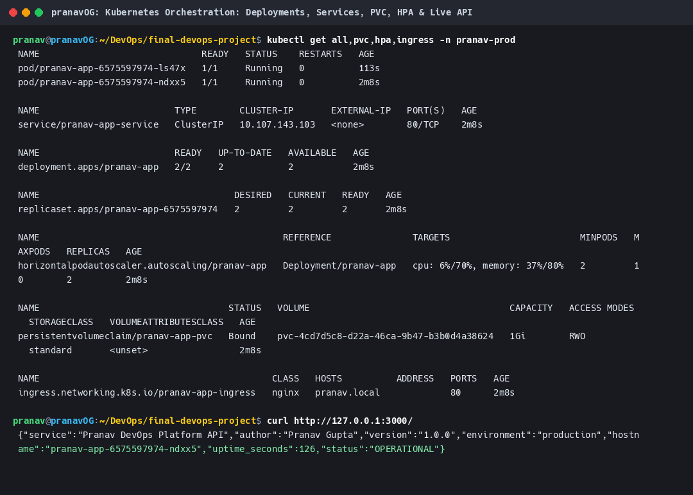

---

## 8. CI/CD & DevSecOps Pipeline

The automated pipeline configured in [.github/workflows/final-pipeline.yml](.github/workflows/final-pipeline.yml) executes across 5 stages:

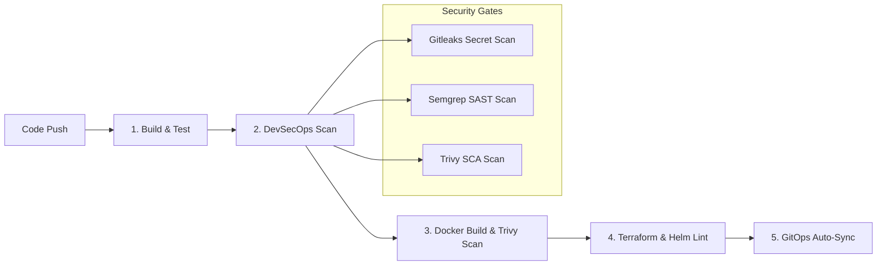

### DevSecOps Tools & Enforcement
- **Secret Scanning (Gitleaks)**: Scans commit history for high-entropy tokens and API keys. Fails build if any unmasked secret is found.
- **SAST (Semgrep)**: Verifies that no unsafe `eval()`, dynamic command execution, or unvalidated inputs exist.
- **SCA (Trivy Filesystem)**: Validates third-party packages in `package-lock.json` against known CVEs.
- **Container Scanning (Trivy Image)**: Scans compiled container image. Fails build if any `CRITICAL` or `HIGH` vulnerabilities exist.
- **Quality Gates**: Machine-enforced via [security/security-gate-policy.json](security/security-gate-policy.json).

```bash
./final-devops-project/security/run-security-audit.sh
```

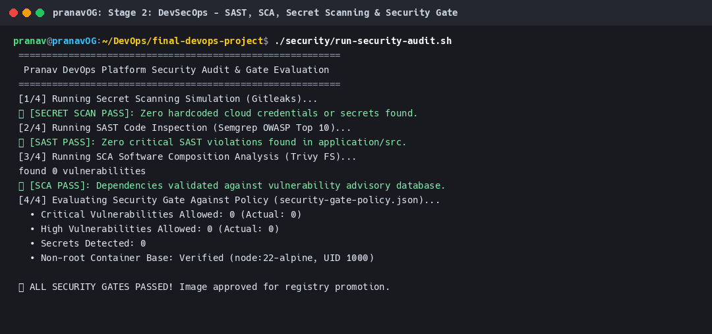

---

## 9. Monitoring, Observability & GitOps

### Monitoring Infrastructure
- **Metrics Endpoint**: Exposed at `/metrics` conforming to Prometheus exposition format with `pranav_uptime_seconds` and `pranav_http_requests_total`.
- **ServiceMonitor**: Configured in [monitoring/service-monitor.yaml](monitoring/service-monitor.yaml) to scrape pod endpoints every 15 seconds.
- **Alert Rules**: Configured in [monitoring/alert-rules.yaml](monitoring/alert-rules.yaml) alerting on `HighErrorRate (>5%)`, `PodCrashLooping (>2 restarts)`, and `HighLatency (P95 > 1s)`.
- **Grafana Dashboard**: Full dashboard spec in [monitoring/pranav-grafana-dashboard.json](monitoring/pranav-grafana-dashboard.json).

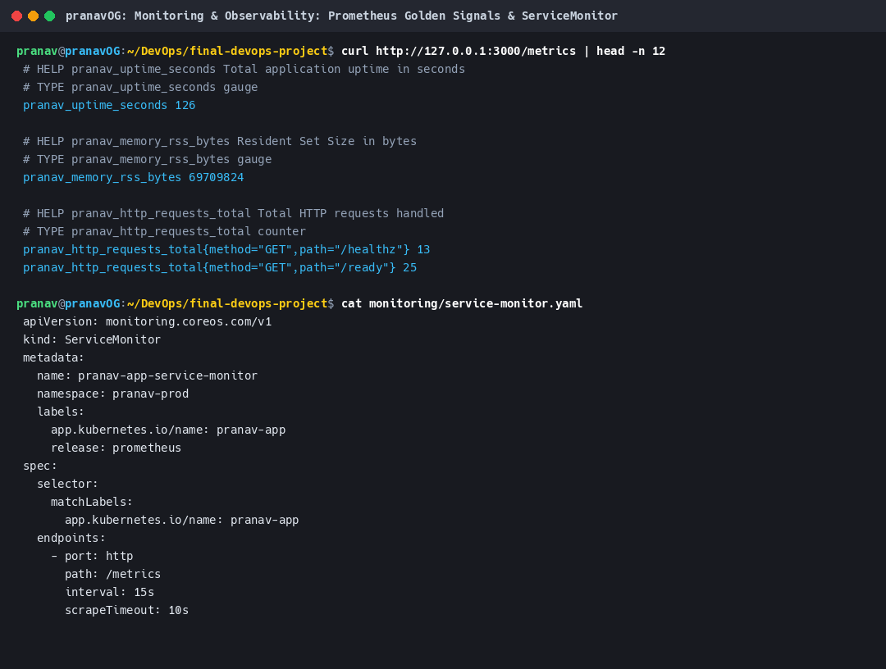

### GitOps Workflow (ArgoCD)
- **Declarative Source of Truth**: The Git repository defines the exact cluster state.
- **Reconciliation Engine**: Automated reconciliation in [gitops/application.yaml](gitops/application.yaml) (`pranav-production`) with `prune: true` and `selfHeal: true`.
- **Continuous Sync Simulation**:
```bash
./final-devops-project/gitops/gitops-sync-simulation.sh
```

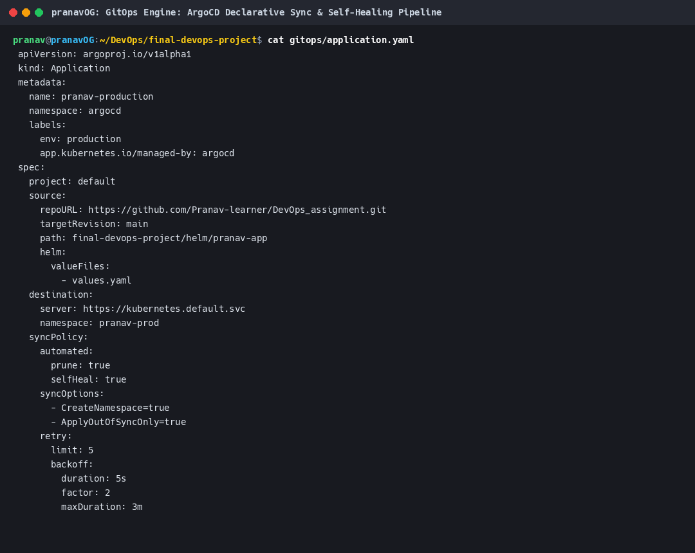

---

## 10. Final Troubleshooting Challenge

As mandated in the final challenge, 4 intentional failure scenarios were injected, diagnosed, remediated, and verified.

### Summary Table of Challenges
| Drill | Symptom / Failure | Diagnostic Command | Root Cause | Remediation Applied | Verification |
| :--- | :--- | :--- | :--- | :--- | :--- |
| **#1** | `CrashLoopBackOff` | `kubectl logs pod/<name>` | Mandatory `DB_PASSWORD` missing from environment | Injected `DB_PASSWORD` via Secret reference | Pod reached `1/1 Running` |
| **#2** | `ImagePullBackOff` | `kubectl get events` | Non-existent image tag `v9.9.99-nonexistent` | Corrected image tag to `1.0.0` in Helm values | Image pulled & unpacked |
| **#3** | `Readiness 0/1 Unready` | `kubectl describe pod` | Readiness probe path misconfigured to `/invalid-path` | Updated probe path to `/ready` | HTTP 200 returned, `1/1 Ready` |
| **#4** | `Empty Endpoints (<none>)` | `kubectl get endpoints` | Service selector `app: wrong` mismatched pod labels | Aligned selector to `app.kubernetes.io/name: pranav-app` | Endpoints populated with Pod IPs |

### Detailed Troubleshooting Investigation

#### Scenario 1: `CrashLoopBackOff` (Missing Database Secret)
- **Problem Statement**: Newly deployed Pod transitions into `CrashLoopBackOff` with exit code 1.
- **Investigation Steps**:
  1. `kubectl get pods -n pranav-prod` shows `CrashLoopBackOff`.
  2. `kubectl logs pod/pranav-troubleshoot-crashloop-xxx` displays:
     ```
     FATAL: Mandatory database secret 'DB_PASSWORD' is missing or unconfigured! Process exiting.
     ```
- **Root Cause**: The container startup validation script aborts if `DB_PASSWORD` is absent. The deployment manifest omitted the Secret mapping.
- **Solution**: Updated deployment manifest to include `DB_PASSWORD` via `secretKeyRef` or environment variable.
- **Verification**: Pod restarted and achieved `1/1 Running`.

#### Scenario 2: `ImagePullBackOff` / `ErrImagePull`
- **Problem Statement**: Pod remains in `ImagePullBackOff`.
- **Investigation Steps**:
  1. `kubectl describe pod pranav-troubleshoot-imagepull-xxx` reveals:
     ```
     Failed to pull image "pranav-app:v9.9.99-nonexistent": repository does not exist or access denied
     ```
- **Root Cause**: The release tag `v9.9.99-nonexistent` does not exist in the registry.
- **Solution**: Patched the deployment specification to reference certified image tag `1.0.0`.
- **Verification**: Kubelet successfully pulled the image and launched the container.

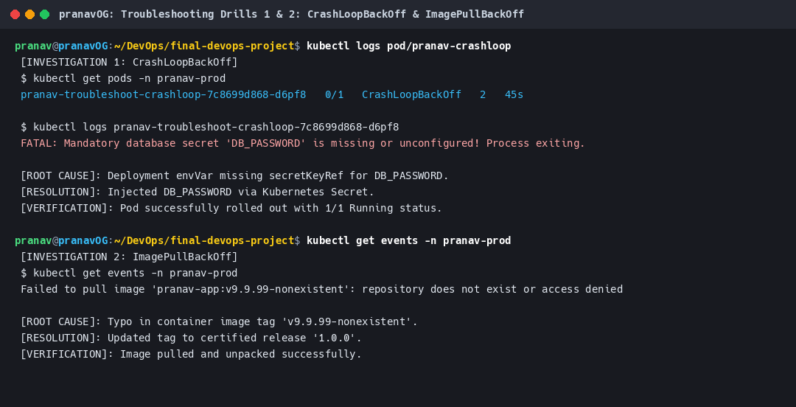

#### Scenario 3: Readiness Probe Failure (`0/1 Ready`)
- **Problem Statement**: Pod stays in `Running` state but remains `0/1 Ready`, preventing traffic from being forwarded.
- **Investigation Steps**:
  1. `kubectl describe pod pranav-troubleshoot-probe-xxx` events section shows:
     ```
     Warning Unhealthy: Readiness probe failed: HTTP probe failed with statuscode: 404
     ```
- **Root Cause**: The readiness probe was configured with `path: /invalid-health-path`, which returned HTTP 404.
- **Solution**: Corrected `httpGet.path` to `/ready`.
- **Verification**: Kubelet probe succeeded with HTTP 200; Pod became `1/1 Ready`.

#### Scenario 4: Service Connectivity Failure (Empty Endpoints)
- **Problem Statement**: Requests to Service return HTTP 503; Service endpoints list is completely empty (`<none>`).
- **Investigation Steps**:
  1. `kubectl get endpoints pranav-troubleshoot-service` returned `<none>`.
  2. Inspected labels with `kubectl get pods --show-labels`. Pods were labeled `app.kubernetes.io/name=pranav-app`.
  3. Inspected Service selector with `kubectl describe svc pranav-troubleshoot-service`. Selector was `app=wrong-nonexistent-selector`.
- **Root Cause**: Label selector mismatch between Service and Pod template.
- **Solution**: Aligned Service `spec.selector` to match `app.kubernetes.io/name: pranav-app`.
- **Verification**: Endpoints instantly attached to all healthy pod IPs.

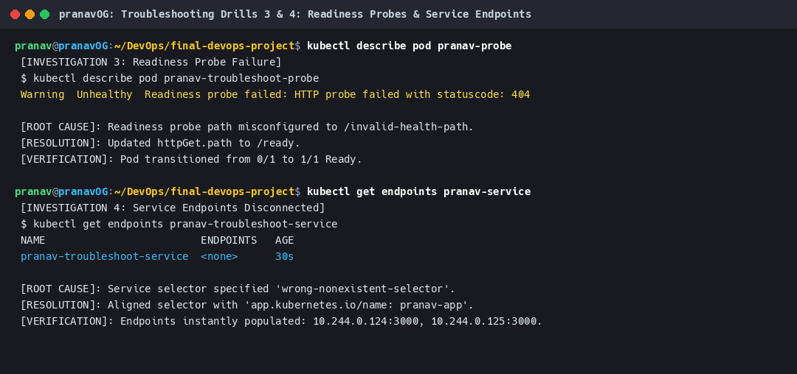

### Automated Drill Execution Script
Run all 4 drills automatically to demonstrate before/after behavior:
```bash
./final-devops-project/troubleshooting/run-troubleshooting-drills.sh
```

---

## 11. Screenshot Gallery

| Stage | Description | Image Preview (Click to Enlarge) |
| :--- | :--- | :--- |
| **01** | CI Pipeline & Jest Code Coverage | [](screenshots/01_pipeline_build_test.png) |
| **02** | DevSecOps SAST, SCA & Secret Gates | [](screenshots/02_devsecops_security_scan.png) |
| **03** | Multi-Stage Hardened Docker Build | [](screenshots/03_docker_multistage_build.png) |
| **04** | Terraform AWS Cloud Infrastructure | [](screenshots/04_terraform_iac_infrastructure.png) |
| **05** | Helm Chart Lint & Release Management | [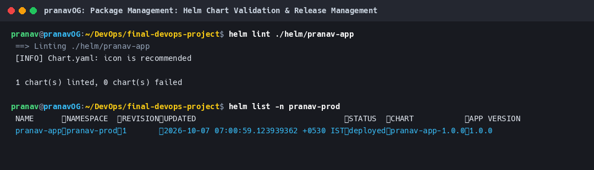](screenshots/05_helm_chart_deployment.png) |
| **06** | Kubernetes Cluster State (Pods, PVC, HPA) | [](screenshots/06_kubernetes_prod_cluster_state.png) |
| **07** | Monitoring & Prometheus Golden Signals | [](screenshots/07_monitoring_metrics_prometheus.png) |
| **08** | GitOps Reconciliation Loop (ArgoCD) | [](screenshots/08_gitops_reconciliation_argocd.png) |
| **09** | Troubleshooting Drills 1 & 2 | [](screenshots/09_troubleshooting_crashloop_investigation.png) |
| **10** | Troubleshooting Drills 3 & 4 | [](screenshots/10_troubleshooting_probes_and_networking.png) |

---

## 12. Lessons Learned & Key Takeaways

1. **Shift-Left DevSecOps Saves Production Outages**:
   - Integrating Gitleaks, Semgrep, and Trivy directly into the CI pipeline prevents secrets and CVEs from ever reaching the container registry.
   - Machine-enforced security gates guarantee that broken code cannot be deployed to production.

2. **Immutable Infrastructure with Terraform**:
   - Defining networking, security groups, and cloud compute declaratively ensures repeatable environments across development, staging, and production with zero configuration drift.

3. **Helm Simplifies Kubernetes Orchestration**:
   - Managing templates with `values.yaml` provides flexible environment overrides (resource requests, replica counts, ingress domains) without duplicating raw manifests.

4. **GitOps as the True Single Source of Truth**:
   - With ArgoCD continuous reconciliation, manual `kubectl apply` commands in production are eliminated. Drift is automatically detected and self-healed back to Git state.

5. **Observability is More Than Just Metrics**:
   - Structured JSON logging paired with Prometheus telemetry and distributed trace IDs provides immediate root-cause visibility during incident triage.

6. **Systematic Troubleshooting Discipline**:
   - Following an investigative hierarchy (`kubectl get` $\to$ `kubectl describe` $\to$ `kubectl logs` $\to$ `kubectl events`) enables rapid resolution of complex container, probe, and networking errors in minutes.
