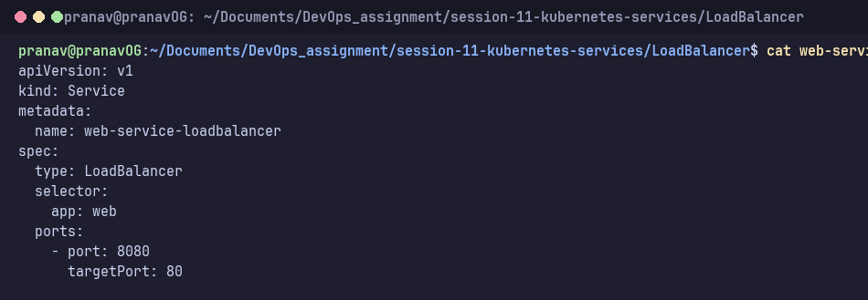
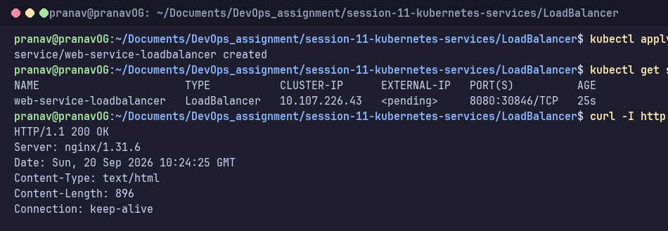
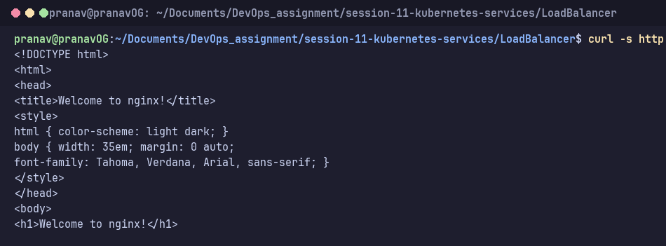

# LoadBalancer Service

**LoadBalancer** asks the cloud provider for an external load balancer with a public IP. It builds on NodePort and ClusterIP (it also got node port `30687`).

Manifest: [`web-service-loadbalancer.yaml`](web-service-loadbalancer.yaml). It maps port `8080` to container port `80`.



```bash
kubectl apply -f web-service-loadbalancer.yaml
kubectl get svc web-service-loadbalancer -o wide
curl -I http://192.168.49.2:30846
```

**Result:** Minikube has no cloud provider, so `EXTERNAL-IP` stays `<pending>` unless `minikube tunnel` is running. That is expected in local development clusters. The underlying NodePort (e.g., `30846`) and ClusterIP are active, returning `HTTP/1.1 200 OK` and serving the Nginx welcome page. Alternatively, `minikube service web-service-loadbalancer --url` can be used.



