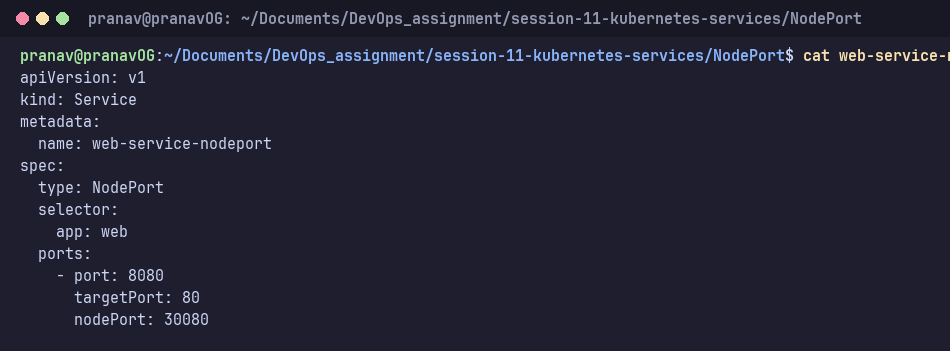
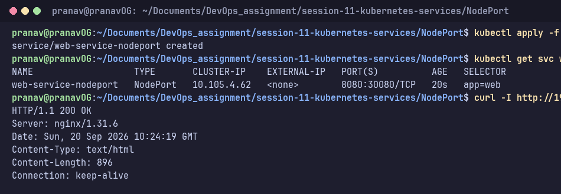
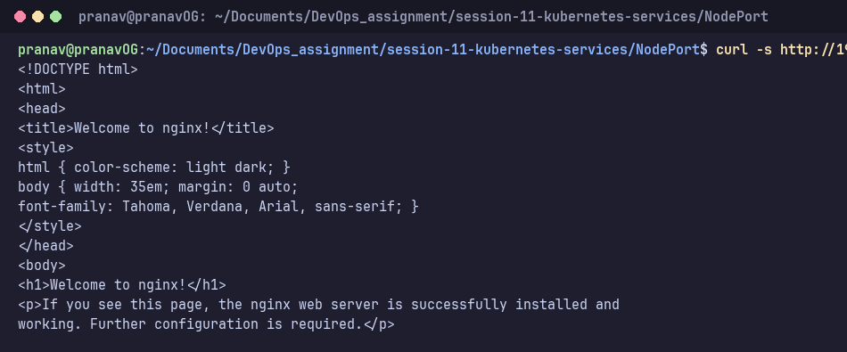

# NodePort Service

**NodePort** opens a fixed port (30000–32767) on every node, so the app can be reached from **outside** the cluster at `<NodeIP>:<nodePort>`. It also gets a ClusterIP.

Manifest: [`web-service-nodeport.yaml`](web-service-nodeport.yaml). It maps port `8080` to container port `80`, with node port `30080`.



```bash
kubectl apply -f web-service-nodeport.yaml
kubectl get svc web-service-nodeport -o wide
curl -I http://192.168.49.2:30080
```

**Result:** `PORT(S)` shows `8080:30080/TCP`. On Linux, the Minikube node IP `192.168.49.2:30080` is directly reachable over the Docker bridge network, returning `HTTP/1.1 200 OK` and serving the Nginx welcome page. Alternatively, `minikube service web-service-nodeport --url` can be used to open a local port forward.



