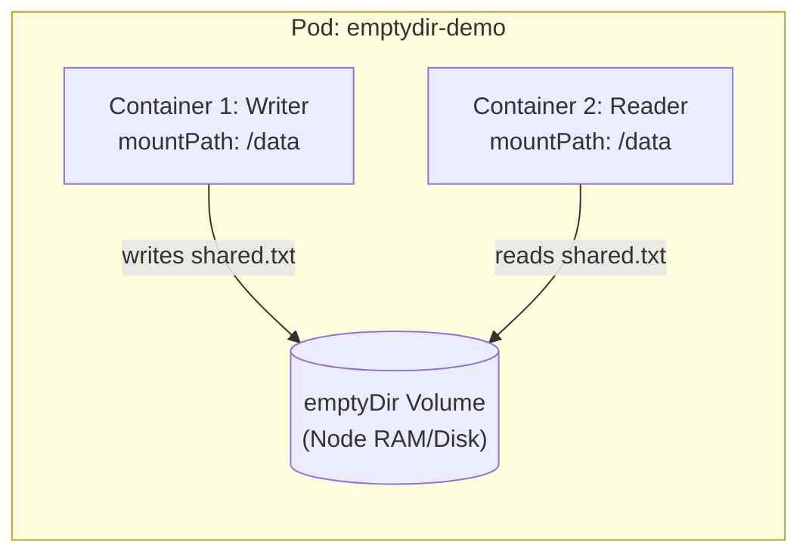
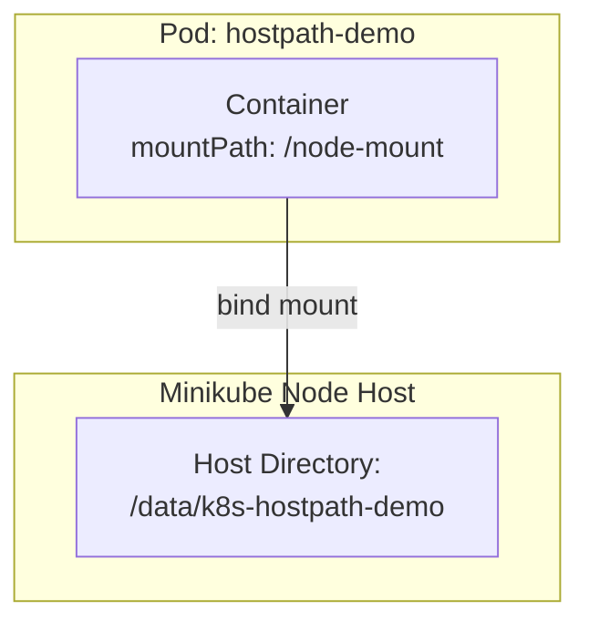
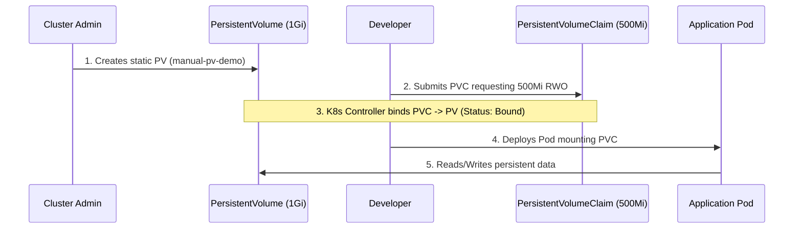
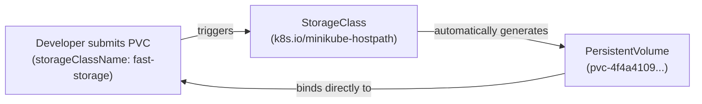
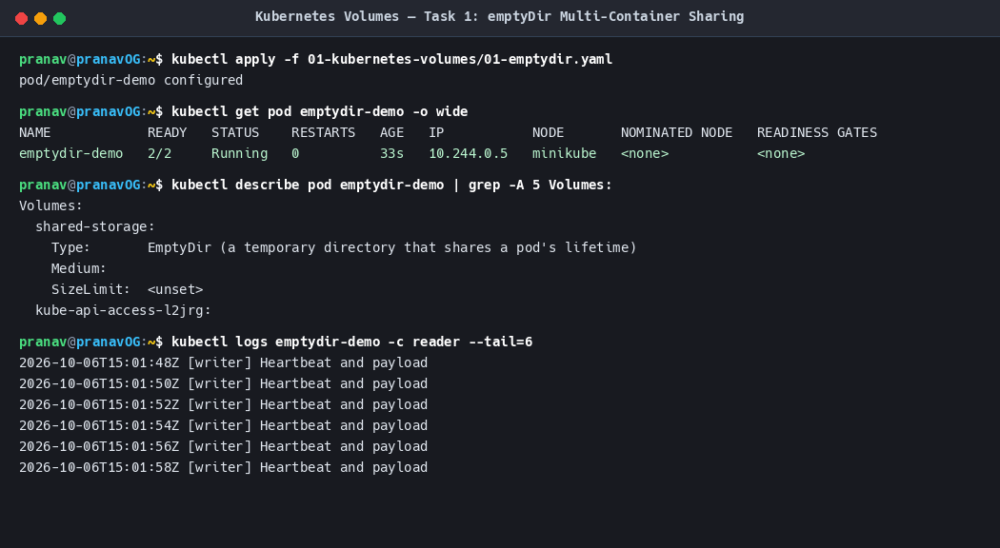
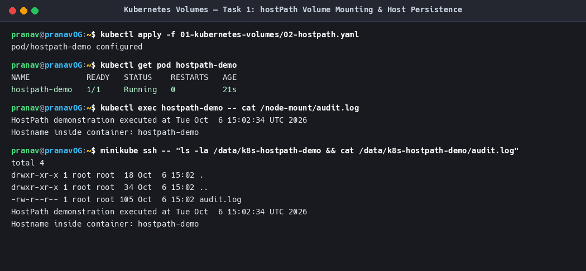
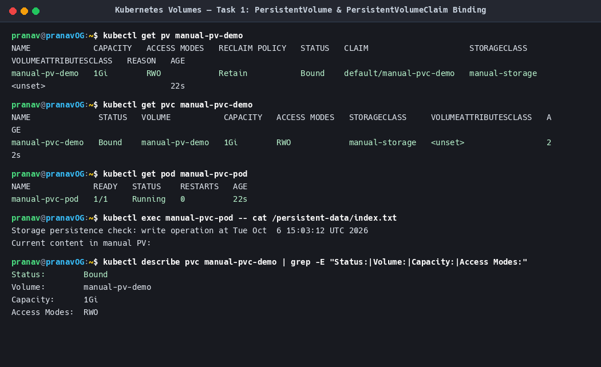
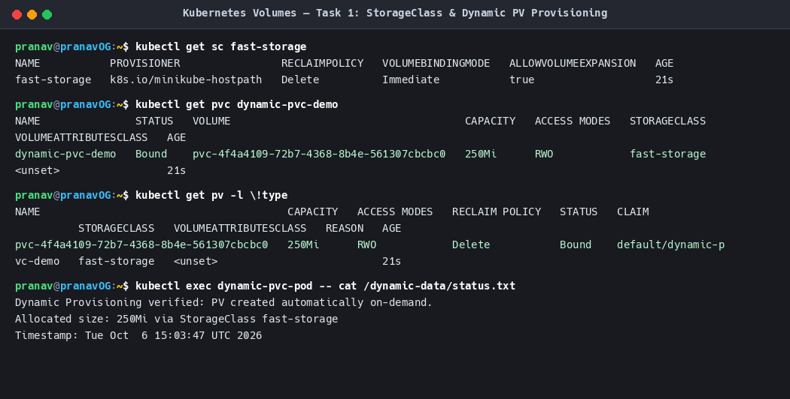

# Kubernetes Volumes — Storage Architecture & Mechanisms

**Author:** Pranav Gupta  
**Enrollment number:** 24BCS10237  
**Course:** SST DevOps & Cloud  
**Session:** 13 — Kubernetes Storage, HPA & Probes  
**Task:** 1 — Kubernetes Volumes  

---

## 1. Overview & Problem Statement

Containers inside Kubernetes Pods are inherently **ephemeral**. When a container crashes or is restarted by the `kubelet`, any file written inside the container layer is lost because the container runtime recreates the container from its pristine image layer. Furthermore, if multiple containers run inside the same Pod, they cannot share files across their local container filesystems by default.

Kubernetes addresses these limitations using **Volumes**. An abstraction that represents a directory accessible to containers in a Pod, backed by a specified storage medium.

---

## 2. Key Volume Concepts & Architectures

| Storage Type | Scope | Lifecycle | Best For | Persistent Across Pod Deletion? |
|---|---|---|---|---|
| **emptyDir** | Pod-level | Created when Pod is assigned to a node; destroyed when Pod is removed. | Temporary cache, scratch space, inter-container communication. | ❌ No |
| **hostPath** | Node-level | Mounts a file or directory from the host node filesystem into the Pod. | Node monitoring agents (Fluentd/Prometheus), Docker socket access. | ⚠️ Yes on the *same node*, but lost if rescheduled to another node. |
| **PersistentVolume (PV)** | Cluster-level | Independent lifecycle; provisioned manually or dynamically. | Enterprise databases, stateful persistent stores (PostgreSQL, MySQL). | ✅ Yes |
| **PersistentVolumeClaim (PVC)** | Namespace-level | Bound to a matching PV; acts as a developer request for storage. | Workload pod volume mounts. | ✅ Yes |
| **StorageClass** | Cluster-level | Defines provisioner plugins, parameters, and volumeBindingMode. | Dynamic on-demand PV provisioning. | N/A (Factory for PVs) |

---

## 3. Deep Dive into Volume Types

### 3.1 emptyDir

An `emptyDir` volume is initially empty. All containers in the Pod can read and write the same files in the `emptyDir` volume, though that volume can be mounted at the same or different paths in each container.



**Manifest (`01-emptydir.yaml`):**
```yaml
apiVersion: v1
kind: Pod
metadata:
  name: emptydir-demo
spec:
  containers:
    - name: writer
      image: busybox:latest
      command: ["/bin/sh", "-c"]
      args:
        - while true; do echo "$(date -u) Heartbeat" >> /data/shared.txt; sleep 2; done
      volumeMounts:
        - name: shared-storage
          mountPath: /data
    - name: reader
      image: busybox:latest
      command: ["/bin/sh", "-c"]
      args:
        - sleep 3; tail -f /data/shared.txt;
      volumeMounts:
        - name: shared-storage
          mountPath: /data
  volumes:
    - name: shared-storage
      emptyDir: {}
```

**Key Behaviors:**
- **Crash Resilience:** If a container within the Pod crashes, files in `emptyDir` remain intact.
- **Pod Deletion:** When the Pod is deleted or evicted, the `emptyDir` data is permanently wiped.
- **Medium:** By default stored on the node's disk, but can be configured to use RAM (`medium: Memory`) for tmpfs-speed caching.

---

### 3.2 hostPath

A `hostPath` volume mounts a file or directory from the host node's filesystem directly into your Pod.



**Manifest (`02-hostpath.yaml`):**
```yaml
apiVersion: v1
kind: Pod
metadata:
  name: hostpath-demo
spec:
  containers:
    - name: hostpath-worker
      image: busybox:latest
      command: ["/bin/sh", "-c"]
      args:
        - echo "HostPath audit" >> /node-mount/audit.log; sleep 3600;
      volumeMounts:
        - name: node-storage
          mountPath: /node-mount
  volumes:
    - name: node-storage
      hostPath:
        path: /data/k8s-hostpath-demo
        type: DirectoryOrCreate
```

**Security & Production Warnings:**
- **Node Affinity Lock-in:** Pods relying on hostPath will see different files if the scheduler moves them to a different node in a multi-node cluster.
- **Security Vulnerability:** A container with root privileges mounting the host root `/` or `/var/run/docker.sock` can compromise the entire node.
- **Production Use:** Restricted almost entirely to DaemonSets running node-level log collectors, CNI daemons, or metrics exporters.

---

### 3.3 PersistentVolume (PV) & PersistentVolumeClaim (PVC)

Kubernetes splits storage into two distinct roles to separate cluster operations from application development:

1. **PersistentVolume (PV):** A piece of storage in the cluster provisioned by an administrator or dynamically provisioned using Storage Classes. It has an independent lifecycle from any individual Pod.
2. **PersistentVolumeClaim (PVC):** A request for storage by a developer. It specifies the requested size, access modes, and optionally a StorageClass.



#### Access Modes
- `ReadWriteOnce` (`RWO`): Volume can be mounted as read-write by a single node.
- `ReadOnlyMany` (`ROX`): Volume can be mounted as read-only by many nodes.
- `ReadWriteMany` (`RWX`): Volume can be mounted as read-write by many nodes (e.g. NFS, CephFS).
- `ReadWriteOncePod` (`RWOP`): Volume can be mounted as read-write by a single Pod (K8s v1.22+).

#### Reclaim Policies
- `Retain`: When PVC is deleted, the PV remains intact with its data, entering `Released` state until manual admin intervention.
- `Delete`: When PVC is deleted, the backing storage volume is automatically purged.
- `Recycle`: Basic scrub (`rm -rf /thevolume/*`) to make it available again (deprecated in favor of dynamic provisioning).

---

### 3.4 StorageClass & Dynamic Provisioning

In large organizations, requiring cluster administrators to manually create a PV every time a developer creates a PVC is an unsustainable bottleneck.

**StorageClass** enables **Dynamic Provisioning**:
1. Cluster Admin creates a `StorageClass` defining a storage provisioner (e.g., AWS EBS, GCP PD, Azure Disk, NFS, or `k8s.io/minikube-hostpath`).
2. Developer submits a `PersistentVolumeClaim` specifying `storageClassName: <class-name>`.
3. The Kubernetes Volume Controller detects the unbound claim, calls the provisioner plugin, automatically creates the backing cloud/local volume, creates a matching `PersistentVolume`, and binds it to the PVC instantly!



---

## 4. Practical Hands-On Verification & Proof

### Execution Evidence 1: emptyDir Multi-Container Sharing


```bash
# Apply manifest
kubectl apply -f 01-kubernetes-volumes/01-emptydir.yaml

# Inspect Pod
kubectl get pod emptydir-demo -o wide

# Verify writer and reader communication through emptyDir
kubectl logs emptydir-demo -c reader --tail=6
```

### Execution Evidence 2: hostPath Mount & Node Filesystem Persistence


```bash
# Apply hostPath manifest
kubectl apply -f 01-kubernetes-volumes/02-hostpath.yaml

# Verify data was written to node directory
kubectl exec hostpath-demo -- cat /node-mount/audit.log
minikube ssh -- "cat /data/k8s-hostpath-demo/audit.log"
```

### Execution Evidence 3: Static PV & PVC Binding


```bash
# Check PV and PVC bound state
kubectl get pv manual-pv-demo
kubectl get pvc manual-pvc-demo
kubectl exec manual-pvc-pod -- cat /persistent-data/index.txt
```

### Execution Evidence 4: StorageClass & Dynamic PV Creation


```bash
# Inspect StorageClass and dynamic PVC
kubectl get sc fast-storage
kubectl get pvc dynamic-pvc-demo
# Observe the dynamically generated PV name (pvc-...)
kubectl get pv
```

---

## 5. Summary Matrix

| Capability | emptyDir | hostPath | Static PV/PVC | Dynamic Provisioning |
|---|---|---|---|---|
| **Human Admin Effort** | None | None | High (Manual per PV) | Zero after initial StorageClass |
| **Cross-Node Portability** | ❌ None | ❌ None | Depends on backend | ✅ High (CSI driver dependent) |
| **Multi-Container Sharing** | ✅ Yes (same pod) | ✅ Yes (same node) | ✅ Yes (PVC access mode) | ✅ Yes |
| **Production Fit** | Temporary cache | System DaemonSets | Legacy on-prem | Modern Cloud-Native Standard |
