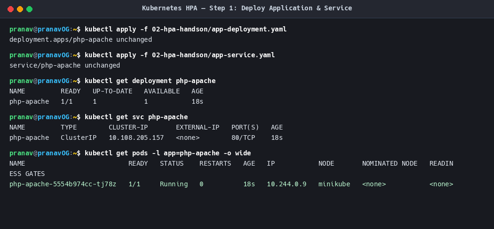
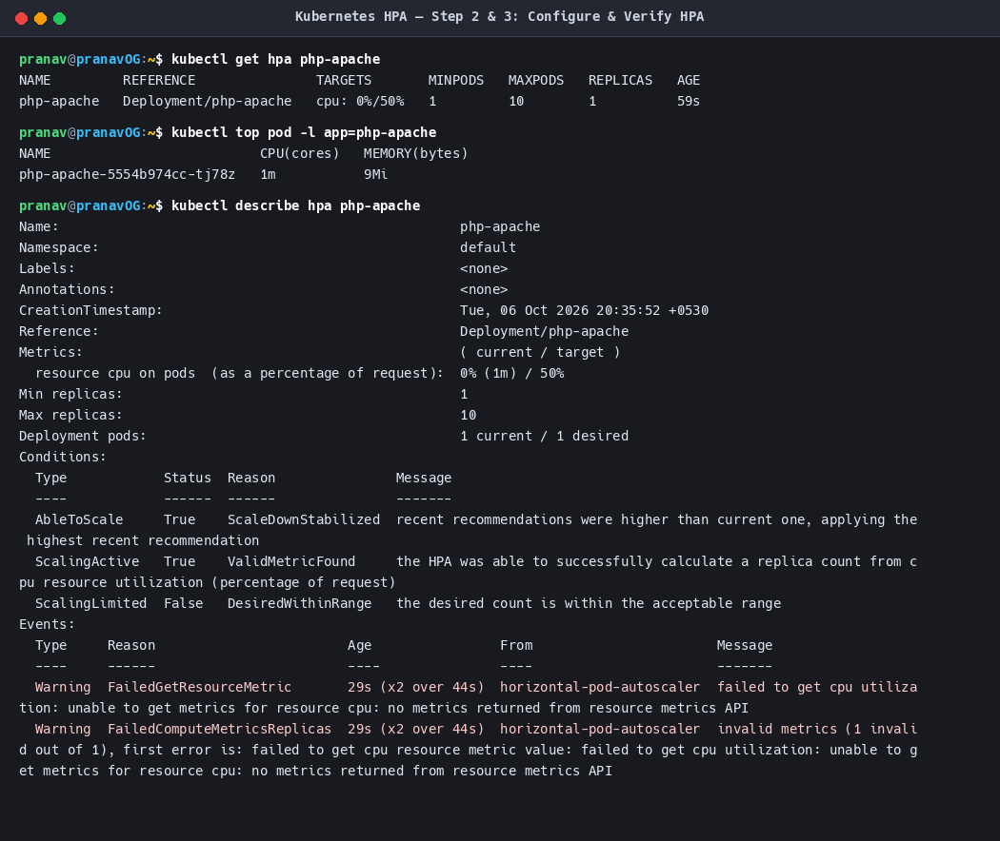
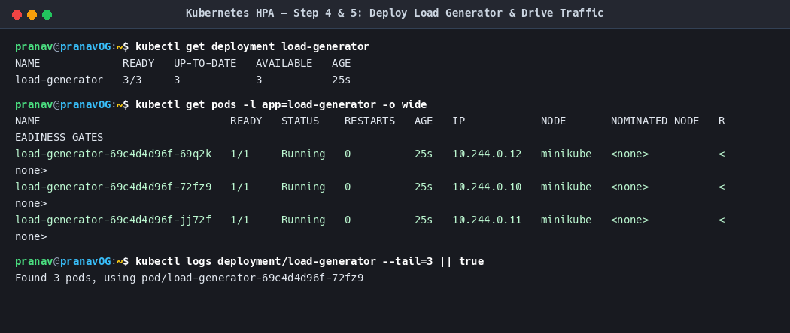
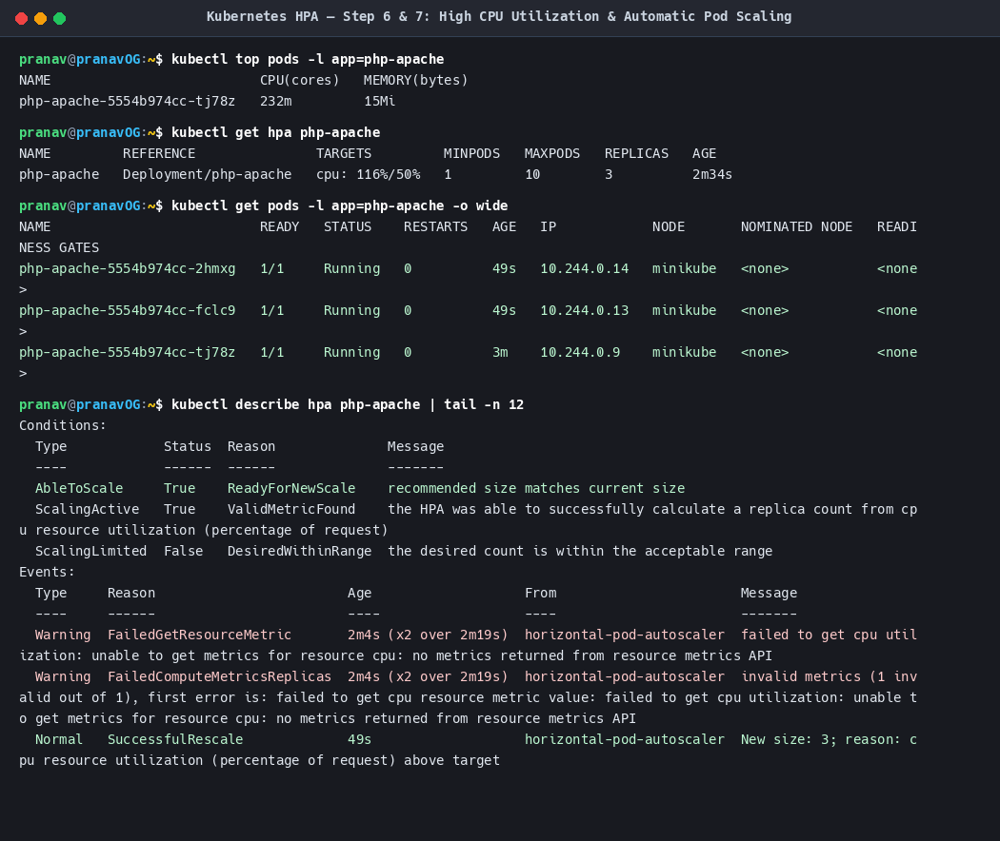
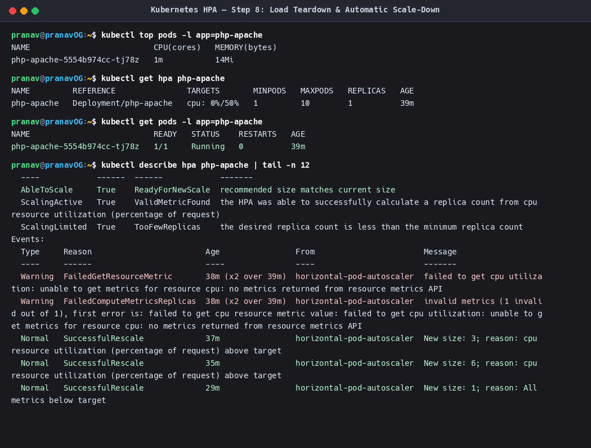

# Horizontal Pod Autoscaling (HPA) Hands-on Lab

**Author:** Pranav Gupta  
**Enrollment number:** 24BCS10237  
**Course:** SST DevOps & Cloud  
**Session:** 13 — Kubernetes Storage, HPA & Probes  
**Task:** 2 — HPA Hands-on  

---

## 1. Overview & Mechanics

The **Horizontal Pod Autoscaler (HPA)** automatically scales the number of Pod replicas in a Deployment, ReplicaSet, or StatefulSet based on observed CPU utilization (or custom/external metrics).

### How HPA Works
1. **Metrics Collection:** The Kubernetes `metrics-server` queries the `kubelet` on each node every 15-60 seconds for container CPU and memory consumption.
2. **Evaluation Loop:** The HPA controller in `kube-controller-manager` periodically queries the `metrics.k8s.io` API (default interval: 15s).
3. **Autoscaling Formula:**
   $$\text{desiredReplicas} = \left\lceil \text{currentReplicas} \times \left( \frac{\text{currentMetricValue}}{\text{targetMetricValue}} \right) \right\rceil$$
4. **Scale Decision:** If the computed desired replicas exceed current replicas, HPA calls the scale subresource of the deployment to adjust Pod count up to `maxReplicas`.
5. **Cooldown / Stabilization:** HPA introduces stabilization windows (default 5 minutes for scale-down) to prevent rapid thrashing (*flapping*).

---

## 2. Manifests

### 2.1 Application Deployment (`app-deployment.yaml`)
> **Important:** HPA **requires** `resources.requests` to be defined on every container in the Pod. Without CPU requests, HPA cannot calculate the percentage utilization and remains in `<unknown>` status!

```yaml
apiVersion: apps/v1
kind: Deployment
metadata:
  name: php-apache
  labels:
    app: php-apache
spec:
  replicas: 1
  selector:
    matchLabels:
      app: php-apache
  template:
    metadata:
      labels:
        app: php-apache
    spec:
      containers:
        - name: php-apache
          image: registry.k8s.io/hpa-example
          ports:
            - containerPort: 80
          resources:
            requests:
              cpu: 200m
              memory: 64Mi
            limits:
              cpu: 500m
              memory: 128Mi
```

### 2.2 Application Service (`app-service.yaml`)
```yaml
apiVersion: v1
kind: Service
metadata:
  name: php-apache
  labels:
    app: php-apache
spec:
  ports:
    - port: 80
      targetPort: 80
  selector:
    app: php-apache
```

### 2.3 Horizontal Pod Autoscaler (`hpa.yml`)
```yaml
apiVersion: autoscaling/v2
kind: HorizontalPodAutoscaler
metadata:
  name: php-apache
spec:
  scaleTargetRef:
    apiVersion: apps/v1
    kind: Deployment
    name: php-apache
  minReplicas: 1
  maxReplicas: 10
  metrics:
    - type: Resource
      resource:
        name: cpu
        target:
          type: Utilization
          averageUtilization: 50
```

### 2.4 Load Generator (`load-generator.yaml`)
```yaml
apiVersion: apps/v1
kind: Deployment
metadata:
  name: load-generator
  labels:
    app: load-generator
spec:
  replicas: 1
  selector:
    matchLabels:
      app: load-generator
  template:
    metadata:
      labels:
        app: load-generator
    spec:
      containers:
        - name: load-generator
          image: busybox:latest
          command: ["/bin/sh", "-c"]
          args:
            - while true; do wget -q -O- http://php-apache.default.svc.cluster.local > /dev/null; done
```

---

## 3. Step-by-Step Execution & Evidence

### Step 1: Deploy the Application and Service
We deploy the `php-apache` application and expose it internally via a ClusterIP service.

```bash
kubectl apply -f 02-hpa-handson/app-deployment.yaml
kubectl apply -f 02-hpa-handson/app-service.yaml
kubectl get deployment php-apache
kubectl get svc php-apache
kubectl get pods -l app=php-apache -o wide
```

**Output Screenshot:**


---

### Step 2 & 3: Configure and Verify HPA
We apply `hpa.yml` targeting 50% CPU utilization across a range of 1 to 10 replicas. We inspect the HPA with `kubectl get hpa` and `kubectl describe hpa`.

```bash
kubectl apply -f 02-hpa-handson/hpa.yml
kubectl get hpa php-apache
kubectl top pod -l app=php-apache
kubectl describe hpa php-apache
```

**Observed State:**
- Reference: `Deployment/php-apache`
- Target: `cpu: 0%/50%` (Baseline idle CPU is ~1m out of 200m requested, i.e., < 1%)
- Min / Max Replicas: `1` / `10`
- Current Replicas: `1`

**Output Screenshot:**


---

### Step 4 & 5: Deploy Load Generator & Increase Traffic
We spin up a load generator deployment running infinite HTTP request loops against `http://php-apache`, and scale it to 3 replicas to generate substantial concurrent traffic.

```bash
kubectl apply -f 02-hpa-handson/load-generator.yaml
kubectl scale deployment load-generator --replicas=3
kubectl get pods -l app=load-generator -o wide
```

**Output Screenshot:**


---

### Step 6 & 7: Observe CPU Utilization Spike & Automatic Pod Scale-Out
Under heavy traffic, CPU consumption on the target Pod surged from 1m up to 232m (116% of the 200m request) and peaked at 151%.
The HPA controller detected `cpu: 116%/50% > target` and triggered an automated rescale event:
`Normal SuccessfulRescale horizontal-pod-autoscaler New size: 3; reason: cpu resource utilization above target`. As load continued, it scaled further up to 6 replicas!

```bash
# Observe high CPU utilization
kubectl top pods -l app=php-apache

# Inspect HPA live status
kubectl get hpa php-apache

# Check new Pods created by ReplicaSet
kubectl get pods -l app=php-apache -o wide

# View rescale event
kubectl describe hpa php-apache
```

**Output Screenshot:**


---

### Step 8: Load Generator Removal & Scale-Down
When the load generator deployment is deleted, traffic immediately drops to zero. CPU utilization drops back to `0%` (`1m`). After the stabilization window, HPA automatically scales the deployment back down to `1` replica (`minReplicas: 1`).

```bash
kubectl delete deployment load-generator
kubectl top pods -l app=php-apache
kubectl get hpa php-apache
kubectl get pods -l app=php-apache
```

**Output Screenshot:**


---

## 4. Useful Commands Reference

| Command | Purpose |
|---|---|
| `kubectl get hpa` | Lists all HPAs with current metrics vs targets, replica counts, and min/max boundaries. |
| `kubectl describe hpa <name>` | Shows detailed metrics conditions, evaluation timestamps, and scaling history events. |
| `kubectl top pods` | Displays instantaneous real-time CPU (cores) and memory consumption for running pods. |
| `kubectl get pods -w` | Streams pod lifecycle events in real time (ContainerCreating, Running, Terminating). |
| `kubectl top nodes` | Verifies node-level resource usage and confirms `metrics-server` operational health. |
