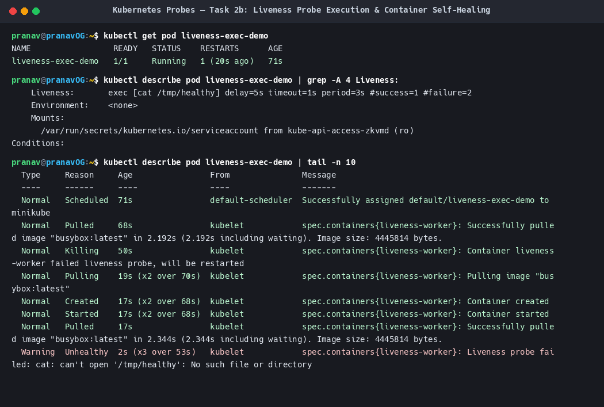
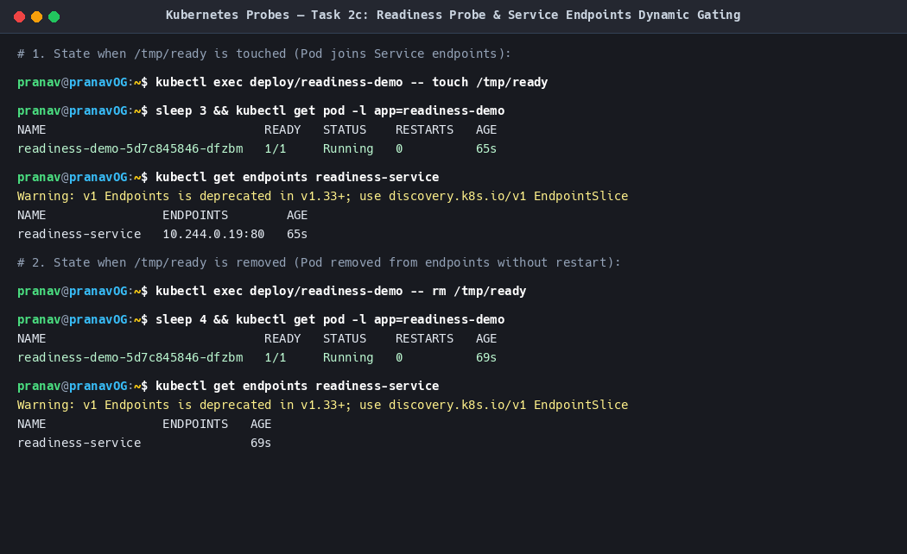
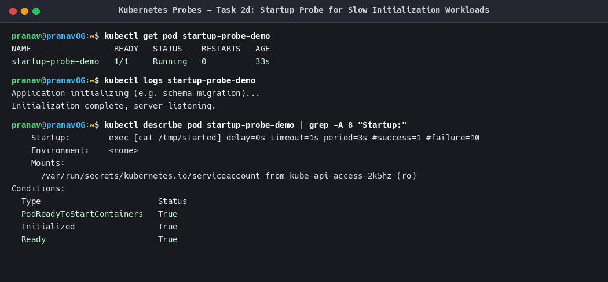

# Kubernetes Probes — Liveness, Readiness & Startup

**Author:** Pranav Gupta  
**Enrollment number:** 24BCS10237  
**Course:** SST DevOps & Cloud  
**Session:** 13 — Kubernetes Storage, HPA & Probes  
**Task:** Probes Hands-on  

---

## 1. Overview & Comparison

Kubernetes uses **Container Probes** to monitor container health and manage application lifecycles automatically. The `kubelet` uses three distinct probes for three specific operational needs:

| Probe Type | What it monitors | Action on Failure | Typical Use Case |
|---|---|---|---|
| **Liveness Probe** | Is the container alive or deadlocked/stuck in an infinite loop? | **Kills & Restarts** the container. | Catching unhandled thread deadlocks, fatal memory corruption. |
| **Readiness Probe** | Is the container ready to receive and serve client network traffic? | **Removes Pod IP from Service Endpoints** (Container remains running). | Warming caches, loading heavy dataset into RAM, waiting for DB connection. |
| **Startup Probe** | Has the container completed initial bootstrapping? | Disables Liveness & Readiness probes until successful. If fails after max threshold, kills container. | Legacy apps, JVM startup, complex database schema migrations taking > 30s. |

---

## 2. Probe Detection Mechanisms

Kubernetes supports four probe mechanisms:
1. `httpGet`: Sends an HTTP GET request to the specified port and path. Any code between 200 and 399 indicates success.
2. `exec`: Executes a command inside the container. Exit code `0` is success; non-zero is failure.
3. `tcpSocket`: Attempts to open a TCP socket on the container port. Successful handshake indicates health.
4. `grpc`: Executes a gRPC health check procedure (K8s v1.24+).

---

## 3. Manifests & Observed Behaviors

### 3.1 Liveness Probe (`01-liveness-exec.yaml`)
Simulates a container that creates `/tmp/healthy` at start, runs normally for 15 seconds, and then deletes the file to simulate an internal crash.

```yaml
apiVersion: v1
kind: Pod
metadata:
  name: liveness-exec-demo
spec:
  containers:
    - name: liveness-worker
      image: busybox:latest
      command: ["/bin/sh", "-c"]
      args:
        - touch /tmp/healthy; sleep 15; rm -rf /tmp/healthy; sleep 600;
      livenessProbe:
        exec:
          command: ["cat", "/tmp/healthy"]
        initialDelaySeconds: 5
        periodSeconds: 3
        failureThreshold: 2
```

**Observed Sequence:**
1. Pod reaches `1/1 Running`.
2. After 15 seconds, `/tmp/healthy` is deleted.
3. Next probe checks fail: `Liveness probe failed: cat: can't open '/tmp/healthy'`.
4. After 2 consecutive failures, `kubelet` fires event: `Container liveness-worker failed liveness probe, will be restarted`.
5. Container restarts (`RESTARTS: 1`).

**Evidence Screenshot:**


---

### 3.2 Readiness Probe (`03-readiness-probe.yaml`)
Demonstrates traffic gating via Kubernetes Service Endpoints.

```yaml
apiVersion: apps/v1
kind: Deployment
metadata:
  name: readiness-demo
spec:
  replicas: 1
  selector:
    matchLabels:
      app: readiness-demo
  template:
    metadata:
      labels:
        app: readiness-demo
    spec:
      containers:
        - name: app
          image: nginx:alpine
          ports:
            - containerPort: 80
          readinessProbe:
            exec:
              command: ["cat", "/tmp/ready"]
            initialDelaySeconds: 3
            periodSeconds: 2
---
apiVersion: v1
kind: Service
metadata:
  name: readiness-service
spec:
  selector:
    app: readiness-demo
  ports:
    - port: 80
      targetPort: 80
```

**Observed Sequence:**
1. Pod starts without `/tmp/ready`. Status shows `0/1 Running` and `kubectl get endpoints readiness-service` returns `<none>`. No client traffic reaches the unready container.
2. We run `touch /tmp/ready`. The probe passes; Pod becomes `1/1 Running`, and its IP `10.244.0.19:80` is registered in `readiness-service` Endpoints immediately!
3. We run `rm /tmp/ready`. The probe fails; Pod transitions to `0/1 Running` and is removed from Endpoints instantly without killing or restarting the container.

**Evidence Screenshot:**


---

### 3.3 Startup Probe (`04-startup-probe.yaml`)
Protects slow initialization sequences from aggressive liveness timeouts.

```yaml
apiVersion: v1
kind: Pod
metadata:
  name: startup-probe-demo
spec:
  containers:
    - name: legacy-slow-app
      image: busybox:latest
      command: ["/bin/sh", "-c"]
      args:
        - sleep 12; touch /tmp/started; sleep 3600;
      startupProbe:
        exec:
          command: ["cat", "/tmp/started"]
        periodSeconds: 3
        failureThreshold: 10
      livenessProbe:
        exec:
          command: ["cat", "/tmp/started"]
        periodSeconds: 5
        failureThreshold: 2
```

**Observed Sequence:**
- Total startup allowance: $10 \times 3\text{s} = 30\text{s}$.
- During the 12-second initialization window, the startup probe fails repeatedly, but `kubelet` does **not** restart the pod.
- Once `/tmp/started` appears, startup probe succeeds and hands over monitoring to the regular liveness probe.

**Evidence Screenshot:**

