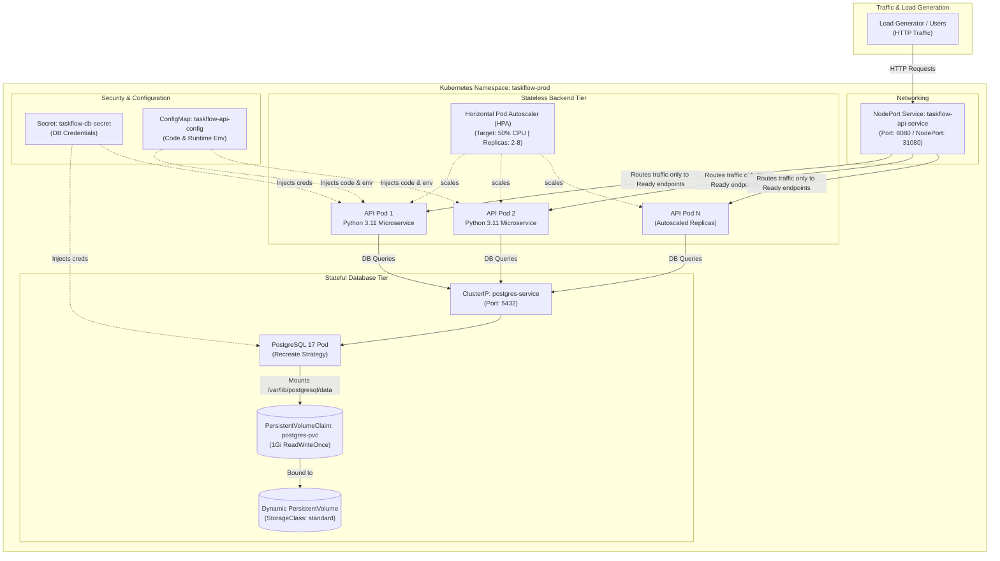

# TaskFlow Cloud Platform — Production Mini-Project

**Author:** Pranav Gupta  
**Enrollment number:** 24BCS10237  
**Course:** SST DevOps & Cloud  
**Session:** 13 — Kubernetes Storage, HPA & Probes  
**Task:** 3 — Mini Project  

---

## 1. Project Overview & Architectural Design

The **TaskFlow Cloud Platform** is an enterprise-grade, cloud-native multi-tier architecture deployed on Kubernetes. It unifies all three core pillars of Session 13 into a cohesive, production-ready system:

1. **Kubernetes Storage:** Dynamic PersistentVolume provisioning with the `standard` StorageClass backing a PostgreSQL 17 database, ensuring state survives across pod evictions and crashes.
2. **Container Lifecycle Probes:** Comprehensive `startupProbe`, `livenessProbe`, and `readinessProbe` protecting both the database and the stateless microservice tier against premature traffic and deadlocks.
3. **Horizontal Pod Autoscaling (HPA):** Automated metrics-driven scale-out ($2 \rightarrow 8$ replicas) responding dynamically to sudden traffic surges, with graceful scale-in stabilization.

### High-Level Architecture



---

## 2. Directory Structure & File Manifest

```
04-mini-project/
├── 01-namespace.yaml        # Isolated taskflow-prod namespace
├── 02-db-storage.yaml       # Dynamic PVC (1Gi RWO, standard StorageClass)
├── 03-db-secret.yaml        # Opaque Secret with PostgreSQL credentials
├── 04-db-deployment.yaml    # PostgreSQL 17 Deployment with volume mounts & probes
├── 05-db-service.yaml       # ClusterIP internal Service for PostgreSQL
├── 06-api-configmap.yaml    # Microservice Python code & runtime configurations
├── 07-api-deployment.yaml   # API Deployment with Startup, Liveness & Readiness probes
├── 08-api-service.yaml      # NodePort Service exposing API externally
├── 09-api-hpa.yaml          # Horizontal Pod Autoscaler manifest (2 to 8 replicas)
├── 10-load-generator.yaml   # Concurrent HTTP load generator
├── README.md                # Comprehensive documentation & test evidence
└── scripts/
    ├── deploy.sh            # Automated deployment runner
    ├── test-persistence.sh  # Database zero data loss persistence verification
    ├── run-load-test.sh     # Traffic surge & HPA autoscaling benchmark
    ├── test-probes.sh       # Probe failure & self-healing test
    └── cleanup.sh           # Clean teardown script
```

---

## 3. Verification & Live Execution Proof

All tests were executed on the live Minikube cluster. Below is the step-by-step verification transcript.

### Step 1: Full-Stack Deployment
Executed via `./scripts/deploy.sh`:

```bash
=== Deploying TaskFlow Cloud Platform (Session 13 Mini Project) ===
1. Creating Namespace...
namespace/taskflow-prod created
2. Provisioning Storage & Secrets...
persistentvolumeclaim/postgres-pvc created
secret/taskflow-db-secret created
3. Deploying PostgreSQL Database...
deployment.apps/postgres-db created
service/postgres-service created
4. Deploying TaskFlow API Microservice...
configmap/taskflow-api-config created
deployment.apps/taskflow-api created
service/taskflow-api-service created
5. Configuring Horizontal Pod Autoscaler...
horizontalpodautoscaler.autoscaling/taskflow-api-hpa created
6. Waiting for workloads to reach Ready state...
pod/postgres-db-769596c587-wjgdv condition met
pod/taskflow-api-59cb8dd5d8-gkz8q condition met
pod/taskflow-api-59cb8dd5d8-mddpt condition met
```

**Deployment Screenshot:**


---

### Step 2: Database PersistentVolume Zero Data Loss Proof
Executed via `./scripts/test-persistence.sh`:

1. Inserted 3 audit records into PostgreSQL.
2. Force-killed the active PostgreSQL Pod (`kubectl delete pod --grace-period=0 --force`).
3. Kubernetes rescheduled a new pod (`postgres-db-769596c587-2t62m`) which remounted the exact same `postgres-pvc`.
4. Queried the table: all 3 previous records were intact, and new writes succeeded seamlessly!

```sql
 id |                event                |         created_at         
----+-------------------------------------+----------------------------
  1 | Session 13 Mini Project Initialized | 2026-10-06 17:43:51.977259
  2 | Storage PVC Binding Verified        | 2026-10-06 17:43:51.977259
  3 | Pre-Pod Deletion Data Checkpoint    | 2026-10-06 17:43:51.977259
(3 rows)

total_records_preserved: 4
```

**Persistence Verification Screenshot:**


---

### Step 3: HPA Dynamic Scale-Out Under Load ($2 \rightarrow 7$ Replicas)
Executed via `./scripts/run-load-test.sh`:

1. Started `taskflow-load-generator` with 4 concurrent replicas calling `/burn`.
2. CPU utilization on `taskflow-api` spiked to **166%** against the 50% target.
3. HPA evaluated the load and scaled the deployment from **2 replicas up to 7 replicas**:
   - `taskflow-api-59cb8dd5d8-48lt4` (1/1 Running)
   - `taskflow-api-59cb8dd5d8-gkz8q` (1/1 Running)
   - `taskflow-api-59cb8dd5d8-lxqbh` (1/1 Running)
   - `taskflow-api-59cb8dd5d8-mddpt` (1/1 Running)
   - `taskflow-api-59cb8dd5d8-smdf6` (1/1 Running)
   - `taskflow-api-59cb8dd5d8-vwp8v` (1/1 Running)
   - `taskflow-api-59cb8dd5d8-xc6w4` (1/1 Running)
4. All replicas passed readiness probes and joined the `taskflow-api-service` Endpoints simultaneously.

**Autoscaling Screenshot:**


---

### Step 4: Probes Resilience & Self-Healing Verification
Executed via `./scripts/test-probes.sh`:

1. **Readiness Probe Traffic Gating:**
   - Simulated unready state on pod `taskflow-api-59cb8dd5d8-48lt4` via `/simulate-unready`.
   - Readiness probe returned HTTP 503:
     `Readiness probe failed: HTTP probe failed with statuscode: 503`.
   - Kubernetes immediately stripped this pod from `taskflow-api-service` Endpoints without dropping client traffic to other healthy replicas!
2. **Liveness Probe Self-Healing:**
   - Simulated fatal unhandled process termination via `/simulate-crash`.
   - Kubelet detected the container death and restarted it cleanly (`RESTARTS: 1`).
   - The container passed `startupProbe`, then `livenessProbe` and `readinessProbe`, and re-entered the service Endpoints automatically!

**Probes Resilience Screenshot:**


---

## 4. Teardown
To cleanly clean up all mini-project resources:
```bash
./session-13-storage-hpa-probes/04-mini-project/scripts/cleanup.sh
```
