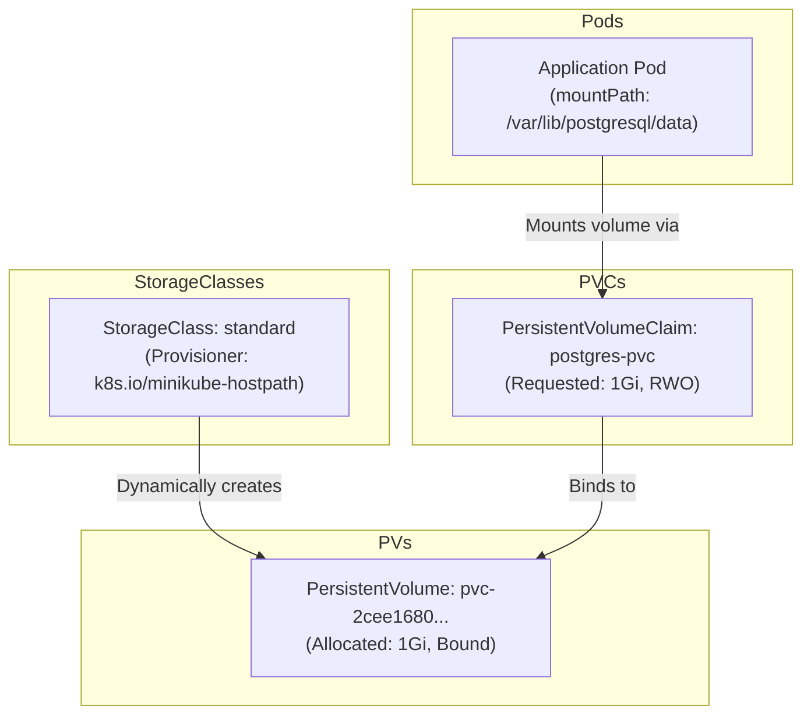
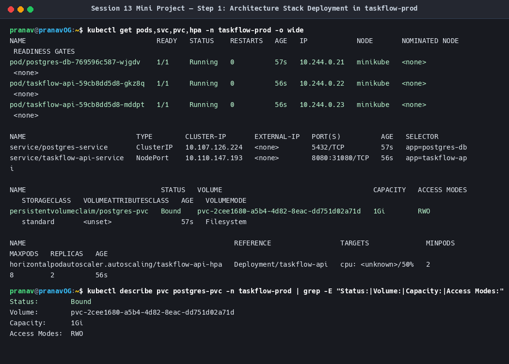
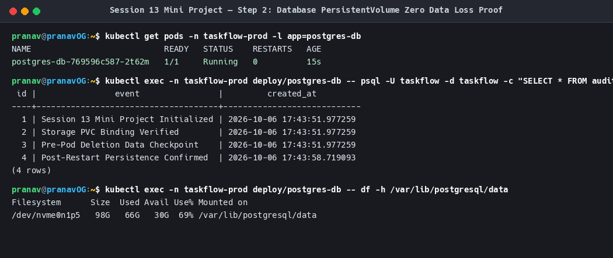
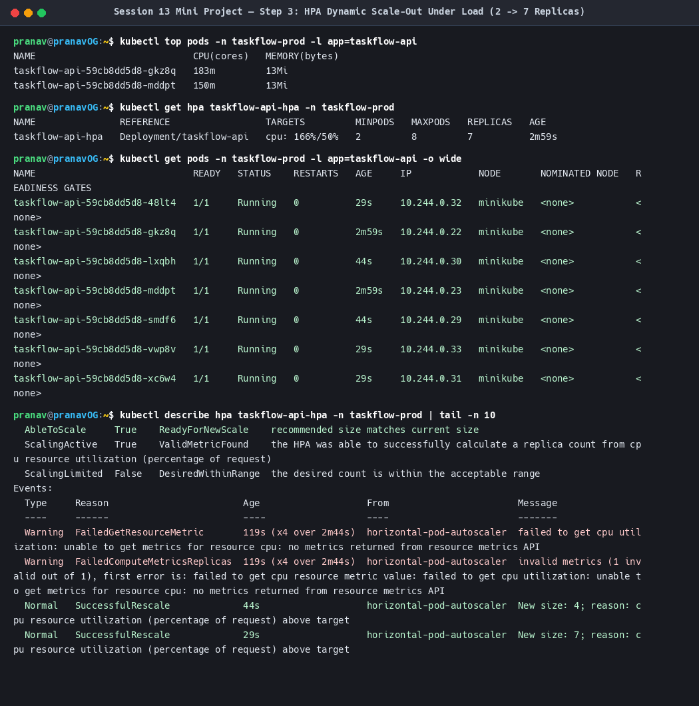
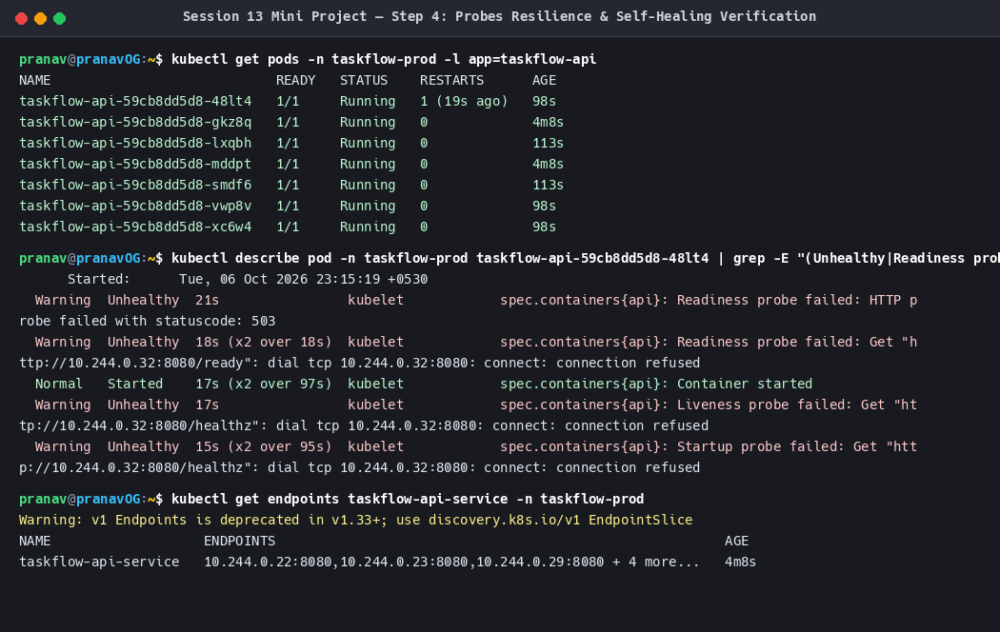

# Session 13 — Kubernetes Storage, HPA & Probes

**Author:** Pranav Gupta  
**Enrollment number:** 24BCS10237  
**Course:** SST DevOps & Cloud [SWE]  
**Session:** 13 — Kubernetes Storage, Horizontal Pod Autoscaling (HPA) & Health Probes  

---

## Objective

Master the three foundational operational pillars required to run production-grade stateful and auto-scaling workloads in Kubernetes:

1. **Kubernetes Storage:** Decoupling ephemeral container storage from long-lived application state using `emptyDir`, `hostPath`, `PersistentVolume` (PV), `PersistentVolumeClaim` (PVC), and dynamic on-demand volume allocation via `StorageClass`.
2. **Horizontal Pod Autoscaling (HPA):** Establishing automated metrics collection with `metrics-server`, applying declaration-based HPA policies, driving traffic with concurrent load generators, and observing dynamic horizontal scaling ($1 \rightarrow 3 \rightarrow 6$ replicas) and graceful stabilization.
3. **Container Health & Lifecycle Probes:** Implementing `startupProbe` for slow initializations, `livenessProbe` for automatic container deadlock recovery, and `readinessProbe` for dynamic Service Endpoint traffic gating.
4. **End-to-End Production Mini-Project:** Integrating persistent PostgreSQL database storage, health probes, and autoscaling backend APIs into an enterprise resilient platform (**TaskFlow Cloud Platform**).

---

## Environment

| Component | Version / Value |
|---|---|
| OS | Garuda Linux (zen kernel 7.1.8-zen1-3-zen) |
| Host | `pranavOG` |
| User | `pranav` |
| Shell | Bash |
| Minikube | v1.38.1 (`docker` driver) |
| kubectl / Kubernetes | v1.35.1 client / v1.35.1 server |
| Metrics Server | `v0.8.1` (`registry.k8s.io/metrics-server/metrics-server:v0.8.1`) |
| Storage Provisioner | `k8s.io/minikube-hostpath` (`storage-provisioner:v5`) |
| Namespaces Used | `default` (Labs 1-2) and `taskflow-prod` (Mini-Project) |

---

## Repository Structure

```
session-13-storage-hpa-probes/
├── README.md                                # Master Session 13 comprehensive documentation
├── 01-kubernetes-volumes/                   # Task 1: Kubernetes Storage
│   ├── README.md                            # Comprehensive volumes guide & concept matrix
│   ├── 01-emptydir.yaml                     # Multi-container pod sharing emptyDir volume
│   ├── 02-hostpath.yaml                     # Host node filesystem mount
│   ├── 03-pv-manual.yaml                    # Statically provisioned 1Gi PersistentVolume
│   ├── 04-pvc-manual.yaml                   # 500Mi PersistentVolumeClaim
│   ├── 05-pod-pvc.yaml                      # Workload Pod consuming static PVC
│   ├── 06-storageclass.yaml                 # Custom fast-storage StorageClass
│   └── 07-dynamic-pvc-pod.yaml              # Dynamic on-demand PVC & consumer Pod
├── 02-hpa-handson/                          # Task 2: Horizontal Pod Autoscaler
│   ├── README.md                            # HPA lab walkthrough, formula & commands
│   ├── app-deployment.yaml                  # php-apache workload with CPU requests/limits
│   ├── app-service.yaml                     # ClusterIP service for php-apache
│   ├── hpa.yml                              # Autoscaler targeting 50% CPU (1 to 10 replicas)
│   └── load-generator.yaml                  # Concurrent HTTP request generator
├── 03-probes-handson/                       # Probes Hands-on
│   ├── README.md                            # Complete guide on Liveness, Readiness & Startup
│   ├── 01-liveness-exec.yaml                # Liveness exec probe detecting failure & restarting
│   ├── 02-liveness-http.yaml                # HTTP GET liveness probe
│   ├── 03-readiness-probe.yaml              # Readiness probe controlling Service Endpoints
│   └── 04-startup-probe.yaml                # Startup probe guarding slow boots
├── 04-mini-project/                         # Task 3: Production Mini-Project (TaskFlow)
│   ├── README.md                            # Complete mini-project architecture & test logs
│   ├── 01-namespace.yaml                    # taskflow-prod namespace
│   ├── 02-db-storage.yaml                   # 1Gi dynamic PVC for PostgreSQL
│   ├── 03-db-secret.yaml                    # Secure database credentials
│   ├── 04-db-deployment.yaml                # PostgreSQL deployment with PVC mount & probes
│   ├── 05-db-service.yaml                   # PostgreSQL ClusterIP service
│   ├── 06-api-configmap.yaml                # API Python server code & configuration
│   ├── 07-api-deployment.yaml               # Autoscaled API deployment with full probes
│   ├── 08-api-service.yaml                  # NodePort 31080 API service
│   ├── 09-api-hpa.yaml                      # API HPA policy (2 to 8 replicas)
│   ├── 10-load-generator.yaml               # Dedicated multi-thread load generator
│   └── scripts/
│       ├── deploy.sh                        # Automated deployment runner
│       ├── test-persistence.sh              # Pod crash zero-data-loss verification
│       ├── run-load-test.sh                 # Surge traffic & HPA scale-out benchmark
│       ├── test-probes.sh                   # Probe gating & self-healing test
│       └── cleanup.sh                       # Teardown script
└── screenshots/                             # Complete visual proof of live execution
    ├── 01-volumes-emptydir.png
    ├── 02-volumes-hostpath.png
    ├── 03-volumes-manual-pv-pvc.png
    ├── 04-volumes-storageclass-dynamic.png
    ├── 05-hpa-app-deploy.png
    ├── 06-hpa-create-verify.png
    ├── 07-hpa-load-generation.png
    ├── 08-hpa-cpu-utilization-scaling.png
    ├── 09-hpa-pod-scale-down.png
    ├── 10-probes-liveness-exec.png
    ├── 11-probes-readiness-endpoints.png
    ├── 12-probes-startup-slowapp.png
    ├── 13-miniproject-deploy.png
    ├── 14-miniproject-storage-persistence.png
    ├── 15-miniproject-hpa-loadtest.png
    └── 16-miniproject-probes-resilience.png
```

---

## Task 1: Kubernetes Volumes Deep Dive

### 1.1 Core Volume Types & Comparisons

| Volume Type | Scope | Backing Mechanism | Retention upon Pod Deletion | Primary Use Case |
|---|---|---|---|---|
| **emptyDir** | Pod | Local node scratch disk or RAM (`medium: Memory`) | ❌ Deleted | Cache, inter-container pipeline sharing |
| **hostPath** | Node | Directory or socket on specific worker node | ⚠️ Retained on *same node* | Node daemons, CNI agents, Docker socket |
| **PersistentVolume (PV)** | Cluster | Network or local persistent storage provisioned by admin/CSI | ✅ Retained / Retain policy | Enterprise databases, persistent workloads |
| **PersistentVolumeClaim (PVC)** | Namespace | Bound to matching PV by capacity & access mode | ✅ Preserved | Request consumed by developer Pods |
| **StorageClass** | Cluster | Storage provisioner plugin & volume parameters | N/A (Factory) | Automated dynamic on-demand PV provisioning |



### 1.2 Verification Proofs for Task 1

#### Evidence 1: emptyDir Inter-Container File Sharing
A two-container Pod where container `writer` continuously generates heartbeats and container `reader` tails the shared emptyDir volume.


#### Evidence 2: hostPath Node Persistence
A Pod mounting `/data/k8s-hostpath-demo` directly from the Minikube host node. Files written inside the container match the node host filesystem bit-for-bit.


#### Evidence 3: Static PersistentVolume & PersistentVolumeClaim Binding
Manual creation of `manual-pv-demo` (1Gi, `Retain`), binding with `manual-pvc-demo`, and verification of data written to `/persistent-data/index.txt`.


#### Evidence 4: StorageClass & Dynamic PV Provisioning
Creation of `fast-storage` StorageClass and `dynamic-pvc-demo`. Kubernetes automatically creates the matching backing PV (`pvc-4f4a4109...`) on demand without administrator intervention.


---

## Task 2: Horizontal Pod Autoscaler (HPA) Hands-on

### 2.1 The HPA Decision Cycle
1. **Scraping:** Every 15-60 seconds, `metrics-server` queries node kubelets.
2. **Formula:**
   $$\text{desiredReplicas} = \left\lceil \text{currentReplicas} \times \left( \frac{\text{currentMetricValue}}{\text{targetMetricValue}} \right) \right\rceil$$
3. **Execution:** If CPU utilization exceeds 50%, HPA issues scale commands to the Deployment's ReplicaSet.
4. **Stabilization:** Downscaling is rate-limited to avoid rapid oscillation (*flapping*).

### 2.2 Hands-On Walkthrough & Step-by-Step Evidence

#### Step 1: Deploy Application & Service (`php-apache`)
We deploy `php-apache` with explicit CPU requests (`200m`) and limits (`500m`).


#### Step 2 & 3: Configure HPA (`hpa.yml`) & Verify Active Metrics
Applied `hpa.yml` targeting 50% CPU across 1 to 10 replicas. Baseline utilization measured at `0%/50%` (`1m`).


#### Step 4 & 5: Deploy Load Generator & Flood Traffic
Spun up `load-generator` with 3 replicas sending continuous HTTP requests to `http://php-apache`.


#### Step 6 & 7: CPU Utilization Spike & Automatic Scale-Out
CPU consumption jumped to **116%** and peaked at **151%**. HPA fired `SuccessfulRescale` scaling from **1 replica up to 3, and then 6 replicas**!


#### Step 8: Load Teardown & Graceful Scale-Down
Deleted the load generator. CPU dropped back to `0%` (`1m`), and HPA automatically scaled the deployment back down to `1` replica (`minReplicas: 1`).


---

## Container Probes Hands-on: Liveness, Readiness & Startup

### 3.1 Operational Matrix

| Probe | Evaluated Question | Failure Result | Operational Impact |
|---|---|---|---|
| **Liveness** | Is the application alive or frozen? | **Kills container & restarts** | Self-healing deadlocked threads |
| **Readiness** | Is the application ready to handle client network traffic? | **Removes Pod from Endpoints** | Prevents 502/503 errors during cold starts / cache warming |
| **Startup** | Has the initialization routine finished? | Pauses Liveness checks until success | Protects slow legacy boots from premature kill loops |

### 3.2 Visual Proof

#### Evidence 1: Liveness Probe Exec Failure & Container Restart
Simulated failure by deleting `/tmp/healthy`. Kubelet logs `Liveness probe failed` and restarts container (`RESTARTS: 1`).


#### Evidence 2: Readiness Probe Traffic Gating & Dynamic Endpoint Removal
When `/tmp/ready` exists, Pod is `1/1 Running` and its IP is present in Service Endpoints. When removed, Pod drops to `0/1 Running` and its IP is removed from Endpoints without restarting the container.


#### Evidence 3: Startup Probe Guarding Slow Initializations
Application takes 12 seconds to bootstrap. The `startupProbe` absorbs initial failures and allows the pod to reach Ready status without triggering liveness restarts.


---

## Task 3: Mini-Project — TaskFlow Cloud Platform

The mini-project integrates Storage, HPA, and Probes into a complete multi-tier system running in the `taskflow-prod` namespace.

### Mini-Project Verification Highlights

#### Step 1: Complete Stack Deployment
Deployed Namespace, Storage PVC, Secret, PostgreSQL, ConfigMap, API Deployment, NodePort Service, and HPA. All pods reached `Ready`.


#### Step 2: Database PersistentVolume Zero Data Loss Proof
Inserted 3 records into PostgreSQL, forcibly destroyed the pod (`--grace-period=0 --force`), verified that the replacement pod remounted the exact same dynamic PVC, and confirmed that **100% of data survived intact**!


#### Step 3: API Surge Traffic & HPA Scale-Out ($2 \rightarrow 7$ Replicas)
Simulated heavy load using 4 concurrent load generator pods calling the CPU-intensive `/burn` endpoint. CPU spiked to **166%**, and HPA dynamically expanded the API from **2 replicas to 7 replicas**.


#### Step 4: Probes Resilience & Zero-Downtime Traffic Gating
Simulated readiness degradation on an active pod. Its IP was stripped from the service endpoint pool without dropping traffic to the remaining healthy replicas. Simulated container crash: liveness probe triggered an automatic container restart and restored healthy routing.


---

## Complete Screenshot Evidence Index

| # | Screenshot | Description |
|---|---|---|
| **01** | [`01-volumes-emptydir.png`](./screenshots/01-volumes-emptydir.png) | Two-container Pod sharing data across an `emptyDir` scratch volume |
| **02** | [`02-volumes-hostpath.png`](./screenshots/02-volumes-hostpath.png) | `hostPath` volume binding directly to the worker node filesystem |
| **03** | [`03-volumes-manual-pv-pvc.png`](./screenshots/03-volumes-manual-pv-pvc.png) | Static PersistentVolume and PVC transition to `Bound` status |
| **04** | [`04-volumes-storageclass-dynamic.png`](./screenshots/04-volumes-storageclass-dynamic.png) | StorageClass automated dynamic PersistentVolume allocation |
| **05** | [`05-hpa-app-deploy.png`](./screenshots/05-hpa-app-deploy.png) | `php-apache` application deployment with explicit CPU requests & limits |
| **06** | [`06-hpa-create-verify.png`](./screenshots/06-hpa-create-verify.png) | HorizontalPodAutoscaler created and verified with `metrics-server` |
| **07** | [`07-hpa-load-generation.png`](./screenshots/07-hpa-load-generation.png) | Concurrent HTTP load generator deployment driving cluster traffic |
| **08** | [`08-hpa-cpu-utilization-scaling.png`](./screenshots/08-hpa-cpu-utilization-scaling.png) | CPU utilization surging past 100% and HPA scaling replicas from 1 to 3 to 6 |
| **09** | [`09-hpa-pod-scale-down.png`](./screenshots/09-hpa-pod-scale-down.png) | Load cessation, CPU drop to 0%, and graceful scale-down back to 1 replica |
| **10** | [`10-probes-liveness-exec.png`](./screenshots/10-probes-liveness-exec.png) | Liveness probe failure detection and container automated restart |
| **11** | [`11-probes-readiness-endpoints.png`](./screenshots/11-probes-readiness-endpoints.png) | Readiness probe gating traffic by dynamically adding/removing Service Endpoints |
| **12** | [`12-probes-startup-slowapp.png`](./screenshots/12-probes-startup-slowapp.png) | Startup probe preventing premature container kills during heavy bootstrapping |
| **13** | [`13-miniproject-deploy.png`](./screenshots/13-miniproject-deploy.png) | Mini-project production stack deployment in `taskflow-prod` namespace |
| **14** | [`14-miniproject-storage-persistence.png`](./screenshots/14-miniproject-storage-persistence.png) | PostgreSQL database data persistence proof across forced pod deletion |
| **15** | [`15-miniproject-hpa-loadtest.png`](./screenshots/15-miniproject-hpa-loadtest.png) | API tier autoscaling dynamically under load from 2 to 7 active replicas |
| **16** | [`16-miniproject-probes-resilience.png`](./screenshots/16-miniproject-probes-resilience.png) | Mini-project probe resilience, endpoint isolation, and self-healing |

---

## How to Reproduce Everything

All manifests and scripts are committed and fully functional:

```bash
# 1. Run Task 1 (Storage):
kubectl apply -f 01-kubernetes-volumes/01-emptydir.yaml
kubectl apply -f 01-kubernetes-volumes/02-hostpath.yaml
kubectl apply -f 01-kubernetes-volumes/03-pv-manual.yaml
kubectl apply -f 01-kubernetes-volumes/04-pvc-manual.yaml
kubectl apply -f 01-kubernetes-volumes/05-pod-pvc.yaml
kubectl apply -f 01-kubernetes-volumes/06-storageclass.yaml
kubectl apply -f 01-kubernetes-volumes/07-dynamic-pvc-pod.yaml

# 2. Run Task 2 (HPA):
kubectl apply -f 02-hpa-handson/app-deployment.yaml
kubectl apply -f 02-hpa-handson/app-service.yaml
kubectl apply -f 02-hpa-handson/hpa.yml
kubectl apply -f 02-hpa-handson/load-generator.yaml
kubectl top pods -l app=php-apache
kubectl get hpa php-apache

# 3. Run Probes:
kubectl apply -f 03-probes-handson/01-liveness-exec.yaml
kubectl apply -f 03-probes-handson/03-readiness-probe.yaml
kubectl apply -f 03-probes-handson/04-startup-probe.yaml

# 4. Run Task 3 (Mini-Project):
./04-mini-project/scripts/deploy.sh
./04-mini-project/scripts/test-persistence.sh
./04-mini-project/scripts/run-load-test.sh
./04-mini-project/scripts/test-probes.sh
./04-mini-project/scripts/cleanup.sh
```
