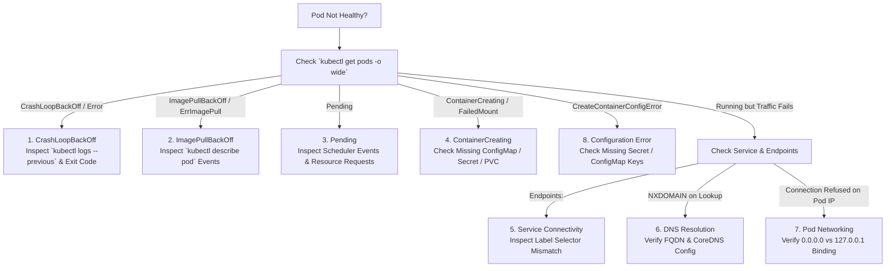

# Kubernetes Common Issues Troubleshooting Playbook

**Author:** Pranav Gupta  
**Enrollment number:** 24BCS10237  
**Course:** SST DevOps & Cloud  
**Session:** 14 — Kubernetes Troubleshooting  
**Task:** 2 — Troubleshoot Common Issues  

---

## 1. Troubleshooting Flowchart & Strategy

Whenever a Kubernetes workload is unhealthy, follow this systematic decision tree:

---

## 2. Issue-by-Issue Diagnostic Playbook

### Issue 1: `CrashLoopBackOff`
- **Problem Statement:** The Pod continuously crashes and restarts with back-off delays (`0/1 CrashLoopBackOff`).
- **Investigation Steps:**
  1. Run `kubectl get pods` to note restart count and status.
  2. Run `kubectl logs <pod> --previous` to view the application crash stack trace right before exit.
  3. Run `kubectl describe pod <pod>` to inspect `Last State: Terminated` and its `Exit Code`.
- **Root Cause:** Container entrypoint specified `/opt/bin/start-production-server.sh`, an executable that does not exist in the image (`Exit Code: 127`).
- **Fix:** Update command args in Pod spec to execute a valid command.
- **Verification:** Pod status transitions to `1/1 Running` with zero crashes.

**Visual Evidence:**

---

### Issue 2: `ErrImagePull` & `ImagePullBackOff`
- **Problem Statement:** Pod is stuck in `ErrImagePull` or `ImagePullBackOff`.
- **Investigation Steps:**
  1. Run `kubectl get pods`.
  2. Run `kubectl describe pod <pod>` and scroll down to the `Events` section.
- **Root Cause:** Specified image tag `nginx:v999.invalid.tag` does not exist on Docker Hub (`manifest unknown`).
- **Fix:** Correct the image tag to a valid version (`nginx:alpine`).
- **Verification:** Image pulls in seconds, and Pod enters `1/1 Running`.

**Visual Evidence:**

---

### Issue 3: `Pending` State
- **Problem Statement:** Pod remains in `Pending` state indefinitely; it is never assigned to any worker node.
- **Investigation Steps:**
  1. Run `kubectl get pods -o wide` — notice `NODE: <none>`.
  2. Run `kubectl describe pod <pod>` and inspect scheduler events.
- **Root Cause:** `FailedScheduling: 0/1 nodes are available: 1 Insufficient cpu`. Pod requested 50 CPU cores on a node with only 2 cores.
- **Fix:** Adjust `resources.requests.cpu` to a realistic value (`50m`).
- **Verification:** Scheduler assigns Pod to `minikube` node immediately, reaching `1/1 Running`.

**Visual Evidence:**

---

### Issue 4: `ContainerCreating` & `FailedMount`
- **Problem Statement:** Pod stays in `ContainerCreating` for minutes without starting.
- **Investigation Steps:**
  1. Run `kubectl describe pod <pod>`.
  2. Check `MountVolume.SetUp` warnings in Events.
- **Root Cause:** The Pod mounted a volume referencing ConfigMap `non-existent-configmap-v1`, which was never created in the namespace.
- **Fix:** Create the missing ConfigMap `app-config-v1` and align the volume spec.
- **Verification:** Kubelet mounts the volume and the container starts (`1/1 Running`).

**Visual Evidence:**

---

### Issue 5: Service Connectivity & Selector Mismatch
- **Problem Statement:** Clients cannot reach the backend service. Requests hang or time out.
- **Investigation Steps:**
  1. Run `kubectl get endpoints <service>`.
  2. Run `kubectl describe svc <service>`. Notice `Endpoints: <none>`.
  3. Compare `Selector` on Service with `Labels` on the target Pods (`kubectl get pods --show-labels`).
- **Root Cause:** Label mismatch. Service selector was looking for `app: backend-wrong-label`, whereas Pods were labeled `app: backend-api`.
- **Fix:** Update Service selector to `app: backend-api`.
- **Verification:** `kubectl get endpoints` immediately reflects `10.244.0.42:80`, and traffic routes properly.

**Visual Evidence:**

---

### Issue 6: DNS Resolution & CoreDNS
- **Problem Statement:** Pod receives `NXDOMAIN` when attempting to communicate with another microservice by name.
- **Investigation Steps:**
  1. Exec into testing pod: `kubectl exec -it <pod> -- nslookup <service>`.
  2. Inspect `/etc/resolv.conf` to check nameserver `10.96.0.10` and search domains.
- **Root Cause:** Application attempted cross-namespace lookup using shorthand or incorrect namespace (`order-service.wrong-namespace`).
- **Fix:** Use full Kubernetes FQDN: `<service-name>.<namespace>.svc.cluster.local`.
- **Verification:** CoreDNS resolves `order-service.default.svc.cluster.local` to ClusterIP `10.104.224.148`.

**Visual Evidence:**

---

### Issue 7: Pod Networking & Localhost vs 0.0.0.0 Binding
- **Problem Statement:** Pod is `1/1 Running`, but `curl <pod-ip>:<port>` fails with `Connection refused`.
- **Investigation Steps:**
  1. Confirm Pod IP is allocated with `kubectl get pod -o wide`.
  2. Attempt connection from the cluster/node: `curl --connect-timeout 2 http://<pod-ip>:8080`.
  3. Inspect listening interfaces inside container: `netstat -tlpn` or check application code.
- **Root Cause:** Server process bound strictly to loopback interface `127.0.0.1`. Linux kernel drops packets arriving on the `eth0` pod network interface.
- **Fix:** Reconfigure server socket to listen on `0.0.0.0` (all network interfaces).
- **Verification:** Connecting to Pod IP over the overlay network returns `HTTP/1.0 200 OK`.

**Visual Evidence:**

---

### Issue 8: Configuration & Missing Secret Keys (`CreateContainerConfigError`)
- **Problem Statement:** Pod fails to start with status `CreateContainerConfigError`.
- **Investigation Steps:**
  1. Run `kubectl describe pod <pod>`.
  2. Check Events for `Failed` container creation reason.
- **Root Cause:** `Warning Failed: Error: couldn't find key NON_EXISTENT_KEY in Secret default/app-secret-v1`.
- **Fix:** Update `valueFrom.secretKeyRef.key` to match the exact key present in the Secret (`CORRECT_DB_KEY`).
- **Verification:** Pod configuration succeeds, environment variables inject, and Pod runs (`1/1 Running`).

**Visual Evidence:**

