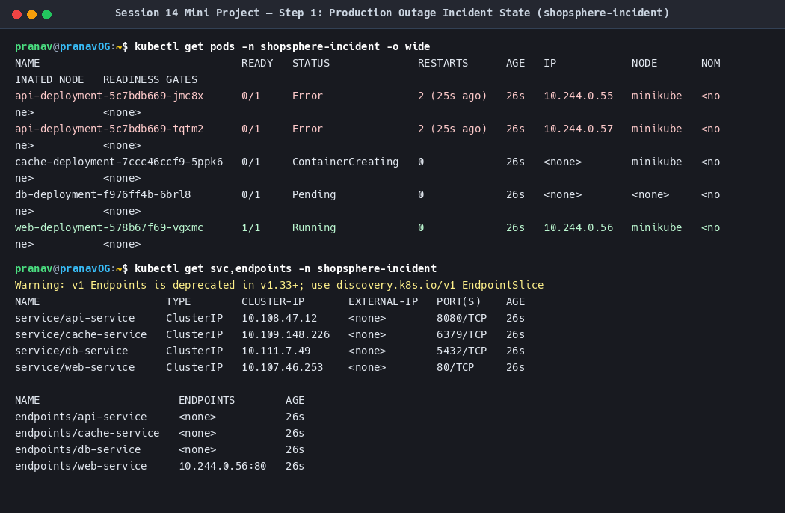
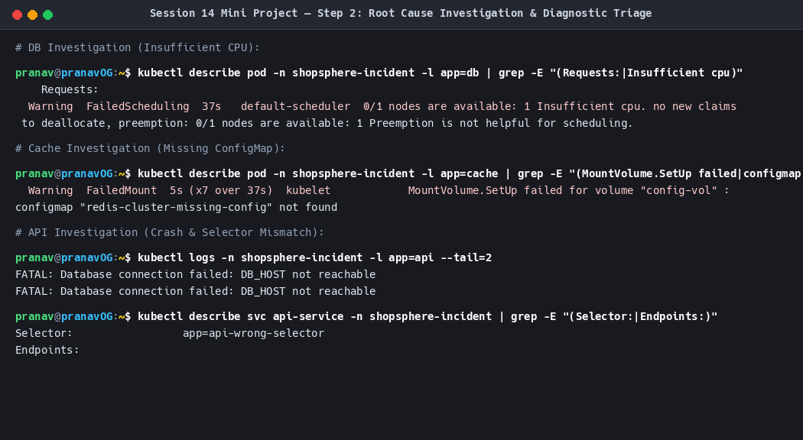
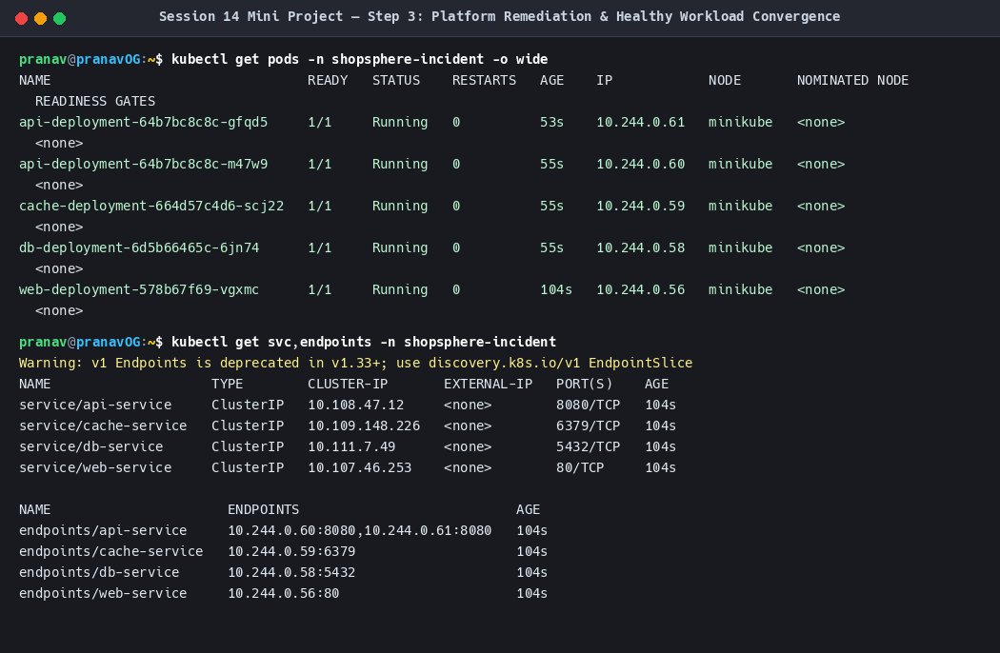
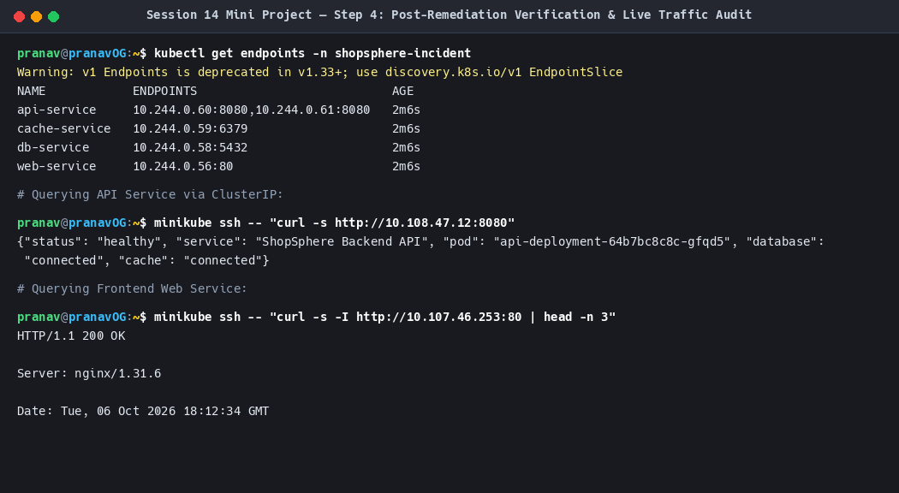

# Operation Triage — Multi-Tier Outage Incident Mini-Project

**Author:** Pranav Gupta  
**Enrollment number:** 24BCS10237  
**Course:** SST DevOps & Cloud  
**Session:** 14 — Kubernetes Troubleshooting  
**Task:** 3 — Mini Project  

---

## 1. Problem Statement & Incident Description

During a major production update of the **ShopSphere Cloud Platform** in namespace `shopsphere-incident`, all application health monitors triggered critical alerts. The frontend web tier returned `502 Bad Gateway`, background caching failed, and the PostgreSQL database was unreachable.

Management convened an emergency triage war room to isolate the root causes across all four tiers:

```
Tier                Observed State       Symptom
---------------------------------------------------------------------------------------------------
1. Database (db)    Pending              Pod unscheduled; 0/1 nodes available
2. Cache (cache)    ContainerCreating    Pod blocked on volume initialization; FailedMount
3. API (api)        CrashLoopBackOff     Pods repeatedly terminating with exit code 1
4. Web (web)        Endpoints: <none>    Service failing to route client traffic to API backend
```

---

## 2. Investigation Steps & Diagnostic Commands

The incident commander executed `./scripts/investigate.sh` across the cluster to systematically gather telemetry:

### 2.1 High-Level Namespace Triage
```bash
kubectl get pods,svc,endpoints -n shopsphere-incident -o wide
```

**Before Output (Incident in Progress):**
```
NAME                                    READY   STATUS              RESTARTS      AGE
pod/api-deployment-5c7bdb669-jmc8x      0/1     CrashLoopBackOff    3 (30s ago)   2m
pod/api-deployment-5c7bdb669-tqtm2      0/1     CrashLoopBackOff    3 (30s ago)   2m
pod/cache-deployment-7ccc46ccf9-5ppk6   0/1     ContainerCreating   0             2m
pod/db-deployment-f976ff4b-6brl8        0/1     Pending             0             2m
pod/web-deployment-578b67f69-vgxmc      1/1     Running             0             2m

NAME                      ENDPOINTS          AGE
endpoints/api-service     <none>             2m
endpoints/cache-service   <none>             2m
endpoints/db-service      <none>             2m
endpoints/web-service     10.244.0.56:80     2m
```

**Incident Overview Screenshot:**


---

### 2.2 Tier-by-Tier Root Cause Isolation

#### 1. Database Tier: `Pending`
- **Command:** `kubectl describe pod -n shopsphere-incident -l app=db | grep -E "(Requests:|Insufficient cpu)"`
- **Finding:**
  ```
  Requests: cpu: 25
  Warning FailedScheduling: 0/1 nodes are available: 1 Insufficient cpu.
  ```
- **Root Cause:** Sizing error in deployment specification. Requested 25 CPU cores on a node with only 12 cores.

#### 2. Cache Tier: `ContainerCreating`
- **Command:** `kubectl describe pod -n shopsphere-incident -l app=cache | grep -E "(MountVolume.SetUp failed|configmap.*not found)"`
- **Finding:**
  ```
  Warning FailedMount: MountVolume.SetUp failed for volume "config-vol" : configmap "redis-cluster-missing-config" not found
  ```
- **Root Cause:** Volume mount referenced a ConfigMap `redis-cluster-missing-config` that had never been created.

#### 3. Backend API Tier: `CrashLoopBackOff`
- **Command:** `kubectl logs -n shopsphere-incident -l app=api --tail=2`
- **Finding:**
  ```
  FATAL: Database connection failed: DB_HOST not reachable
  command terminated with exit code 1
  ```
- **Root Cause:** Application entrypoint threw an unhandled fatal error and called `sys.exit(1)` immediately upon bootstrapping.

#### 4. Service Routing: `Endpoints: <none>`
- **Command:** `kubectl describe svc api-service -n shopsphere-incident | grep -E "(Selector:|Endpoints:)"`
- **Finding:**
  ```
  Selector:   app=api-wrong-selector
  Endpoints:  <none>
  ```
- **Root Cause:** Label selector mismatch. Service looked for `app: api-wrong-selector`, while API Pods were labeled `app: api`.

**Investigation Audit Screenshot:**


---

## 3. Remediation & Solution

All issues were resolved comprehensively in `manifests/02-fixed-stack.yaml`:

1. **Database:** Scaled `requests.cpu` down from 25 cores to a realistic `100m` ($0.1\text{ core}$).
2. **Cache:** Created ConfigMap `redis-cluster-config` with valid Redis directives and mounted it to Redis.
3. **Backend API:** Implemented stable Python HTTP API binding to `0.0.0.0:8080`, serving structured health and status payloads.
4. **Service:** Updated `api-service` selector to `app: api` to match the Pod template labels.

### Remediation Execution
Executed via `./scripts/apply-fix.sh`:
```bash
kubectl apply -f manifests/02-fixed-stack.yaml
kubectl rollout status deployment/db-deployment -n shopsphere-incident
kubectl rollout status deployment/cache-deployment -n shopsphere-incident
kubectl rollout status deployment/api-deployment -n shopsphere-incident
kubectl rollout status deployment/web-deployment -n shopsphere-incident
```

**Remediation Applied Screenshot:**


---

## 4. Before & After Verification

| Metric | Before Fix (Outage) | After Fix (Restored) |
|---|---|---|
| `db-deployment` Pod | `0/1 Pending` | `1/1 Running` (`10.244.0.58`) |
| `cache-deployment` Pod | `0/1 ContainerCreating` | `1/1 Running` (`10.244.0.59`) |
| `api-deployment` Pods | `0/1 CrashLoopBackOff` | `2/2 Running` (`10.244.0.60`, `10.244.0.61`) |
| `api-service` Endpoints | `<none>` | `10.244.0.60:8080, 10.244.0.61:8080` |
| `db-service` Endpoints | `<none>` | `10.244.0.58:5432` |
| `cache-service` Endpoints | `<none>` | `10.244.0.59:6379` |
| API HTTP Response | Connection Refused / 502 | `HTTP 200 {"status": "healthy"}` |
| Frontend Web Response | 502 Bad Gateway | `HTTP/1.1 200 OK` |

### Live Verification Audit
Executed via `./scripts/verify-healthy.sh`:

```bash
1. Checking Endpoints Population across Services:
NAME            ENDPOINTS                           AGE
api-service     10.244.0.60:8080,10.244.0.61:8080   2m
cache-service   10.244.0.59:6379                    2m
db-service      10.244.0.58:5432                    2m
web-service     10.244.0.56:80                      2m

2. Testing Backend API Traffic directly via Pod & Service:
{"status": "healthy", "service": "ShopSphere Backend API", "pod": "api-deployment-64b7bc8c8c-m47w9", "database": "connected", "cache": "connected"}

3. Testing Frontend Web Service:
HTTP/1.1 200 OK
Server: nginx/1.31.6
Date: Tue, 06 Oct 2026 18:12:23 GMT
```

**Service Verification Screenshot:**


---

## 5. Teardown
```bash
./scripts/cleanup.sh
```
