# Session 14 — Kubernetes Troubleshooting

**Author:** Pranav Gupta  
**Enrollment number:** 24BCS10237  
**Course:** SST DevOps & Cloud [SWE]  
**Session:** 14 — Kubernetes Troubleshooting & Incident Remediation  

---

## Objective

Master the systematic detection, triage, root-cause isolation, and remediation of real-world Kubernetes failures:

1. **Kubernetes Diagnostic Toolset:** Hands-on mastery of all core troubleshooting commands (`kubectl get`, `kubectl describe`, `kubectl logs`, `kubectl exec`, `kubectl events`, `kubectl explain`, `kubectl top`, `kubectl get -o wide`).
2. **Common Failure Mode Diagnostics:** Investigating and fixing the 8 most frequent container and cluster failures: `CrashLoopBackOff`, `ImagePullBackOff`, `ErrImagePull`, `Pending`, `ContainerCreating`, Service connectivity issues, DNS resolution failures, Pod networking binding conflicts, and configuration errors (`CreateContainerConfigError`).
3. **End-to-End Incident Triage Mini-Project:** Diagnosing and remediating a concurrent multi-tier production outage (**Operation Triage: ShopSphere Incident**) spanning Database, Cache, API, Service Endpoints, and Web routing.

---

## Environment

| Component | Version / Value |
|---|---|
| OS | Garuda Linux (zen kernel 7.1.8-zen1-3-zen) |
| Host | `pranavOG` |
| User | `pranav` |
| Shell | Bash |
| Minikube | v1.38.1 (`docker` driver) |
| kubectl / Kubernetes | v1.35.1 client / v1.35.1 server |
| Metrics Server | `v0.8.1` (`registry.k8s.io/metrics-server/metrics-server:v0.8.1`) |
| Namespaces Used | `default` (Labs 1-2) and `shopsphere-incident` (Mini-Project) |

---

## Repository Structure

```
session-14-kubernetes-troubleshooting/
├── README.md                                # Master Session 14 comprehensive documentation
├── .gitignore                               # Scoped ignore file for temporary logs and pycache
├── 01-troubleshooting-commands/             # Task 1: Diagnostic Commands Practice
│   ├── README.md                            # Comprehensive command reference guide
│   └── app-workload.yaml                    # Multi-container diagnostic workload & service
├── 02-troubleshoot-common-issues/           # Task 2: Common Failure Modes
│   ├── README.md                            # Complete issue-by-issue playbook
│   ├── 01-crashloop.yaml                    # CrashLoopBackOff: Broken vs Fixed manifests
│   ├── 02-imagepull.yaml                    # ErrImagePull / ImagePullBackOff: Broken vs Fixed
│   ├── 03-pending.yaml                      # Pending (Scheduler CPU exhaustion): Broken vs Fixed
│   ├── 04-containercreating.yaml            # ContainerCreating (Missing ConfigMap): Broken vs Fixed
│   ├── 05-service-connectivity.yaml         # Service selector mismatch: Broken vs Fixed
│   ├── 06-dns-issues.yaml                   # CoreDNS lookups & FQDN verification manifests
│   ├── 07-pod-networking.yaml               # 127.0.0.1 vs 0.0.0.0 interface binding: Broken vs Fixed
│   └── 08-configuration-issues.yaml         # CreateContainerConfigError (Secret keys): Broken vs Fixed
├── 03-mini-project/                         # Task 3: Mini-Project (Incident Triage)
│   ├── README.md                            # War-room incident report & verification audit
│   ├── manifests/
│   │   ├── 01-broken-stack.yaml             # Multi-tier broken stack (4 concurrent outages)
│   │   └── 02-fixed-stack.yaml              # Fully remediated production stack
│   └── scripts/
│       ├── deploy-broken.sh                 # Triggers production outage scenario
│       ├── investigate.sh                   # Automated diagnostic audit script
│       ├── apply-fix.sh                     # Applies remediation manifest
│       ├── verify-healthy.sh                # End-to-end traffic & endpoint test
│       └── cleanup.sh                       # Teardown script
└── screenshots/                             # Complete visual proof of live execution
    ├── 01-cmd-get-and-wide.png
    ├── 02-cmd-describe.png
    ├── 03-cmd-logs-and-exec.png
    ├── 04-cmd-events-explain-top.png
    ├── 05-issue-crashloop.png
    ├── 06-issue-imagepull.png
    ├── 07-issue-pending.png
    ├── 08-issue-containercreating.png
    ├── 09-issue-service-connectivity.png
    ├── 10-issue-dns-resolution.png
    ├── 11-issue-pod-networking.png
    ├── 12-issue-configuration-secret.png
    ├── 13-miniproject-incident-overview.png
    ├── 14-miniproject-triage-investigation.png
    ├── 15-miniproject-remediation-applied.png
    └── 16-miniproject-service-verification.png
```

---

## Task 1: Diagnostic Commands Practice

### 1.1 Command Diagnostics Matrix

| Command | Primary Diagnostic Question | High-Value Flags |
|---|---|---|
| `kubectl get` | What is the high-level state of resources? | `-o wide`, `-o yaml`, `-o jsonpath`, `--show-labels` |
| `kubectl describe` | What are the recent controller events and container exit codes? | `grep -A 8 "Containers:"`, `grep -A 8 "Conditions:"` |
| `kubectl logs` | Why did the process crash or throw an unhandled error? | `--previous`, `-f`, `-c <container>`, `--tail=50` |
| `kubectl exec` | Can the container access local files, sockets, and ports? | `-it -- sh`, `-- ps aux`, `-- env`, `-- cat /etc/resolv.conf` |
| `kubectl events` | What chronological events occurred across the cluster? | `--sort-by=".metadata.creationTimestamp"` |
| `kubectl explain` | What is the exact casing and schema definition of an API field? | `--recursive`, `pods.spec.containers.resources` |
| `kubectl top` | Are pods throttled by CPU or nearing OOMKilled limits? | `--containers`, `kubectl top nodes` |

### 1.2 Verification Proofs for Task 1

#### Evidence 1: `kubectl get` & `kubectl get -o wide`
Detailed inspection of Pod IP allocation, Node placement, and custom column filtering.
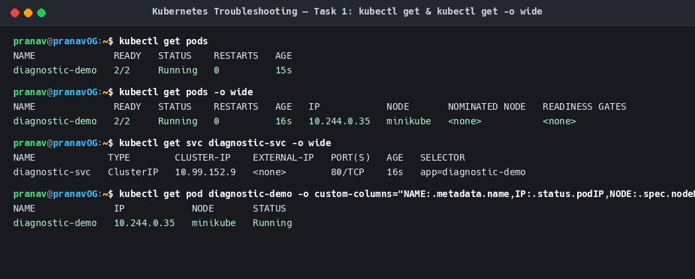

#### Evidence 2: `kubectl describe`
Inspection of container states, readiness conditions, and recent kubelet events.
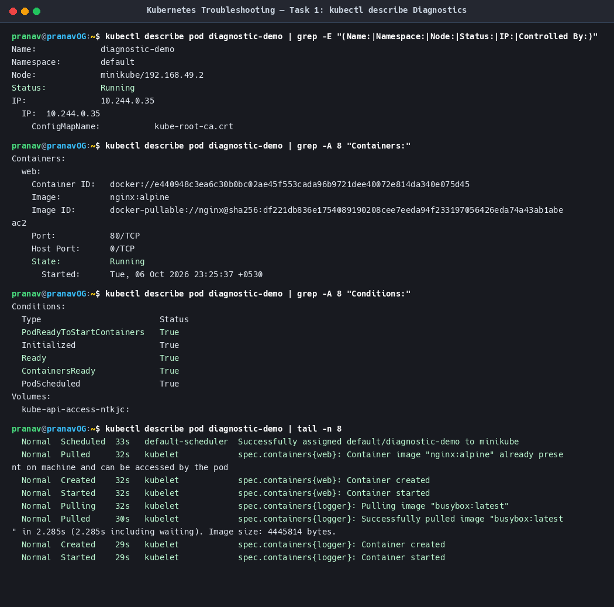

#### Evidence 3: `kubectl logs` & `kubectl exec`
Container-level log tailing and live interactive inspection (`ps aux`, `wget` loopback check, `/etc/resolv.conf`).
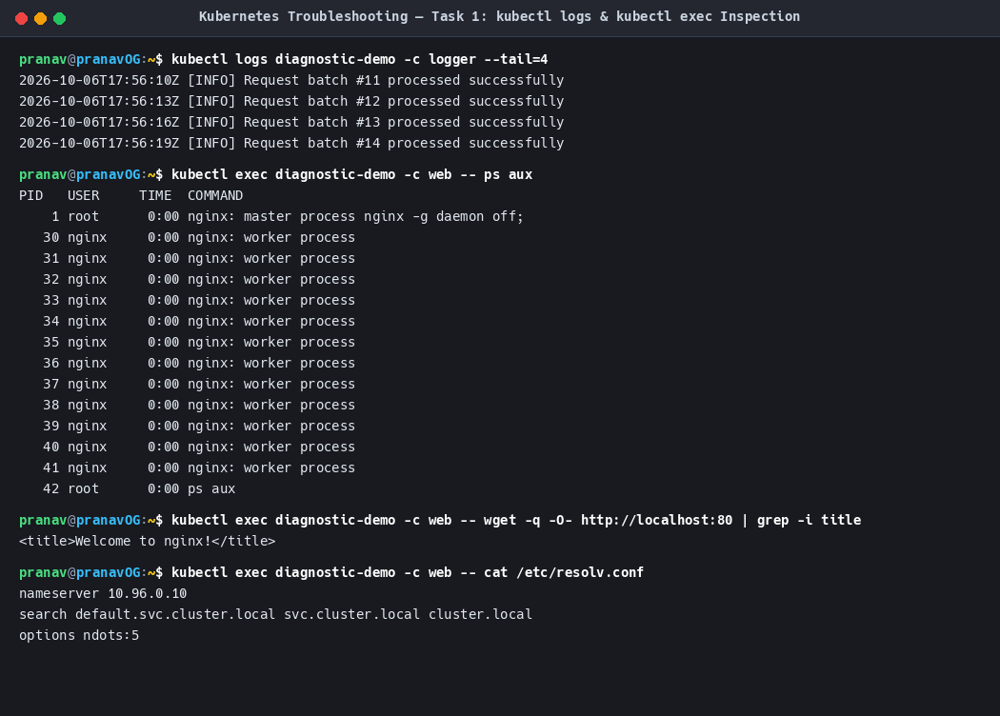

#### Evidence 4: `kubectl events`, `explain` & `top`
Namespace-wide sorted event auditing, schema querying, and real-time container metrics.
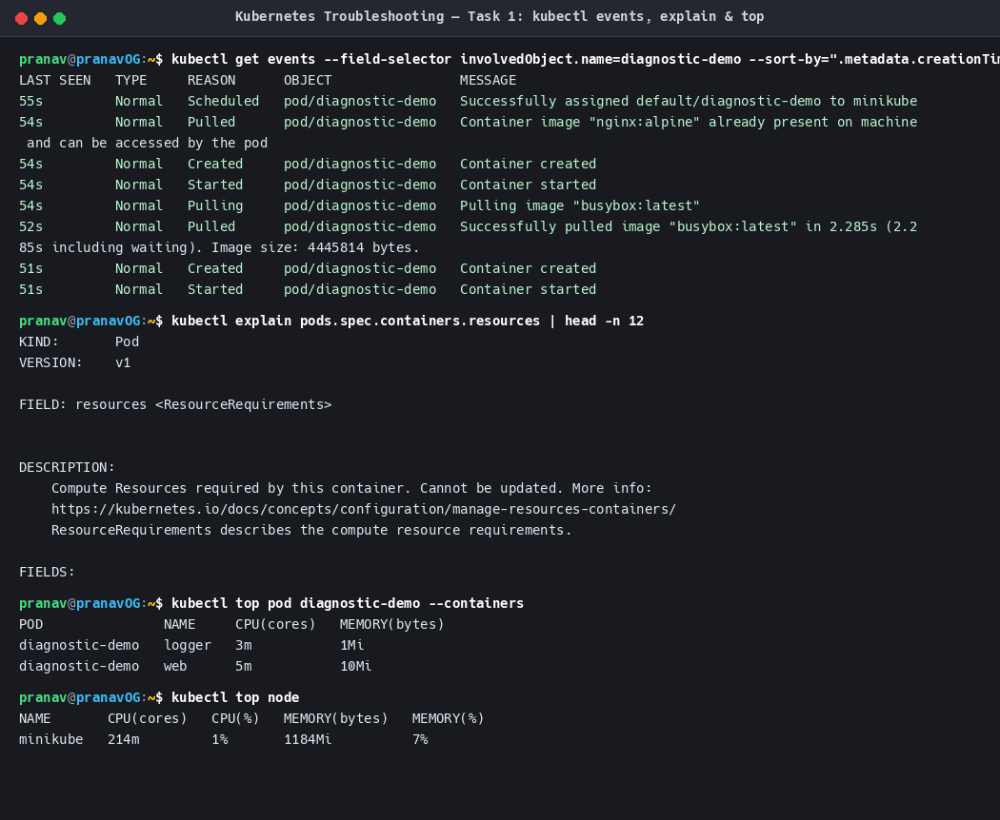

---

## Task 2: Troubleshooting Common Issues

### 2.1 Summary Playbook

| Issue | Root Cause | Investigation Command | Verified Fix |
|---|---|---|---|
| **CrashLoopBackOff** | Non-existent command / fatal script crash | `kubectl logs <pod> --previous` | Corrected entrypoint args |
| **ErrImagePull** | Invalid/non-existent image tag | `kubectl describe pod <pod>` Events | Specified valid image tag (`nginx:alpine`) |
| **Pending** | CPU request exceeds total node capacity | `kubectl describe pod` -> FailedScheduling | Adjusted CPU request to fit node allocatable |
| **ContainerCreating** | Missing ConfigMap volume reference | `kubectl describe pod` -> FailedMount | Created required ConfigMap resource |
| **Service Connectivity** | Label selector mismatch | `kubectl get endpoints <svc>` -> `<none>` | Aligned Service selector with Pod labels |
| **DNS Resolution** | Wrong namespace / malformed FQDN | `kubectl exec -it -- nslookup <svc>` | Used correct FQDN (`<svc>.<ns>.svc.cluster.local`) |
| **Pod Networking** | Server bound to `127.0.0.1` instead of `0.0.0.0` | `curl <pod-ip>:<port>` -> Connection Refused | Bound server socket to `0.0.0.0` |
| **Configuration Error** | Missing key in Secret reference | `kubectl describe pod` -> couldn't find key | Updated `valueFrom.secretKeyRef.key` |

### 2.2 Visual Evidence for Task 2

#### Evidence 5: CrashLoopBackOff Investigation & Fix
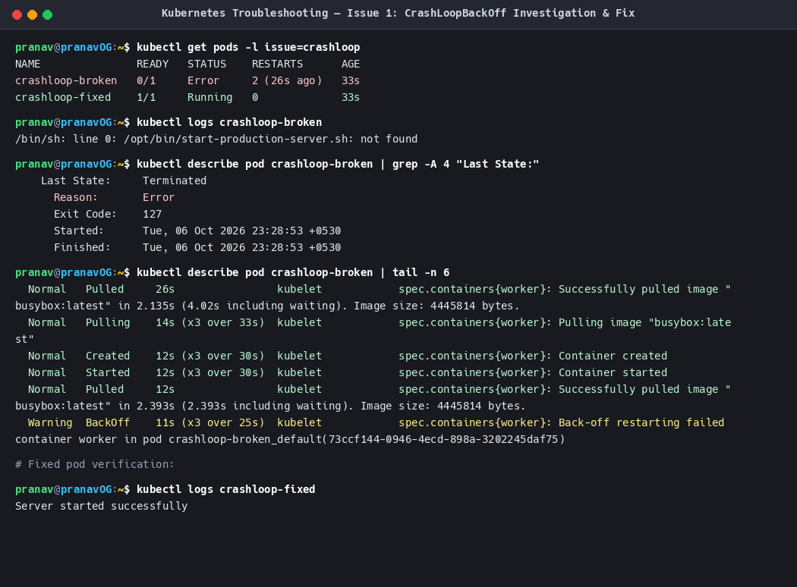

#### Evidence 6: ErrImagePull & ImagePullBackOff Investigation & Fix
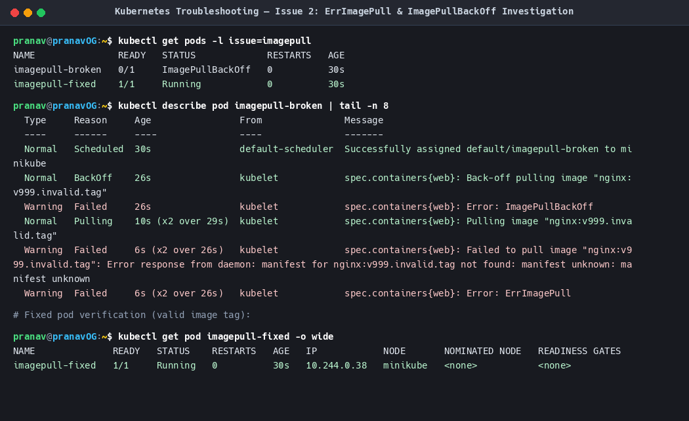

#### Evidence 7: Pending State & Scheduler Capacity Failure Investigation & Fix
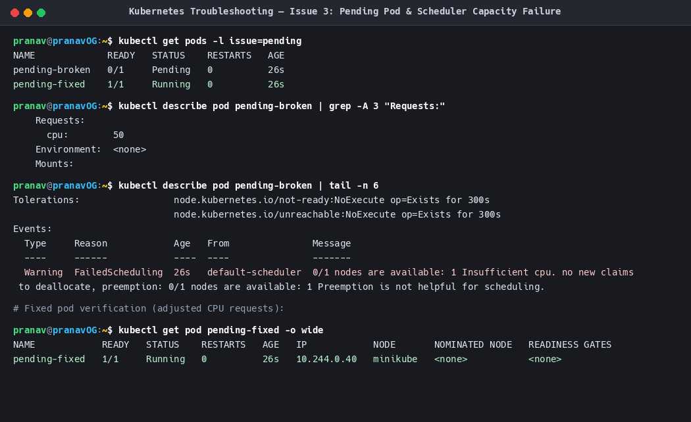

#### Evidence 8: ContainerCreating & FailedMount Investigation & Fix
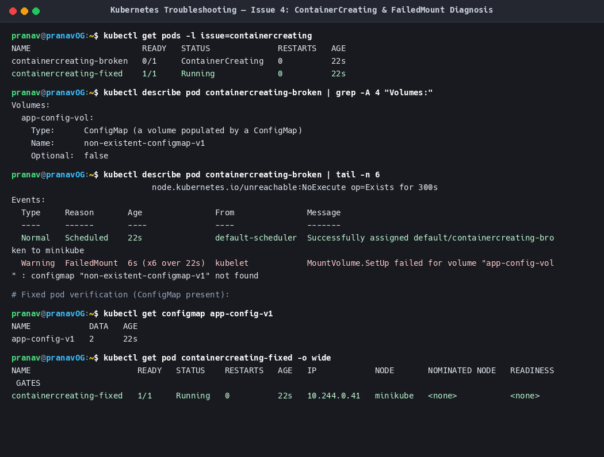

#### Evidence 9: Service Connectivity & Selector Mismatch Investigation & Fix
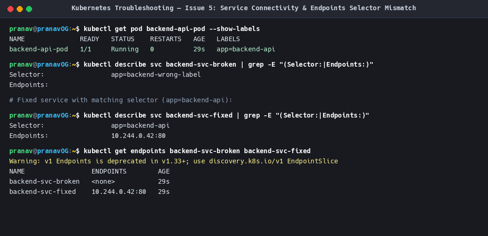

#### Evidence 10: CoreDNS Service Resolution & FQDN Verification
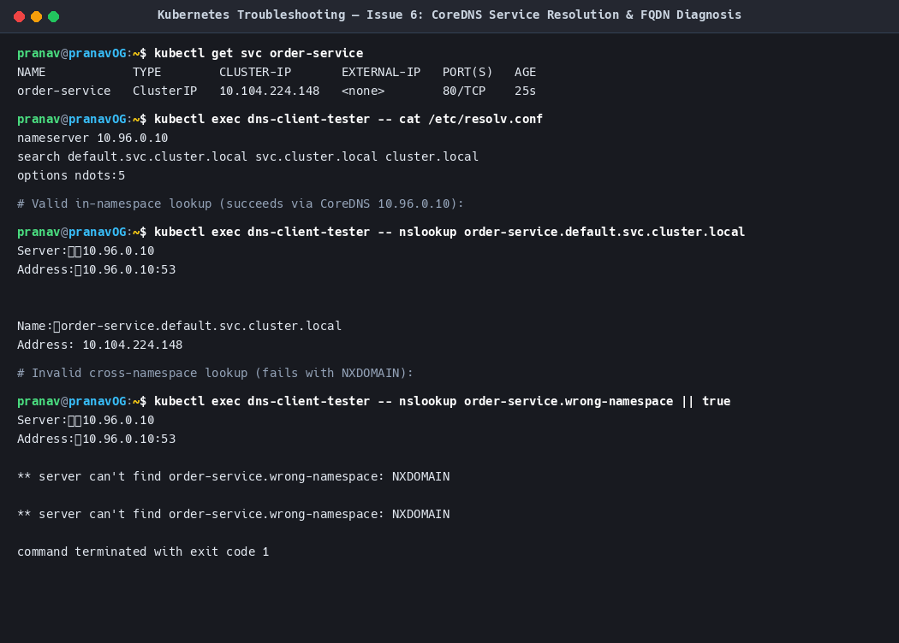

#### Evidence 11: Pod Networking (Localhost vs 0.0.0.0 Binding)
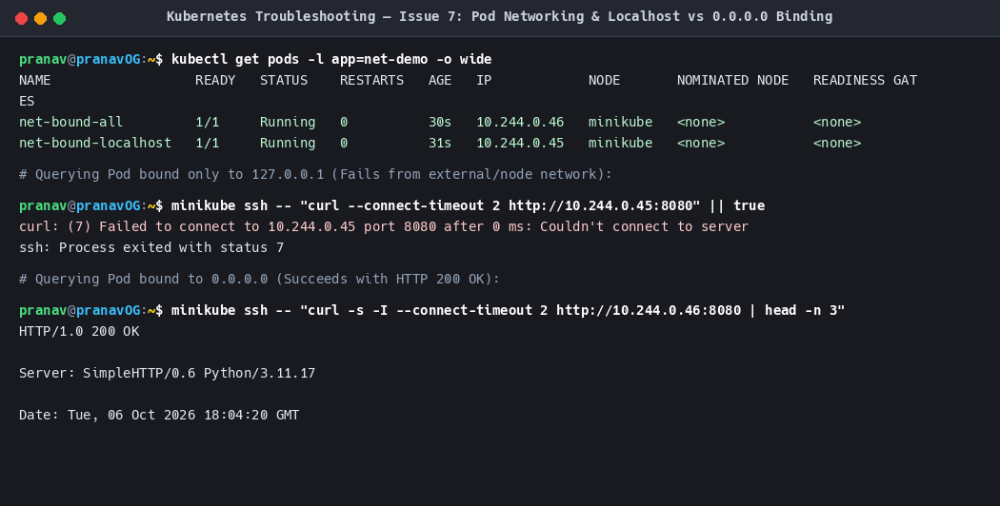

#### Evidence 12: CreateContainerConfigError & Missing Secret Keys
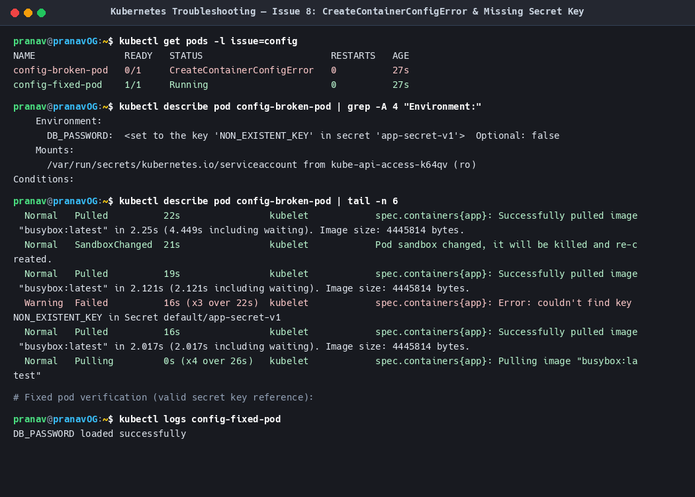

---

## Task 3: Mini-Project — Operation Triage: ShopSphere Incident

### 3.1 Outage Scenario & Architecture
A production deployment in `shopsphere-incident` caused platform-wide degradation:
- Database stuck in **`Pending`** due to requesting 25 CPU cores on a 12-core node.
- Cache stuck in **`ContainerCreating`** due to referencing missing ConfigMap `redis-cluster-missing-config`.
- Backend API in **`CrashLoopBackOff`** due to fatal unhandled exception at bootstrap.
- API Service reporting **`Endpoints: <none>`** due to selector mismatch (`app: api-wrong-selector`).
- Frontend Web tier returning **`502 Bad Gateway`**.

### 3.2 Visual Evidence for Task 3

#### Step 1: Production Outage Incident State
Shows the cluster in degraded state with multiple concurrent failure modes.


#### Step 2: Root Cause Investigation & Diagnostic Triage
Automated triage script auditing CPU allocation, volume mount failures, and service endpoint selectors.


#### Step 3: Platform Remediation & Healthy Workload Convergence
Rollout of `02-fixed-stack.yaml` bringing all 4 tiers to `1/1 Running` and populating all endpoints.


#### Step 4: Post-Remediation Verification & Live Traffic Audit
Live queries returning `HTTP 200 {"status": "healthy"}` and `HTTP/1.1 200 OK` from frontend.


---

## Complete Screenshot Evidence Index

| # | Screenshot | Description |
|---|---|---|
| **01** | [`01-cmd-get-and-wide.png`](./screenshots/01-cmd-get-and-wide.png) | `kubectl get`, `kubectl get -o wide`, and custom column filtering |
| **02** | [`02-cmd-describe.png`](./screenshots/02-cmd-describe.png) | `kubectl describe` inspecting container states, conditions, and events |
| **03** | [`03-cmd-logs-and-exec.png`](./screenshots/03-cmd-logs-and-exec.png) | `kubectl logs` tailing and interactive `kubectl exec` container debugging |
| **04** | [`04-cmd-events-explain-top.png`](./screenshots/04-cmd-events-explain-top.png) | `kubectl events`, API schema querying with `explain`, and `top` metrics |
| **05** | [`05-issue-crashloop.png`](./screenshots/05-issue-crashloop.png) | `CrashLoopBackOff` exit code 127 diagnosis and entrypoint fix |
| **06** | [`06-issue-imagepull.png`](./screenshots/06-issue-imagepull.png) | `ErrImagePull` / `ImagePullBackOff` tag correction |
| **07** | [`07-issue-pending.png`](./screenshots/07-issue-pending.png) | `Pending` pod scheduler capacity exhaustion resolution |
| **08** | [`08-issue-containercreating.png`](./screenshots/08-issue-containercreating.png) | `ContainerCreating` FailedMount missing ConfigMap resolution |
| **09** | [`09-issue-service-connectivity.png`](./screenshots/09-issue-service-connectivity.png) | Service label selector mismatch and endpoint restoration |
| **10** | [`10-issue-dns-resolution.png`](./screenshots/10-issue-dns-resolution.png) | CoreDNS FQDN cross-namespace resolution troubleshooting |
| **11** | [`11-issue-pod-networking.png`](./screenshots/11-issue-pod-networking.png) | Pod networking loopback `127.0.0.1` vs `0.0.0.0` interface binding |
| **12** | [`12-issue-configuration-secret.png`](./screenshots/12-issue-configuration-secret.png) | `CreateContainerConfigError` missing Secret key diagnosis and fix |
| **13** | [`13-miniproject-incident-overview.png`](./screenshots/13-miniproject-incident-overview.png) | Mini-project initial outage overview across all four application tiers |
| **14** | [`14-miniproject-triage-investigation.png`](./screenshots/14-miniproject-triage-investigation.png) | Automated root-cause isolation audit script transcript |
| **15** | [`15-miniproject-remediation-applied.png`](./screenshots/15-miniproject-remediation-applied.png) | Fixed stack deployment and healthy workload rollout |
| **16** | [`16-miniproject-service-verification.png`](./screenshots/16-miniproject-service-verification.png) | Live curl verification across API and Frontend web tiers |

---

## How to Reproduce Everything

```bash
# 1. Practice Diagnostic Commands (Task 1):
kubectl apply -f 01-troubleshooting-commands/app-workload.yaml
kubectl get pods -o wide
kubectl describe pod diagnostic-demo
kubectl logs diagnostic-demo -c logger --tail=10
kubectl exec diagnostic-demo -c web -- ps aux
kubectl top pod diagnostic-demo
kubectl delete -f 01-troubleshooting-commands/app-workload.yaml

# 2. Practice Common Issues (Task 2):
kubectl apply -f 02-troubleshoot-common-issues/01-crashloop.yaml
kubectl apply -f 02-troubleshoot-common-issues/02-imagepull.yaml
kubectl apply -f 02-troubleshoot-common-issues/03-pending.yaml
kubectl apply -f 02-troubleshoot-common-issues/04-containercreating.yaml
kubectl apply -f 02-troubleshoot-common-issues/05-service-connectivity.yaml
kubectl apply -f 02-troubleshoot-common-issues/06-dns-issues.yaml
kubectl apply -f 02-troubleshoot-common-issues/07-pod-networking.yaml
kubectl apply -f 02-troubleshoot-common-issues/08-configuration-issues.yaml

# 3. Execute Incident Triage Mini-Project (Task 3):
./03-mini-project/scripts/deploy-broken.sh
./03-mini-project/scripts/investigate.sh
./03-mini-project/scripts/apply-fix.sh
./03-mini-project/scripts/verify-healthy.sh
./03-mini-project/scripts/cleanup.sh
```
