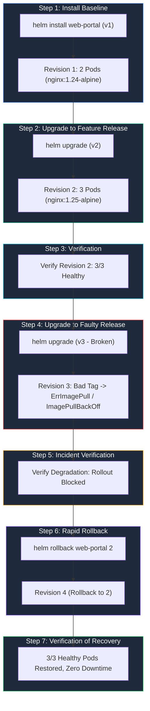

# Session 15 — Task 2: Helm Complete Rollback Lifecycle

This document provides a complete, production-grade demonstration of Helm's release versioning and rollback mechanism:
$$\text{Install (v1)} \longrightarrow \text{Upgrade (v2)} \longrightarrow \text{Verify} \longrightarrow \text{Upgrade (v3 - Broken)} \longrightarrow \text{Verify Failure} \longrightarrow \text{Rollback (to v2)} \longrightarrow \text{Verify Restored Health}$$

---

## Architectural Workflow Diagram



---

## Release Revisions Specification

| Revision | Values File | Image Tag | Replicas | Environment | State / Description |
|---|---|---|---|---|---|
| **Rev 1** | [`values-v1.yaml`](values-v1.yaml) | `nginx:1.24-alpine` | `2` | `v1.0.0-stable` | Initial production baseline |
| **Rev 2** | [`values-v2.yaml`](values-v2.yaml) | `nginx:1.25-alpine` | `3` | `v2.0.0-feature` | Enhanced version with scale-out |
| **Rev 3** | [`values-v3.yaml`](values-v3.yaml) | `nginx:1.26-alpine-invalid-tag-fail` | `3` | `v3.0.0-broken` | Faulty rollout triggering `ImagePullBackOff` |
| **Rev 4** | *(Rolled back to Rev 2)* | `nginx:1.25-alpine` | `3` | `v2.0.0-feature` | Automated recovery restoring Rev 2 state |

---

## Detailed Step-by-Step Execution

### Step 1: Initial Deployment (Revision 1)
Deploy the baseline application with 2 replicas using `values-v1.yaml`:
```bash
helm install web-portal ./web-portal -f values-v1.yaml -n rollback-demo --create-namespace
kubectl rollout status deployment/web-portal -n rollback-demo --timeout=60s
helm list -n rollback-demo
```
**Output:**
```
NAME: web-portal
LAST DEPLOYED: Tue Oct  6 23:57:56 2026
NAMESPACE: rollback-demo
STATUS: deployed
REVISION: 1
deployment "web-portal" successfully rolled out
```

---

### Step 2: Feature Upgrade (Revision 2)
Perform a rolling upgrade applying `values-v2.yaml` (upgrading image from `1.24-alpine` to `1.25-alpine` and scaling from 2 to 3 replicas):
```bash
helm upgrade web-portal ./web-portal -f values-v2.yaml -n rollback-demo
kubectl rollout status deployment/web-portal -n rollback-demo --timeout=60s
```
**Output:**
```
Release "web-portal" has been upgraded. Happy Helming!
NAME: web-portal
STATUS: deployed
REVISION: 2
deployment "web-portal" successfully rolled out
```

---

### Step 3: Verification of Revision 2
Confirm 3 replicas are running the new image:
```bash
kubectl get pods -n rollback-demo -l app.kubernetes.io/name=web-portal
helm history web-portal -n rollback-demo
```
**Output:**
```
NAME                          READY   STATUS    RESTARTS   AGE
web-portal-769f7bf7d8-cc6jz   1/1     Running   0          14s
web-portal-769f7bf7d8-fsd6f   1/1     Running   0          16s
web-portal-769f7bf7d8-tkp8t   1/1     Running   0          19s

REVISION	UPDATED                 	STATUS    	CHART           	APP VERSION	DESCRIPTION     
1       	Tue Oct  6 23:57:56 2026	superseded	web-portal-0.1.0	1.16.0     	Install complete
2       	Tue Oct  6 23:58:24 2026	deployed  	web-portal-0.1.0	1.16.0     	Upgrade complete
```

---

### Step 4: Upgrade Again (Revision 3 — Introducing Failure)
Deploy `values-v3.yaml`, which specifies a non-existent image tag `nginx:1.26-alpine-invalid-tag-fail`:
```bash
helm upgrade web-portal ./web-portal -f values-v3.yaml -n rollback-demo
```
**Output:**
```
Release "web-portal" has been upgraded. Happy Helming!
NAME: web-portal
STATUS: deployed
REVISION: 3
```

---

### Step 5: Incident Verification (Revision 3 Degradation)
Inspect pods to observe Kubernetes stalling the rollout and flagging `ImagePullBackOff`:
```bash
kubectl get pods -n rollback-demo -l app.kubernetes.io/name=web-portal
```
**Output:**
```
NAME                          READY   STATUS             RESTARTS   AGE
web-portal-6d6d8654bf-fw7h8   0/1     ImagePullBackOff   0          21s
web-portal-769f7bf7d8-cc6jz   1/1     Running            0          29s
web-portal-769f7bf7d8-fsd6f   1/1     Running            0          31s
web-portal-769f7bf7d8-tkp8t   1/1     Running            0          34s
```
> [!WARNING]
> The new ReplicaSet cannot pull the image. Kubernetes keeps the 3 existing Revision 2 pods alive, but the rollout is blocked and cluster alarms are firing.

---

### Step 6: Rollback to Revision 2
Execute `helm rollback` targeting Revision 2:
```bash
helm rollback web-portal 2 -n rollback-demo
kubectl rollout status deployment/web-portal -n rollback-demo --timeout=30s
```
**Output:**
```
Rollback was a success! Happy Helming!
deployment "web-portal" successfully rolled out
```

---

### Step 7: Final Verification of Restored State
Verify that the faulty container is terminated, the 3 healthy Revision 2 pods remain active, and Helm history records the remediation:
```bash
kubectl get pods -n rollback-demo -l app.kubernetes.io/name=web-portal
helm history web-portal -n rollback-demo
```
**Output:**
```
NAME                          READY   STATUS    RESTARTS   AGE
web-portal-769f7bf7d8-cc6jz   1/1     Running   0          52s
web-portal-769f7bf7d8-fsd6f   1/1     Running   0          54s
web-portal-769f7bf7d8-tkp8t   1/1     Running   0          57s

REVISION	UPDATED                 	STATUS    	CHART           	APP VERSION	DESCRIPTION     
1       	Tue Oct  6 23:57:56 2026	superseded	web-portal-0.1.0	1.16.0     	Install complete
2       	Tue Oct  6 23:58:24 2026	superseded	web-portal-0.1.0	1.16.0     	Upgrade complete
3       	Tue Oct  6 23:58:37 2026	superseded	web-portal-0.1.0	1.16.0     	Upgrade complete
4       	Tue Oct  6 23:59:05 2026	deployed  	web-portal-0.1.0	1.16.0     	Rollback to 2   
```

---

## Evidence Screenshots

Terminal evidence screenshots for Task 2 are stored in [`screenshots/`](../screenshots/):
1. `07-rollback-step1-install-v1.png`: Step 1 initial installation of Revision 1 (`values-v1.yaml`).
2. `08-rollback-step2-upgrade-v2.png`: Step 2 upgrade to Revision 2 (`values-v2.yaml`) & rollout completion.
3. `09-rollback-step3-upgrade-v3.png`: Step 3 & 4 upgrade to Revision 3 and detection of `ImagePullBackOff`.
4. `10-rollback-step4-rollback-v2.png`: Step 5 & 6 execution of `helm rollback web-portal 2`.
5. `11-rollback-step5-history-verification.png`: Step 7 verification of restored 3 healthy pods and 4 revisions in Helm history.
