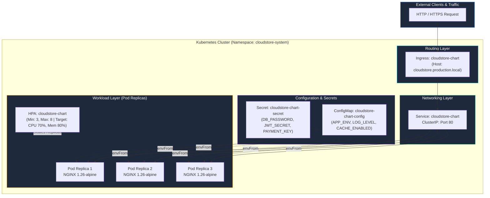

# Session 15 — Task 3: Enterprise Helm Mini-Project — CloudStore Platform

## Overview

The **CloudStore Platform** is a multi-tier, production-ready Helm chart engineered for high-availability enterprise e-commerce workloads on Kubernetes. It packages decoupled application configurations, credential management, Layer 7 ingress routing, health probing, and dynamic CPU/Memory Horizontal Pod Autoscaling (HPA) into a parameterized, reusable Helm package.

---

## Architecture Diagram



---

## Directory Structure

```
03-mini-project/
├── cloudstore-chart/
│   ├── Chart.yaml              # Chart metadata (v1.0.0, AppVersion 2.5.0)
│   ├── values.yaml             # Default development environment values
│   ├── values-staging.yaml     # Staging environment profile
│   ├── values-prod.yaml        # Production HA profile (3 replicas, HPA, Ingress, Secrets)
│   ├── .helmignore             # Packaging ignore rules
│   └── templates/
│       ├── _helpers.tpl        # Reusable template partials (name, fullname, labels)
│       ├── configmap.yaml      # Decoupled application configuration
│       ├── secret.yaml         # Base64-encoded credentials and tokens
│       ├── serviceaccount.yaml # Pod identity RBAC account
│       ├── deployment.yaml     # Enterprise Deployment with rolling update, probes, envFrom
│       ├── service.yaml        # ClusterIP service definition
│       ├── ingress.yaml        # Ingress routing rules & annotations
│       ├── hpa.yaml            # Autoscaling v2 CPU/Memory metrics
│       └── NOTES.txt           # Post-install endpoint guidance
├── scripts/
│   ├── deploy.sh               # Lints, templates, and deploys selected profile
│   ├── upgrade.sh              # Performs zero-downtime rolling upgrade to canary/new image
│   ├── rollback.sh             # Safely rolls back to prior revision
│   ├── verify.sh               # Asserts pod, service, ingress, HPA, and curl traffic health
│   └── cleanup.sh              # Graceful uninstallation and namespace deletion
└── README.md                   # Complete architectural and operational manual
```

---

## Helm Chart Components & Template Mechanics

### 1. `Chart.yaml`
```yaml
apiVersion: v2
name: cloudstore-chart
description: Enterprise CloudStore e-commerce platform Helm chart with ConfigMaps, Secrets, Ingress, Probes, and HPA
type: application
version: 1.0.0
appVersion: "2.5.0"
maintainers:
  - name: Pranav Gupta
    email: 24bcs10237@cuchd.in
```

### 2. Environment Profiles Comparison

| Parameter | Development (`values.yaml`) | Staging (`values-staging.yaml`) | Production (`values-prod.yaml`) |
|---|---|---|---|
| **Replicas** | `1` | `2` | `3` (Baseline) |
| **Autoscaling (HPA)** | Disabled | Disabled | Enabled (Min 3, Max 8, CPU 70%, Mem 80%) |
| **Ingress Host** | `cloudstore.local` (Disabled) | `staging.cloudstore.local` | `cloudstore.production.local` |
| **Resource CPU Request** | `50m` | `30m` | `50m` |
| **Resource CPU Limit** | `200m` | `150m` | `250m` |
| **Config `APP_ENV`** | `development` | `staging` | `production` |
| **Config `LOG_LEVEL`** | `debug` | `info` | `warn` |

### 3. Key Template Features
- **ConfigMap & Secret Injection**: `deployment.yaml` utilizes `envFrom` pointing dynamically to `{{ include "cloudstore-chart.fullname" . }}-config` and `-secret`.
- **Zero-Downtime Rollout Strategy**: `strategy.rollingUpdate.maxSurge: 1` and `maxUnavailable: 0` ensures zero service interruption during upgrades.
- **Dual Probes**: Configurable HTTP `livenessProbe` (period: 10s, timeout: 3s) and `readinessProbe` (period: 5s, timeout: 2s) gating endpoints.
- **Conditional Ingress & HPA**: Gated via `{{- if .Values.ingress.enabled }}` and `{{- if .Values.autoscaling.enabled }}`.

---

## Operational Workflow & CLI Execution

### Step 1: Chart Validation & Template Rendering
```bash
helm lint cloudstore-chart
helm template cloudstore cloudstore-chart -f cloudstore-chart/values-prod.yaml | head -n 35
```
**Result**: Passed with `0 chart(s) failed`, valid Kubernetes YAML generated.

### Step 2: Staging Deployment
```bash
./scripts/deploy.sh staging
helm list -n cloudstore-system
kubectl get deployment,pods,svc,ingress -n cloudstore-system
```
**Result**: 2 replicas running on `staging.cloudstore.local`.

### Step 3: Production Deployment
```bash
./scripts/deploy.sh prod
kubectl get deployment,pods,hpa,ingress -n cloudstore-system
helm status cloudstore -n cloudstore-system
```
**Result**: 3/3 replicas running, HPA registered targeting 3-8 replicas, ingress registered for `cloudstore.production.local`.

### Step 4: Zero-Downtime Rolling Upgrade
```bash
./scripts/upgrade.sh 1.27-alpine
helm history cloudstore -n cloudstore-system
./scripts/verify.sh
```
**Result**: Kubernetes performed zero-downtime rolling replacement to `nginx:1.27-alpine`. Revision 3 deployed. Live HTTP curl returns `HTTP 200 OK`.

### Step 5: Production Rollback & Teardown
```bash
./scripts/rollback.sh 2
helm history cloudstore -n cloudstore-system
./scripts/verify.sh
./scripts/cleanup.sh
```
**Result**: Seamlessly rolled back to Revision 2. Revision 4 recorded as `Rollback to 2`. Verification verified all 3 replicas active, followed by clean cluster uninstallation.

---

## Evidence Screenshots

Terminal evidence screenshots for Task 3 are stored in [`screenshots/`](../screenshots/):
1. `12-miniproject-chart-lint-template.png`: Chart lint validation and dry-run manifest rendering.
2. `13-miniproject-staging-install.png`: Staging environment installation and release verification.
3. `14-miniproject-prod-install-hpa.png`: Production installation featuring HPA autoscaling, 3 replicas, and Ingress.
4. `15-miniproject-upgrade-canary.png`: Rolling upgrade to image `1.27-alpine` and full endpoint verification.
5. `16-miniproject-rollback-verification.png`: Rollback to Revision 2, verification of restored pods and clean teardown.
