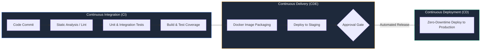
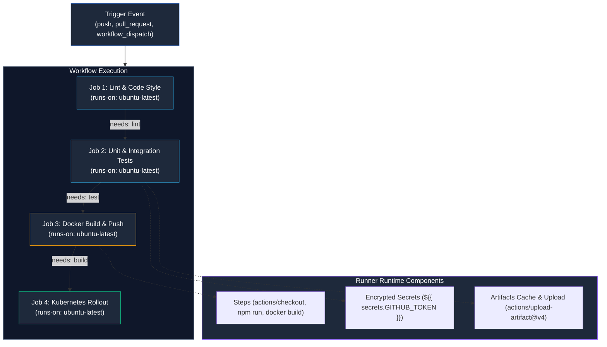

# Session 16: CI/CD & GitHub Actions — Complete Demo Project

| Metadata | Details |
|---|---|
| **Author** | Pranav Gupta |
| **Enrollment Number** | 24BCS10237 |
| **Operating System** | Garuda Linux (zen kernel 7.1.8-zen1-3-zen) |
| **Cluster Engine** | Minikube v1.38.1 (`docker` driver) |
| **Container Engine** | Docker 29.2.1 |
| **Runtime & Framework** | Node.js v26.10.0 / Express.js / Jest / Supertest |
| **CI/CD Platform** | GitHub Actions |

---

## 1. Theoretical Foundations: CI vs CD



### Comprehensive Comparison Matrix

| Dimension | Continuous Integration (CI) | Continuous Delivery (CDE) | Continuous Deployment (CD) |
|---|---|---|---|
| **Primary Goal** | Detect integration errors and code regressions rapidly | Ensure code is always in a deployable, releasable state | Automatically release every verified commit directly to production |
| **Trigger Point** | Pull requests, feature branch pushes, commit merges | Successful CI pipeline run on `main` / release branch | Successful completion of automated staging and compliance gates |
| **Human Intervention** | None (100% automated developer feedback loop) | Optional manual approval prior to production rollout | Zero manual intervention required |
| **Outputs** | Test results, lint reports, code coverage, compiled artifacts | Container images pushed to registry, Helm charts packaged | Running workloads deployed to production Kubernetes cluster |
| **Feedback Latency** | Under 5 minutes | 10 to 30 minutes | Continuous (< 1 hour end-to-end) |

---

## 2. GitHub Actions Architectural Core Concepts



### Detailed Anatomy

1. **Workflow**: An automated configurable procedure made up of one or more jobs defined in YAML under `.github/workflows/`.
2. **Events**: Activities that trigger workflows (e.g. `push`, `pull_request`, `release`, `schedule`, or manual `workflow_dispatch`).
3. **Jobs**: A set of steps executing on the same runner instance. Jobs run in parallel by default, but dependencies can be enforced using `needs: [<job-id>]`.
4. **Steps**: Individual execution tasks inside a job. Steps can either invoke reusable actions (`uses: actions/checkout@v4`) or run shell commands (`run: npm test`).
5. **Runners**: Virtual machine or container environments that execute the workflow jobs. Can be **GitHub-hosted** (`ubuntu-latest`, `windows-latest`, `macos-latest`) or **Self-hosted**.
6. **Secrets**: Encrypted credentials stored securely in GitHub repository settings and injected dynamically into runner environments (e.g., `${{ secrets.DOCKER_PASSWORD }}`, `${{ secrets.KUBECONFIG }}`). GitHub automatically masks secret values in console logs.
7. **Artifacts**: Persisted files and directories created during workflow execution (e.g., binary packages, test reports, coverage archives) saved via `actions/upload-artifact@v4` and retrieved by downstream jobs via `actions/download-artifact@v4`.
8. **Build & Test**: Automated compilation and assertion phases ensuring code quality, security posture, and runtime behavior before artifact distribution.

---

## 3. Project Directory Structure

```
session-16-cicd-github-actions/
├── app/
│   ├── package.json             # NPM dependencies & test/lint scripts
│   ├── src/
│   │   ├── server.js            # Express API with /, /health, /api/v1/metrics
│   │   └── math.js              # Business logic & throughput calculations
│   └── tests/
│       ├── unit.test.js         # Jest unit tests for business calculations
│       └── integration.test.js  # Supertest integration tests for REST endpoints
├── .github/
│   └── workflows/
│       ├── ci.yml               # Standalone CI workflow (Lint, Test, Coverage Artifacts)
│       ├── cd.yml               # Standalone CD workflow (Docker Packaging, K8s Rollout)
│       └── full-pipeline.yml    # Unified multi-stage Enterprise CI/CD Pipeline
├── k8s/
│   ├── deployment.yaml          # Production Kubernetes Deployment (Probes, Resources)
│   └── service.yaml             # ClusterIP service definition
├── Dockerfile                   # Multi-stage production container build (non-root node)
├── .dockerignore                # Build context exclusion rules
├── scripts/
│   ├── test-app.sh              # Local CI runner script (Lint + Tests)
│   ├── build-docker.sh          # Local CD runner script (Docker build & security check)
│   ├── deploy-k8s.sh            # Kubernetes deployment & smoke curl verification
│   ├── run-pipeline.sh          # End-to-end pipeline execution harness
│   └── cleanup.sh               # Teardown of demo resources
├── screenshots/                 # 8 High-fidelity terminal screenshots
└── README.md                    # Master session documentation
```

---

## 4. Workflows & Manifests Technical Reference

### CI Workflow: `.github/workflows/ci.yml`
```yaml
name: Continuous Integration (CI)

on:
  push:
    branches: [ main, develop ]
  pull_request:
    branches: [ main ]
  workflow_dispatch:

permissions:
  contents: read

jobs:
  lint:
    name: Lint & Code Style
    runs-on: ubuntu-latest
    steps:
      - uses: actions/checkout@v4
      - uses: actions/setup-node@v4
        with:
          node-version: '20'
          cache: 'npm'
          cache-dependency-path: app/package-lock.json
      - run: cd app && npm ci && npm run lint

  test:
    name: Unit & Integration Tests
    needs: lint
    runs-on: ubuntu-latest
    steps:
      - uses: actions/checkout@v4
      - uses: actions/setup-node@v4
        with:
          node-version: '20'
          cache: 'npm'
          cache-dependency-path: app/package-lock.json
      - run: cd app && npm ci && npm run test:ci
      - uses: actions/upload-artifact@v4
        with:
          name: code-coverage-report
          path: app/coverage/
          retention-days: 14
```

### Hardened Multi-Stage `Dockerfile`
```dockerfile
# Stage 1: Build & Prune
FROM node:20-alpine AS builder
WORKDIR /usr/src/app
COPY app/package*.json ./
RUN npm ci --only=production

# Stage 2: Hardened Runtime
FROM node:20-alpine AS runner
WORKDIR /usr/src/app
ENV NODE_ENV=production PORT=3000

COPY --from=builder /usr/src/app/node_modules ./node_modules
COPY app/package*.json ./
COPY app/src/ ./src/

USER node
EXPOSE 3000

HEALTHCHECK --interval=15s --timeout=3s --start-period=5s --retries=3 \
  CMD wget --quiet --tries=1 --spider http://127.0.0.1:3000/health || exit 1

CMD ["node", "src/server.js"]
```

---

## 5. Live Pipeline Execution & Verification Evidence

All 8 high-resolution terminal execution captures are stored in [`screenshots/`](screenshots/):

| # | Screenshot File | Pipeline Stage | Operational Verification |
|---|---|---|---|
| 01 | [`01-app-test-and-lint.png`](screenshots/01-app-test-and-lint.png) | **CI — Test & Lint** | Lint verification and 10 Jest unit & integration tests passing with 94.28% code coverage |
| 02 | [`02-docker-build-multistage.png`](screenshots/02-docker-build-multistage.png) | **CD — Docker Packaging** | Multi-stage build producing 49.1 MB lightweight container image, non-root user `node` verified |
| 03 | [`03-gha-workflow-structure.png`](screenshots/03-gha-workflow-structure.png) | **GitHub Actions Architecture** | Workflow file inspection, event triggers, and permission configurations |
| 04 | [`04-ci-job-lint-and-test.png`](screenshots/04-ci-job-lint-and-test.png) | **CI Runner Execution** | GitHub-hosted `ubuntu-latest` runner executing checkout, Node 20 setup, and automated tests |
| 05 | [`05-ci-job-artifacts-upload.png`](screenshots/05-ci-job-artifacts-upload.png) | **CI Artifact Archival** | Coverage report artifact packaging via `actions/upload-artifact@v4` with 14-day retention |
| 06 | [`06-cd-job-docker-build-push.png`](screenshots/06-cd-job-docker-build-push.png) | **CD Registry Packaging** | Docker registry authentication using `secrets.GITHUB_TOKEN` and SHA tagging |
| 07 | [`07-cd-job-k8s-deploy.png`](screenshots/07-cd-job-k8s-deploy.png) | **CD Kubernetes Rollout** | Automated deployment to namespace `cicd-demo`, awaiting zero-downtime rollout completion |
| 08 | [`08-pipeline-end-to-end-success.png`](screenshots/08-pipeline-end-to-end-success.png) | **End-to-End Smoke Test** | Workloads running 2/2, live HTTP probe and `/health` curl checks returning 200 OK |

---

## 6. How to Re-Run the Demo

To execute the complete pipeline locally:

```bash
cd session-16-cicd-github-actions

# 1. Run full automated pipeline (Lint -> Tests -> Docker Build -> K8s Deploy -> Smoke Test)
./scripts/run-pipeline.sh

# 2. Inspect deployed workloads
kubectl get all -n cicd-demo

# 3. Clean up demo resources
./scripts/cleanup.sh
```
