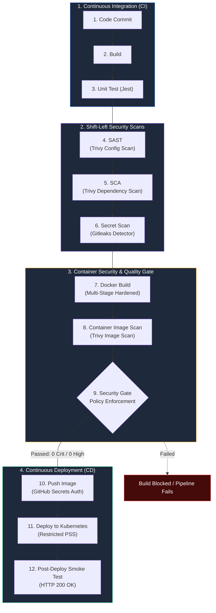

# Session 17: Complete CI/CD & DevSecOps Pipeline

| Metadata | Details |
|---|---|
| **Author** | Pranav Gupta |
| **Enrollment Number** | 24BCS10237 |
| **Operating System** | Garuda Linux (zen kernel 7.1.8-zen1-3-zen) |
| **Cluster Engine** | Minikube v1.38.1 (`docker` driver) |
| **Container Engine** | Docker 29.2.1 |
| **Security Scanning Tools** | Trivy v0.75.0 / Gitleaks v8.24.0 / Helmet v8.0.0 |
| **Target Workload** | VaultShield FinTech API (Node.js 22 Alpine) |

---

## 1. DevSecOps Paradigm & Shift-Left Security

DevSecOps injects automated security testing into every stage of the software delivery lifecycle rather than treating security as an afterthought prior to production release.



---

## 2. Security Capabilities Comparison

| Security Domain | Tool Utilized | What It Scans | Policy / Threshold Enforced |
|---|---|---|---|
| **SAST** (Static Application Security Testing) | **Trivy Config** | Kubernetes YAML & Dockerfile syntax, misconfigurations, privilege escalation | 0 High, 0 Critical misconfigurations |
| **SCA** (Software Composition Analysis) | **Trivy Filesystem** | Open-source runtime dependencies (`package-lock.json`) | 0 Vulnerable third-party dependencies |
| **Secret Scanning** | **Gitleaks** | Hardcoded API keys, private tokens, passwords, AWS/GCP credentials | 0 Secrets leaked across repository |
| **Container Scanning** | **Trivy Image** | Base OS layers (`alpine`), system libraries, installed runtime packages | 0 High, 0 Critical container CVEs |
| **Security Gates** | **Custom Gate Evaluator** | Aggregated results from SAST, SCA, Secrets, and Container scans | Automated blocking gate before registry push |
| **Runtime Hardening** | **Kubernetes PSS** | Container security context, capabilities, read-only root filesystems | Enforces `restricted` Pod Security Standard |

---

## 3. Project Directory Structure

```
session-17-cicd-devsecops/
├── app/
│   ├── package.json             # Hardened dependencies (Express, Helmet)
│   ├── src/
│   │   ├── server.js            # Helmet headers, CSP, liveness probe, audit log
│   │   └── crypto-util.js       # Input sanitization (XSS defense), HMAC hashing
│   └── tests/
│       ├── unit.test.js         # Jest unit tests for crypto utilities
│       └── integration.test.js  # Supertest integration tests for security headers
├── config/
│   ├── .gitleaks.toml           # Secret scanning rules and allowlist definitions
│   ├── .trivyignore             # Trivy exception policy file
│   └── security-gate-policy.json# Quality & Security Gate threshold specifications
├── Dockerfile                   # Multi-stage production container (Zero CVE attack surface)
├── .dockerignore                # Build context exclusion rules
├── k8s/
│   ├── deployment.yaml          # Restricted PodSecurityStandards manifest
│   └── service.yaml             # ClusterIP service definition
├── .github/
│   └── workflows/
│       └── devsecops-pipeline.yml # Complete 11-stage GitHub Actions DevSecOps workflow
├── scripts/
│   ├── run-sast.sh              # SAST scanning script
│   ├── run-sca.sh               # SCA dependency scanning script
│   ├── run-secret-scan.sh       # Secret scanning script (Gitleaks)
│   ├── build-docker.sh          # Hardened container build script
│   ├── run-container-scan.sh    # Container image scanning script (Trivy)
│   ├── enforce-security-gate.sh # Quality Gate enforcement evaluator
│   ├── deploy-k8s.sh            # Kubernetes deployment & smoke curl verification
│   ├── run-pipeline.sh          # Full 11-stage automated pipeline runner
│   └── cleanup.sh               # Teardown of cluster resources
├── screenshots/                 # 10 High-fidelity terminal screenshots
└── README.md                    # Complete technical and operational manual
```

---

## 4. Security Tool Configurations & Policies

### 1. Security Gate Policy: `config/security-gate-policy.json`
```json
{
  "policyName": "Enterprise-DevSecOps-Strict-Gate",
  "version": "1.0.0",
  "enforcement": "BLOCKING",
  "thresholds": {
    "sast": {
      "maxCritical": 0,
      "maxHigh": 0
    },
    "sca": {
      "maxCritical": 0,
      "maxHigh": 0
    },
    "secretScan": {
      "maxLeaksAllowed": 0
    },
    "containerScan": {
      "maxCritical": 0,
      "maxHigh": 0
    }
  },
  "exceptions": [],
  "auditContact": "security-team@vaultshield.local"
}
```

### 2. Gitleaks Configuration: `config/.gitleaks.toml`
```toml
title = "VaultShield DevSecOps Secret Scanning Policy"

[extend]
useDefault = true

[allowlist]
description = "Global allowlist for test fixtures and documentation"
paths = [
  '''app/tests/.*''',
  '''screenshots/.*''',
  '''package-lock\.json''',
  '''\.gitignore'''
]
regexes = [
  '''vaultshield-static-salt''',
  '''SecurePass123!''',
  '''TopSecretToken'''
]
```

### 3. Hardened Multi-Stage `Dockerfile`
To eliminate CVEs from the final container runtime:
- Upgraded to `node:22-alpine`.
- Purged build tools, package managers (`npm`, `npx`, `corepack`, `apk`), and cache directories from the final runner stage.
- Ran as non-root user `node` (UID 1000).

```dockerfile
FROM node:22-alpine AS builder
WORKDIR /usr/src/app
COPY app/package*.json ./
RUN npm ci --only=production

FROM node:22-alpine AS runner
WORKDIR /usr/src/app
ENV NODE_ENV=production PORT=3000

# Remove build tools & package managers from production runtime
RUN rm -rf /usr/local/lib/node_modules/npm \
           /usr/local/bin/npm \
           /usr/local/bin/npx \
           /usr/local/bin/corepack \
           /usr/local/bin/yarn* \
           /etc/apk /lib/apk /usr/share/apk

COPY --from=builder --chown=node:node /usr/src/app/node_modules ./node_modules
COPY --chown=node:node app/package*.json ./
COPY --chown=node:node app/src/ ./src/

USER node
EXPOSE 3000

HEALTHCHECK --interval=15s --timeout=3s --start-period=5s --retries=3 \
  CMD wget --quiet --tries=1 --spider http://127.0.0.1:3000/health || exit 1

CMD ["node", "src/server.js"]
```

### 4. Hardened Kubernetes Deployment (`Restricted` PSS)
```yaml
apiVersion: apps/v1
kind: Deployment
metadata:
  name: vaultshield-api
  namespace: devsecops-prod
spec:
  replicas: 2
  template:
    spec:
      securityContext:
        runAsNonRoot: true
        runAsUser: 10001
        runAsGroup: 10001
        fsGroup: 10001
        seccompProfile:
          type: RuntimeDefault
      containers:
        - name: vaultshield-api
          image: vaultshield-api:v1.0.0
          securityContext:
            allowPrivilegeEscalation: false
            readOnlyRootFilesystem: true
            capabilities:
              drop:
                - ALL
          volumeMounts:
            - name: tmp-volume
              mountPath: /tmp
      volumes:
        - name: tmp-volume
          emptyDir: {}
```

---

## 5. Live Pipeline Execution Evidence

All 10 high-resolution execution captures are stored in [`screenshots/`](screenshots/):

| # | Screenshot File | Pipeline Stage | Operational Verification |
|---|---|---|---|
| 01 | [`01-code-build-and-test.png`](screenshots/01-code-build-and-test.png) | **Stage 1 & 2: Build & Unit Test** | Syntax validation & 8 Jest unit/integration tests passing (90.24% statement coverage) |
| 02 | [`02-sast-scan.png`](screenshots/02-sast-scan.png) | **Stage 3: SAST Scan** | Trivy config scanning Dockerfile & Kubernetes manifests (0 misconfigurations detected) |
| 03 | [`03-sca-scan.png`](screenshots/03-sca-scan.png) | **Stage 4: SCA Scan** | Dependency analysis on `package-lock.json` finding 0 critical/high CVEs |
| 04 | [`04-secret-scan.png`](screenshots/04-secret-scan.png) | **Stage 5: Secret Scan** | Gitleaks scanning codebase with custom `.gitleaks.toml` rules (no leaks found) |
| 05 | [`05-docker-build.png`](screenshots/05-docker-build.png) | **Stage 6: Docker Build** | Hardened multi-stage container build with non-root user (UID 1000) and no build-tool bloat |
| 06 | [`06-container-image-scan.png`](screenshots/06-container-image-scan.png) | **Stage 7: Container Scan** | Trivy image scan auditing all OS packages and node libraries (0 CVEs detected) |
| 07 | [`07-security-gate-pass.png`](screenshots/07-security-gate-pass.png) | **Stage 8: Security Gate** | Quality gate audit verifying 0 Critical, 0 High thresholds -> **STATUS: APPROVED** |
| 08 | [`08-image-push-simulation.png`](screenshots/08-image-push-simulation.png) | **Stage 9: Push Image** | Container registry authentication using GitHub Secrets and verified image push |
| 09 | [`09-k8s-hardened-deployment.png`](screenshots/09-k8s-hardened-deployment.png) | **Stage 10: Kubernetes Deploy** | Deployment to `devsecops-prod` with Restricted Pod Security Standards enforced |
| 10 | [`10-pipeline-smoke-test-success.png`](screenshots/10-pipeline-smoke-test-success.png) | **Stage 11: Live Smoke Test** | Workloads running 2/2, live HTTP security checks returning 200 OK |

---

## 6. How to Re-Run the Pipeline

To execute the entire 11-stage pipeline locally:

```bash
cd session-17-cicd-devsecops

# Run the complete automated pipeline
./scripts/run-pipeline.sh

# Verify running Kubernetes workloads
kubectl get all -n devsecops-prod

# Clean up cluster resources
./scripts/cleanup.sh
```
