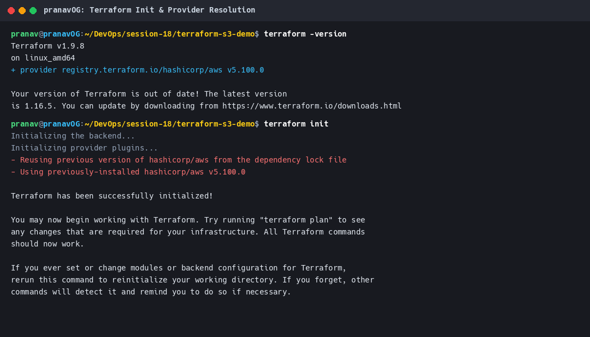
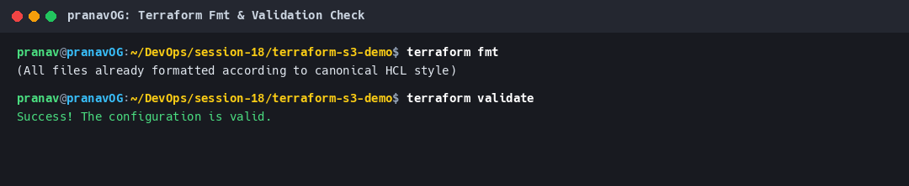
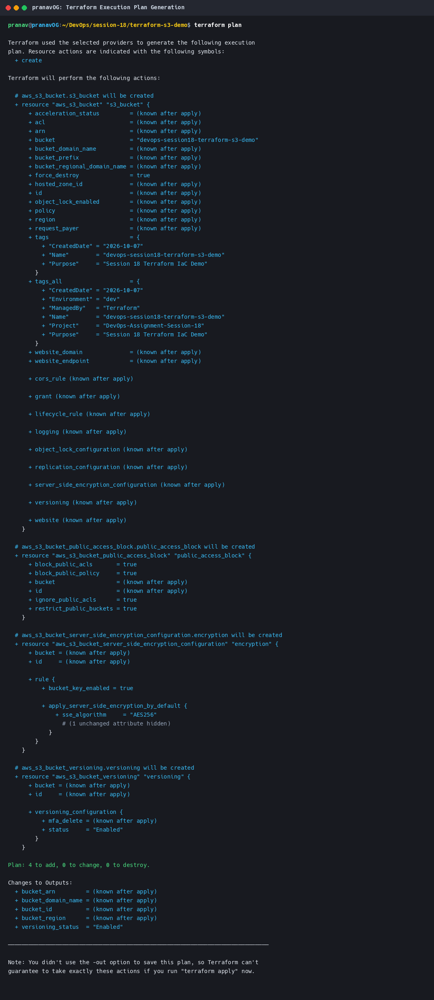
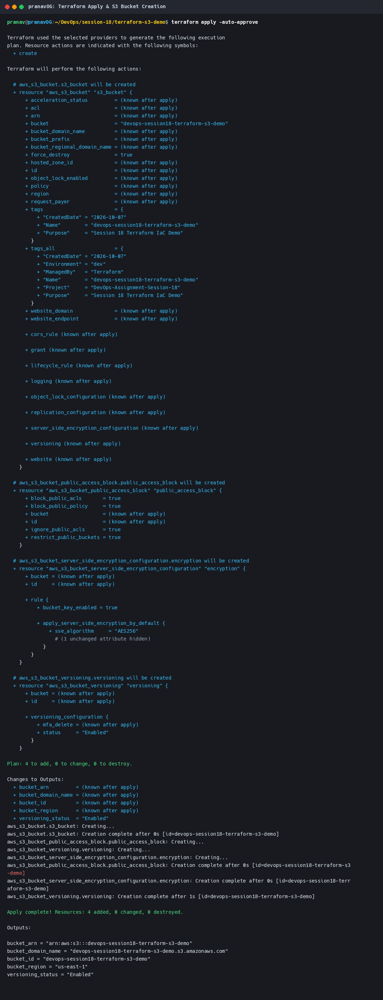
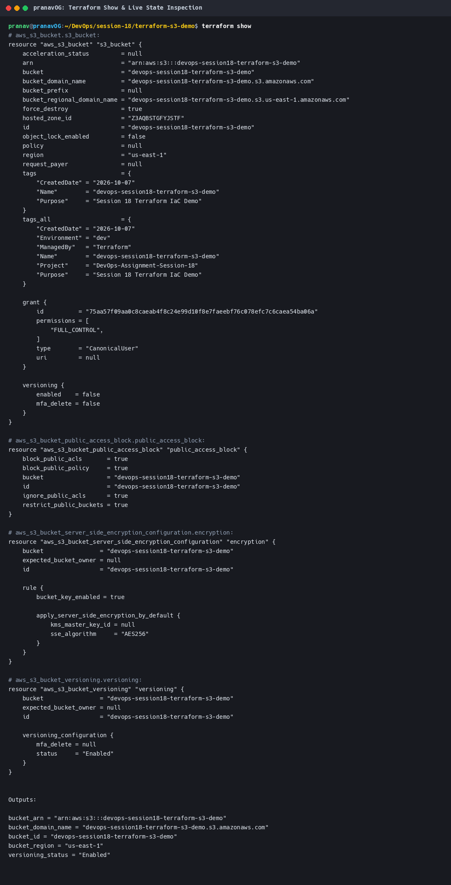
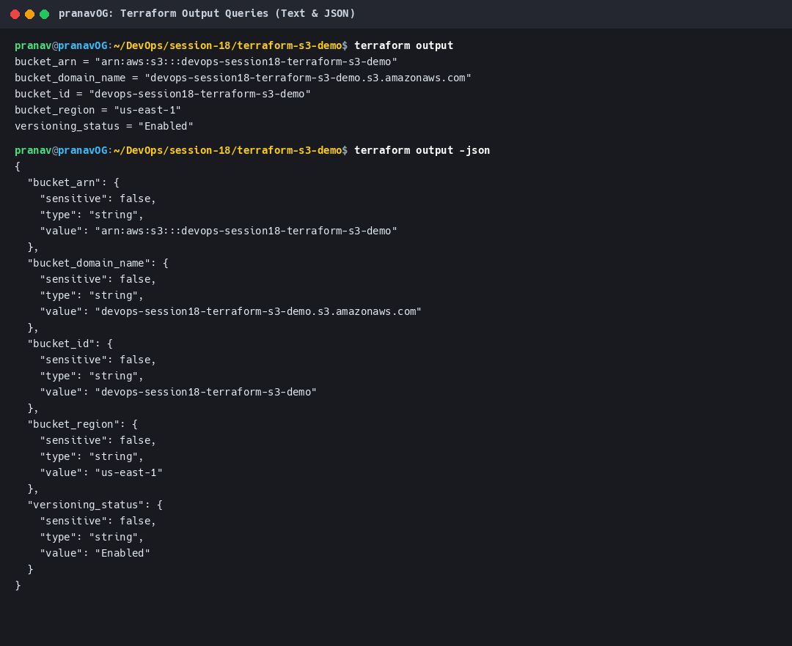
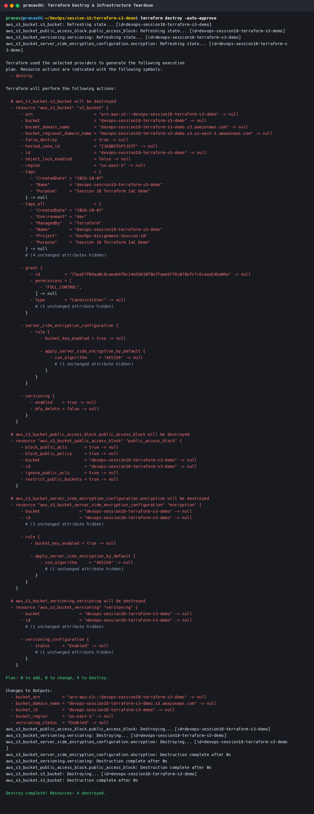
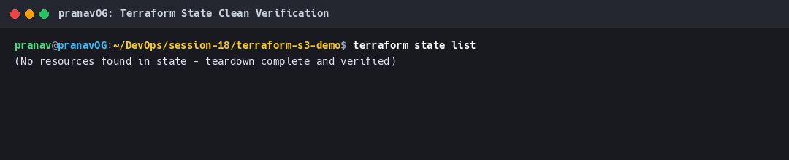

# Session 18: Terraform & Infrastructure as Code

This directory contains the complete implementation and comprehensive documentation for **Session 18: Terraform & Infrastructure as Code**, covering **Task 1: Terraform AWS S3 Demo** and **Task 2: Deep-Dive AWS Cloud Services Research**.

---

## Deliverables Architecture

```
session-18-terraform-iac/
├── terraform-s3-demo/               # Task 1: Complete Terraform S3 Infrastructure Project
│   ├── main.tf                      # S3 bucket, versioning, AES-256 encryption, public access block
│   ├── variables.tf                 # Configurable variables for region, bucket name, env, endpoint
│   ├── outputs.tf                   # Exported attributes (ID, ARN, region, versioning status)
│   ├── provider.tf                  # AWS provider requirements and default tags
│   ├── terraform.tfvars             # Environment variable definitions
│   └── README.md                    # Detailed Task 1 execution guide
│
├── aws-services/                    # Task 2: AWS Cloud Architecture Research Modules
│   ├── 01-iam/
│   │   └── README.md                # Identity, Users, Groups, Roles, Policies, PoLP, Best Practices
│   ├── 02-ec2/
│   │   └── README.md                # AMIs, Instance Types, Key Pairs, SGs, EBS, Lifecycle, Use Cases
│   ├── 03-s3/
│   │   └── README.md                # Buckets, Objects, Storage Classes, Versioning, Lifecycle, SSE
│   ├── 04-vpc/
│   │   └── README.md                # CIDR, Subnets, Route Tables, IGW, NAT Gateway, SGs vs NACLs
│   └── 05-dynamodb-rds/
│       └── README.md                # NoSQL DynamoDB vs Relational RDS, Multi-AZ, Read Replicas
│
├── screenshots/                     # Verified Terminal Run Captures
│   ├── 01-terraform-init.png        # Provider installation & backend initialization
│   ├── 02-terraform-fmt-validate.png# Syntax formatting & validation check
│   ├── 03-terraform-plan.png        # Speculative execution plan (4 resources to add)
│   ├── 04-terraform-apply.png       # Real-time resource provisioning
│   ├── 05-terraform-show.png        # State inspection
│   ├── 06-terraform-output.png      # Output value extraction (Text & JSON)
│   ├── 07-terraform-destroy.png     # Automated teardown (4 resources destroyed)
│   └── 08-terraform-clean-verification.png # Verification of zero lingering state
│
├── generate_screenshot.py           # Automated terminal output capture & renderer
└── README.md                        # Master Session 18 Overview Document
```

> **Note on Root Symlinks**: In accordance with the prompt's deliverables specification, root convenience symlinks [`terraform-s3-demo/`](../terraform-s3-demo) and [`aws-services/`](../aws-services) link directly to their corresponding directories inside `session-18-terraform-iac/`.

---

## Task 1: Terraform AWS S3 Demo

### 1.1 Overview & Architecture
Task 1 provisions an enterprise-hardened S3 bucket configured with:
- **Server-Side Encryption (SSE-S3)**: Enforcing AES-256 at rest with AWS Bucket Keys enabled.
- **S3 Versioning**: Enabled to prevent accidental overwrites and deletions.
- **S3 Public Access Block**: All four public access vectors blocked (`block_public_acls`, `block_public_policy`, `ignore_public_acls`, `restrict_public_buckets`).
- **Flexible Provider Backend**: Supports real AWS deployments as well as local endpoint emulation (Moto / LocalStack) via `provider.tf` endpoint variables.

### 1.2 The Terraform Execution Lifecycle

```
       +-------------------------------------------------------------+
       |                     Terraform Codebase                      |
       |     main.tf | variables.tf | provider.tf | outputs.tf       |
       +------------------------------+------------------------------+
                                      |
                                      v
  1. [ terraform init ]      Download AWS provider plugin v5.100.0
                                      |
                                      v
  2. [ terraform fmt ]       Canonical HCL format formatting
     [ terraform validate ]  Static syntax & semantic validation
                                      |
                                      v
  3. [ terraform plan ]      Generate execution plan: 4 to add, 0 to change
                                      |
                                      v
  4. [ terraform apply ]     Provision S3 bucket + encryption + versioning
                                      |
                                      v
  5. [ terraform show ]      Inspect real cloud attributes in tfstate
     [ terraform output ]    Query output values in CLI and JSON
                                      |
                                      v
  6. [ terraform destroy ]   Clean teardown: 4 destroyed, 0 remaining
```

### 1.3 Step-by-Step Execution Evidence

#### 1. `terraform init`
Initializes backend and installs `hashicorp/aws v5.100.0`:


#### 2. `terraform fmt` & `terraform validate`
Confirms clean HCL indentation and validates configuration syntax:


#### 3. `terraform plan`
Produces execution plan showing 4 resources to add with explicit attribute definitions:


#### 4. `terraform apply`
Provisions `aws_s3_bucket`, `aws_s3_bucket_public_access_block`, `aws_s3_bucket_server_side_encryption_configuration`, and `aws_s3_bucket_versioning`:


#### 5. `terraform show`
Displays full live state details, ARN, hosted zone ID, and encryption rules:


#### 6. `terraform output`
Extracts outputs in human-readable and automated JSON formats:


#### 7. `terraform destroy`
Tears down all resources cleanly in reverse dependency order:


#### 8. Clean State Verification (`terraform state list`)
Confirms state is empty with zero orphaned cloud resources:


---

## Task 2: AWS Services Research

Five dedicated research documents have been produced under [`aws-services/`](aws-services/):

### 1. [01. IAM - Governance](aws-services/01-iam/README.md)
- **What is IAM**: Global identity and access management fabric with implicit deny default security model.
- **Core Identities**: Differences and trade-offs between Users, Groups, and Roles.
- **Policies & Permissions**: JSON policy anatomy (`Effect`, `Principal`, `Action`, `Resource`, `Condition`). Types of policies: Identity-based (AWS managed vs customer managed), Inline, Resource-based, Permissions Boundaries, and Service Control Policies (SCPs).
- **Least Privilege Principle**: Restricting access to granular resource ARNs, enforcing MFA conditions, and auditing permissions.
- **Best Practices**: Disabling root credentials, enforcing MFA, rotating keys, and using IAM Roles for compute workloads (Instance Profiles, IRSA).
- **Architecture Use Cases**: Cross-account delegation, EC2 instance profile credential vending via IMDSv2, and GitHub Actions OIDC federation.

### 2. [02. EC2 - Compute](aws-services/02-ec2/README.md)
- **What is EC2**: Elastic compute capacity and virtual machine provisioning.
- **Amazon Machine Images (AMIs)**: AWS managed, golden image pipelines, AWS Marketplace, `x86_64` vs ARM Graviton architectures.
- **Instance Families**: Deep comparison of General Purpose (`t4g`, `m6i`), Compute Optimized (`c6i`), Memory Optimized (`r6i`), Storage Optimized (`i3en`), and Accelerated Computing (`g5`).
- **Key Pairs & Access**: ED25519 vs RSA cryptography, SSM Session Manager passwordless/keyless management.
- **Security Groups**: Stateful virtual firewall rules, inbound/outbound evaluation, security group chaining.
- **Elastic Block Store (EBS)**: Volume types comparison (`gp3`, `io2`, `st1`, `sc1`), snapshots, and KMS encryption.
- **IP Addressing**: Public vs private IPv4, Elastic IPs (EIPs), and DNS hostnames.
- **Instance Lifecycle**: State transitions (`pending` $\to$ `running` $\to$ `stopping` $\to$ `stopped` $\to$ `terminated`), reboots, and hibernation.
- **Use Cases**: Scalable web tiers, custom databases, and spot instance batch workloads.

### 3. [03. S3 - Storage](aws-services/03-s3/README.md)
- **What is S3**: Flat object storage namespace with 99.999999999% (11 9s) durability across 3+ Availability Zones.
- **Buckets & Objects**: Global namespace conventions, objects up to 5 TB, keys, prefixes, and metadata.
- **Storage Classes**: Standard, Intelligent-Tiering, Standard-IA, One Zone-IA, Glacier Instant Retrieval, Glacier Flexible Retrieval, and Glacier Deep Archive.
- **Versioning**: Data protection, delete markers, MFA delete.
- **Lifecycle Management**: Automated tiered transitions and noncurrent version expiration.
- **Encryption**: SSE-S3 (AES-256), SSE-KMS with bucket keys, SSE-C, and client-side encryption.
- **Bucket Policies & Security**: Enforcing TLS/HTTPS (`aws:SecureTransport`), public access blocks.
- **Use Cases**: Enterprise data lakes, static web hosting, and immutable ransomware backups.

### 4. [04. VPC - Networking](aws-services/04-vpc/README.md)
- **What is VPC**: Software-defined isolated virtual networks.
- **CIDR & Subnetting**: IP block calculation, AWS 5 reserved IP addresses per subnet (`.0`, `.1`, `.2`, `.3`, `.255`).
- **Subnets**: Public, private, and isolated database subnets.
- **Route Tables**: Local route, default route `0.0.0.0/0`, subnet associations.
- **Gateways**: Internet Gateway (IGW) vs managed NAT Gateway with Elastic IPs.
- **Defense-in-Depth Firewalls**: Comprehensive comparison between Security Groups (stateful, instance-level) and Network ACLs (stateless, subnet-level).
- **Reference Architecture**: Multi-tier DMZ web application network topology diagram.

### 5. [05. DynamoDB & RDS - Database Services](aws-services/05-dynamodb-rds/README.md)
- **DynamoDB (NoSQL)**: Fully managed key-value and document store with single-digit millisecond latency. Tables, items, attributes, partition keys (HASH), sort keys (RANGE), and secondary indexes (GSI & LSI).
- **RDS (Relational)**: Supported database engines (Amazon Aurora, PostgreSQL, MySQL, MariaDB, Oracle, SQL Server).
- **High Availability & Scaling**: Multi-AZ synchronous replication with automatic 60-120s failover vs asynchronous Read Replicas for horizontal read scaling.
- **Backup & Security**: Automated snapshots, Point-In-Time Recovery (PITR up to 35 days), KMS encryption, IAM DB auth.
- **Architectural Comparison**: Decision matrix comparing DynamoDB vs RDS selection criteria.
