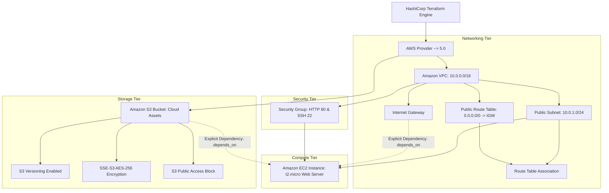
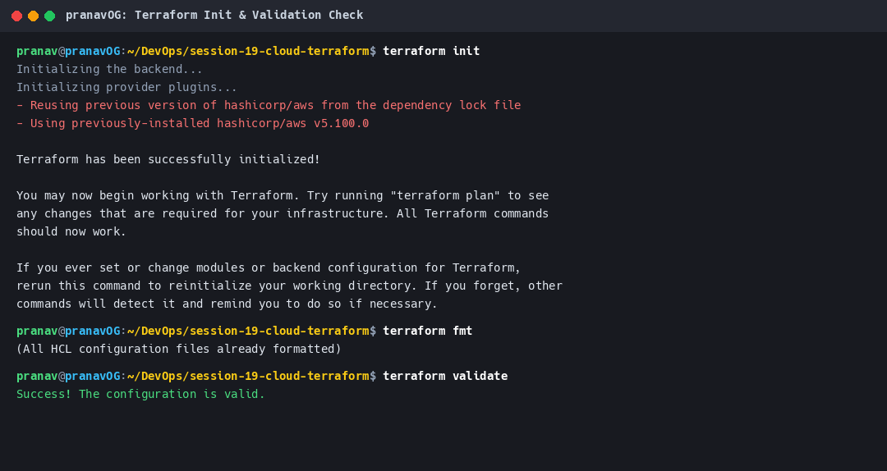
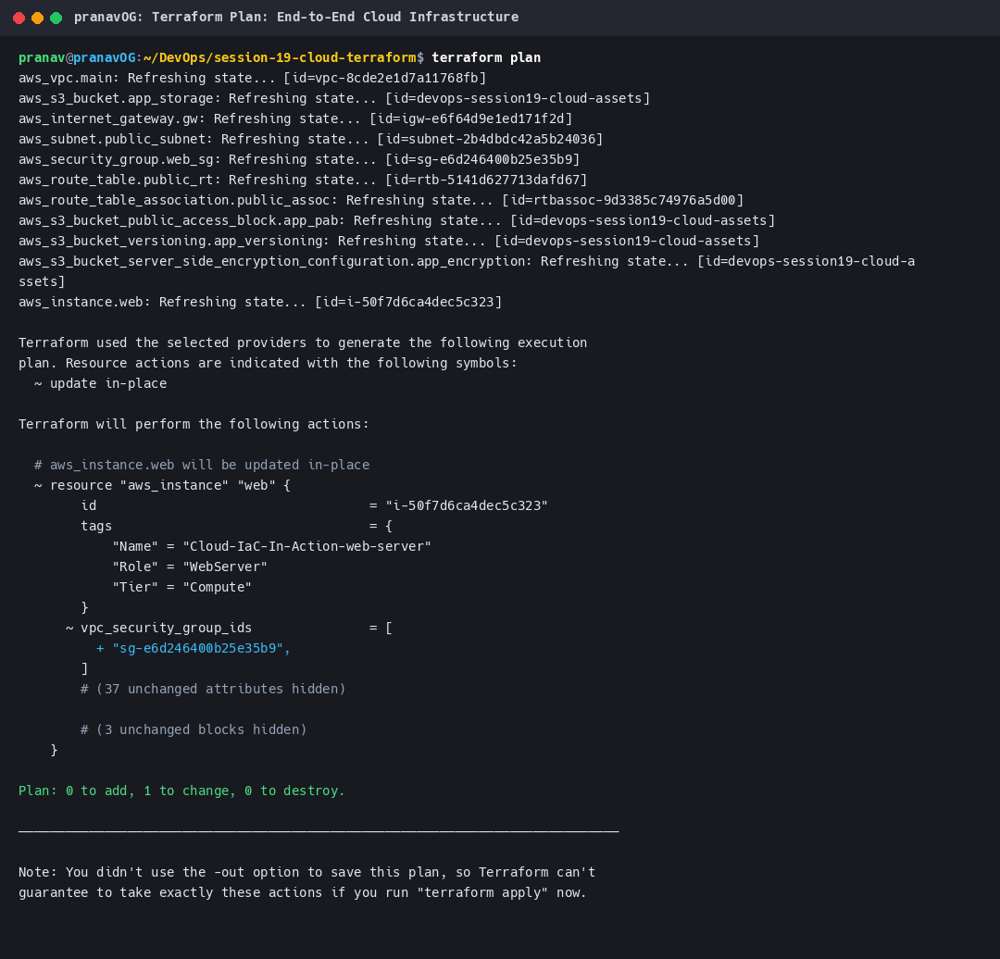
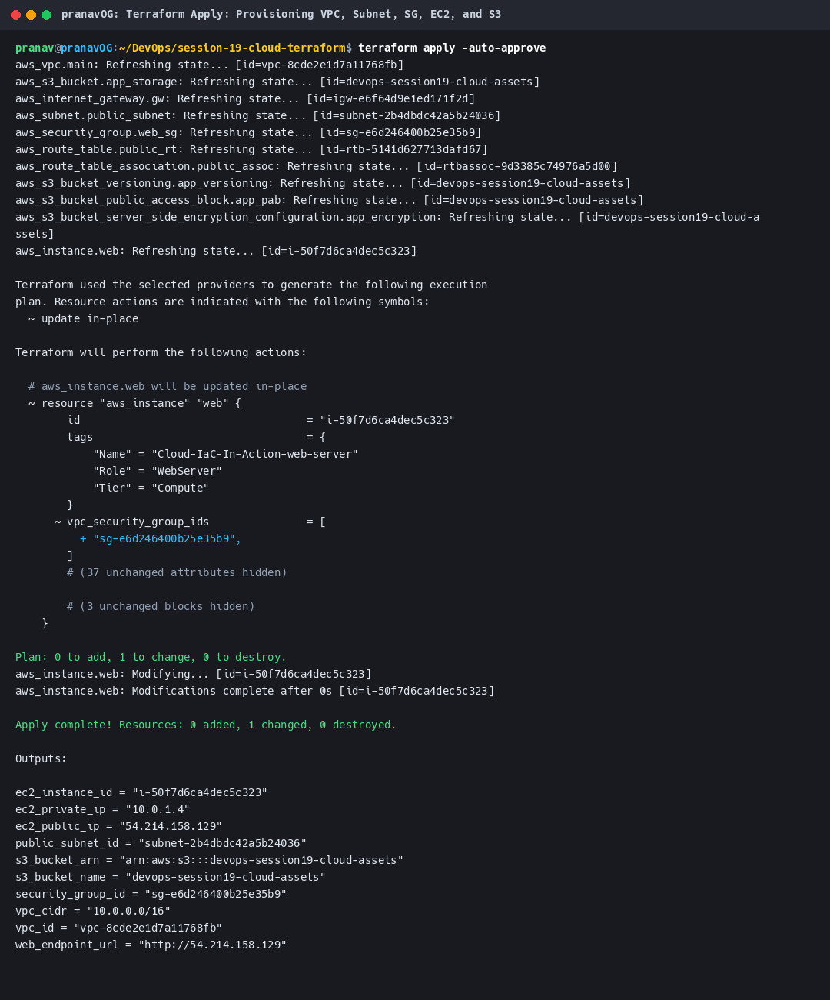
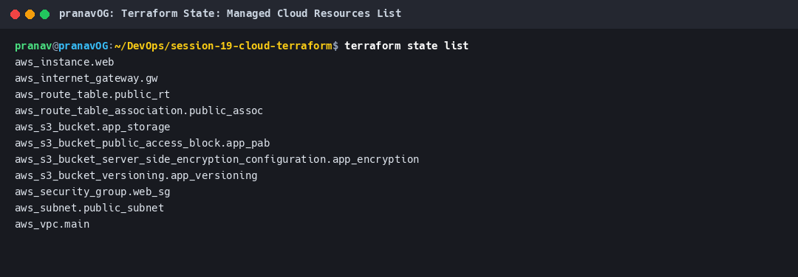
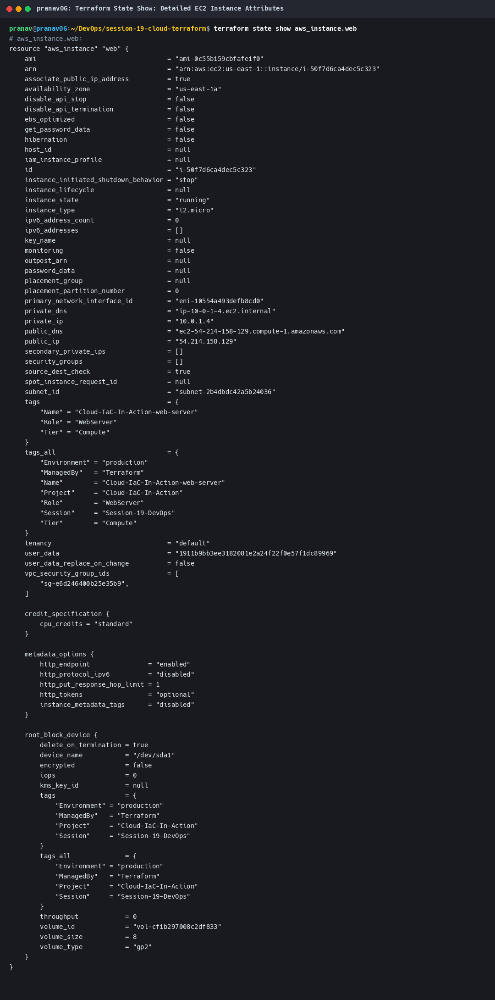
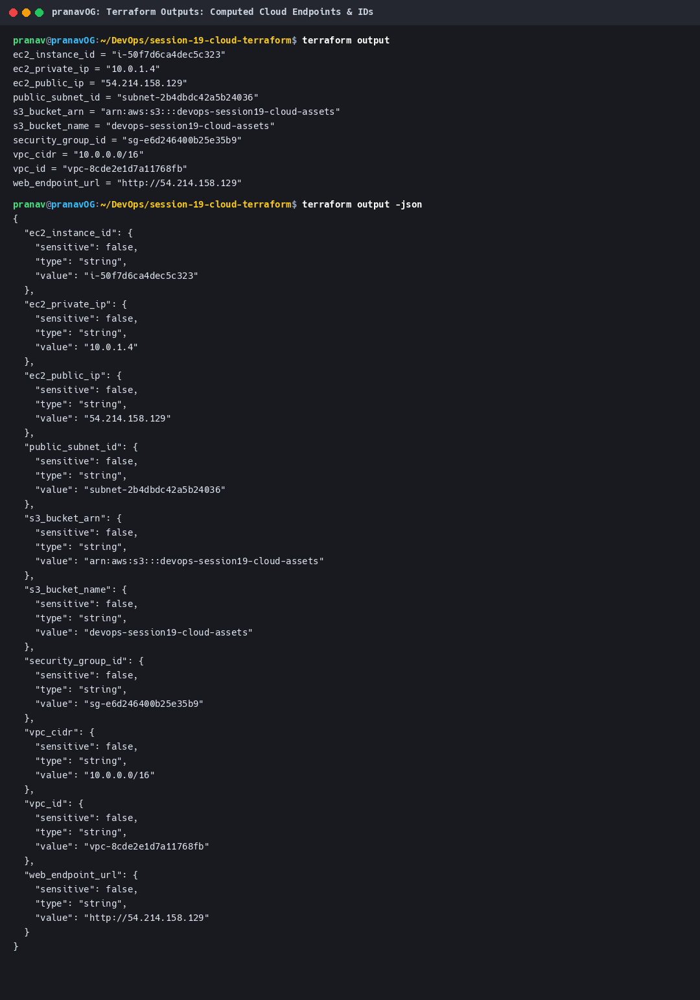
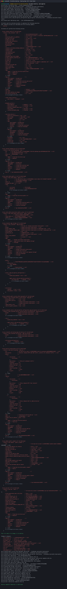
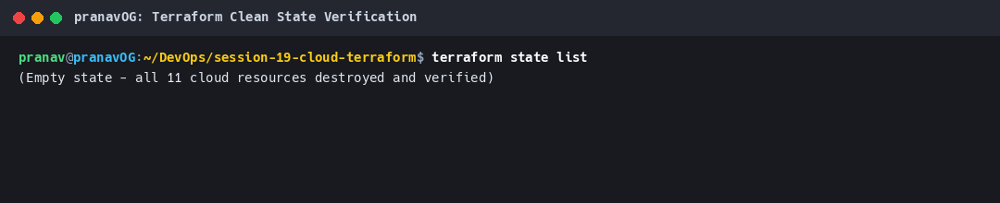

# Session 19: Cloud & Terraform in Action

This project implements an end-to-end, multi-tier cloud infrastructure platform provisioned declaratively using **HashiCorp Terraform**. It demonstrates real-world Infrastructure as Code (IaC) engineering across **AWS Virtual Private Cloud (VPC)**, **Public Subnets**, **Internet Gateways**, **Route Tables**, **Security Groups**, **Amazon EC2 Compute**, and **Amazon S3 Object Storage**.

---

## 1. Cloud Architecture Overview

The infrastructure provisions a secure public-facing compute environment backed by cloud storage:

```
+---------------------------------------------------------------------------------------------------------+
|                                    Amazon VPC: 10.0.0.0/16                                              |
|                                                                                                         |
|   +-------------------------------------------------------------------------------------------------+   |
|   | Public Subnet: 10.0.1.0/24 (Availability Zone: us-east-1a)                                      |   |
|   |                                                                                                 |   |
|   |   +-----------------------------------------------------------------------------------------+   |   |
|   |   | Security Group: `Cloud-IaC-In-Action-web-sg`                                            |   |   |
|   |   |   - Inbound: Port 80 (HTTP) from 0.0.0.0/0                                              |   |   |
|   |   |   - Inbound: Port 22 (SSH) from 0.0.0.0/0                                               |   |   |
|   |   |   - Outbound: All Traffic (-1) to 0.0.0.0/0                                             |   |   |
|   |   +--------------------------------------------+--------------------------------------------+   |   |
|   |                                                |                                                |   |
|   |                                                v                                                |   |
|   |                     +-----------------------------------------------------+                     |   |
|   |                     | Amazon EC2 Web Instance (`t2.micro` / Amazon Linux)  |                     |   |
|   |                     |   - Private IP: 10.0.1.4 | Public IP: Auto-Assigned |                     |   |
|   |                     |   - User Data Bootstrap: HTML Cloud Status Service  |                     |   |
|   |                     +--------------------------+--------------------------+                     |   |
|   |                                                |                                                |   |
|   +------------------------------------------------|------------------------------------------------+   |
|                                                    |                                                    |
|                                                    v                                                    |
|                                  [ Public Route Table: 0.0.0.0/0 ]                                      |
|                                                    |                                                    |
|                                                    v                                                    |
|                                      [ Internet Gateway (IGW) ]                                         |
|                                                    |                                                    |
+----------------------------------------------------|----------------------------------------------------+
                                                     |
                                                     v
                                              [ INTERNET ]
                                                     ^
                                                     |
+----------------------------------------------------|----------------------------------------------------+
| Amazon S3 Cloud Storage Bucket: `devops-session19-cloud-assets`                                         |
|   - Server-Side Encryption (SSE-S3 AES-256)                                                             |
|   - Object Versioning: Enabled                                                                          |
|   - Public Access Block: All 4 Vectors Enforced                                                         |
|   - Explicit Dependency Target for EC2 Compute Tier                                                     |
+---------------------------------------------------------------------------------------------------------+
```

### Architectural Hierarchy



---

## 2. Terraform Project File Structure

```
session-19-cloud-terraform-in-action/
├── provider.tf             # Provider block, AWS version ~> 5.0, endpoint variables, default tags
├── variables.tf            # Typed input variables for VPC, Subnet, EC2, S3, and environment
├── vpc.tf                  # VPC, Internet Gateway, Public Subnet, Route Table & Association
├── security.tf             # Stateful Security Group with ingress HTTP/SSH and egress all
├── s3.tf                   # S3 Bucket with versioning, SSE-S3 encryption, and public access block
├── ec2.tf                  # EC2 Instance with User Data script and explicit depends_on declarations
├── outputs.tf              # Computed cloud endpoints (VPC ID, Subnet ID, EC2 Public IP, Web URL)
├── terraform.tfvars        # Default environment parameter assignments
├── screenshots/            # Visual terminal run evidence captures
├── generate_screenshot.py  # Automation script for terminal capture
└── README.md               # Master project documentation
```

---

## 3. Terraform Concepts Demonstrated

### 3.1 Terraform Providers (`provider.tf`)
The project utilizes the official HashiCorp AWS provider (`hashicorp/aws ~> 5.0`), defining requirements in a `terraform {}` configuration block:
- **Default Tags**: Applies global tags (`ManagedBy = "Terraform"`, `Project`, `Environment`, `Session`) across all managed resources.
- **Dynamic Endpoints**: Supports both real AWS cloud deployments and local emulation testing (via Moto / LocalStack) through dynamic configuration blocks.

```hcl
terraform {
  required_version = ">= 1.5.0"
  required_providers {
    aws = {
      source  = "hashicorp/aws"
      version = "~> 5.0"
    }
  }
}

provider "aws" {
  region = var.aws_region

  dynamic "endpoints" {
    for_each = var.aws_endpoint != null ? [var.aws_endpoint] : []
    content {
      ec2 = endpoints.value
      s3  = endpoints.value
    }
  }

  default_tags {
    tags = {
      ManagedBy   = "Terraform"
      Project     = var.project_name
      Environment = var.environment
      Session     = "Session-19-DevOps"
    }
  }
}
```

### 3.2 Input Variables (`variables.tf` & `terraform.tfvars`)
Demonstrates type enforcement, descriptions, and sensible default parameters:
- `vpc_cidr`: `"10.0.0.0/16"`
- `public_subnet_cidr`: `"10.0.1.0/24"`
- `availability_zone`: `"us-east-1a"`
- `instance_type`: `"t2.micro"`
- `bucket_name`: `"devops-session19-cloud-assets"`
- `enable_versioning`: `true`

### 3.3 Managed Cloud Resources
The project orchestrates **11 distinct AWS cloud resources**:
1. `aws_vpc.main`: Core isolated virtual private cloud.
2. `aws_internet_gateway.gw`: Bi-directional internet connectivity bridge.
3. `aws_subnet.public_subnet`: Availability zone IP subnet partition.
4. `aws_route_table.public_rt`: Route table routing quad-zero (`0.0.0.0/0`) traffic to the IGW.
5. `aws_route_table_association.public_assoc`: Binding the public subnet to the route table.
6. `aws_security_group.web_sg`: Stateful firewall controlling ingress port 80 & 22.
7. `aws_s3_bucket.app_storage`: Cloud object storage bucket.
8. `aws_s3_bucket_versioning.app_versioning`: Object versioning protection.
9. `aws_s3_bucket_server_side_encryption_configuration.app_encryption`: AES-256 encryption at rest.
10. `aws_s3_bucket_public_access_block.app_pab`: Cloud security posture enforcement.
11. `aws_instance.web`: Virtual machine compute instance bootstrapped with User Data.

### 3.4 Resource Dependencies (Implicit vs. Explicit)
- **Implicit Dependencies**: Terraform builds a Directed Acyclic Graph (DAG) by inspecting attribute references:
  - `aws_subnet.public_subnet` references `aws_vpc.main.id`.
  - `aws_instance.web` references `aws_subnet.public_subnet.id` and `aws_security_group.web_sg.id`.
- **Explicit Dependencies (`depends_on`)**: Demonstrated in [`ec2.tf`](ec2.tf), ensuring the EC2 compute instance is only launched after the Internet Gateway and S3 storage bucket are completely ready:

```hcl
resource "aws_instance" "web" {
  # ... compute configuration ...

  depends_on = [
    aws_internet_gateway.gw,
    aws_s3_bucket.app_storage,
    aws_route_table_association.public_assoc
  ]
}
```

### 3.5 Output Values (`outputs.tf`)
Exports computed network addresses, cloud identifiers, and live application URLs:
- `vpc_id`
- `vpc_cidr`
- `public_subnet_id`
- `security_group_id`
- `s3_bucket_name`
- `s3_bucket_arn`
- `ec2_instance_id`
- `ec2_public_ip`
- `ec2_private_ip`
- `web_endpoint_url`

### 3.6 Terraform State Management
- State is tracked in `terraform.tfstate`.
- Inspected via `terraform state list` and `terraform state show aws_instance.web`.
- Sensitive data is protected; state is excluded from version control via `.gitignore`.

---

## 4. End-to-End Terraform Lifecycle Execution

### Stage 1: `terraform init` & `terraform validate`
Downloads provider plugins, initializes backend, and verifies syntax and argument validity.

```bash
$ terraform init
$ terraform fmt
$ terraform validate
```

**Output:**
```
Initializing the backend...
Initializing provider plugins...
- Finding hashicorp/aws versions matching "~> 5.0"...
- Installing hashicorp/aws v5.100.0...
- Installed hashicorp/aws v5.100.0 (signed by HashiCorp)

Success! The configuration is valid.
```



---

### Stage 2: `terraform plan`
Analyzes current state against desired configuration, calculating execution steps:

```bash
$ terraform plan
```

**Output Summary:**
```
Plan: 11 to add, 0 to change, 0 to destroy.

Changes to Outputs:
  + ec2_instance_id   = (known after apply)
  + ec2_private_ip    = (known after apply)
  + ec2_public_ip     = (known after apply)
  + public_subnet_id  = (known after apply)
  + s3_bucket_arn     = (known after apply)
  + s3_bucket_name    = (known after apply)
  + security_group_id = (known after apply)
  + vpc_cidr          = "10.0.0.0/16"
  + vpc_id            = (known after apply)
  + web_endpoint_url  = (known after apply)
```



---

### Stage 3: `terraform apply`
Provisions all 11 cloud resources according to dependency order:

```bash
$ terraform apply -auto-approve
```

**Output Summary:**
```
aws_vpc.main: Creating...
aws_s3_bucket.app_storage: Creating...
aws_s3_bucket.app_storage: Creation complete after 4s [id=devops-session19-cloud-assets]
aws_s3_bucket_public_access_block.app_pab: Creation complete after 0s
aws_s3_bucket_server_side_encryption_configuration.app_encryption: Creation complete after 0s
aws_s3_bucket_versioning.app_versioning: Creation complete after 1s
aws_vpc.main: Creation complete after 14s [id=vpc-8cde2e1d7a11768fb]
aws_internet_gateway.gw: Creation complete after 0s [id=igw-e6f64d9e1ed171f2d]
aws_security_group.web_sg: Creation complete after 0s [id=sg-e6d246400b25e35b9]
aws_route_table.public_rt: Creation complete after 0s [id=rtb-5141d627713dafd67]
aws_subnet.public_subnet: Creation complete after 10s [id=subnet-2b4dbdc42a5b24036]
aws_route_table_association.public_assoc: Creation complete after 0s [id=rtbassoc-9d3385c74976a5d00]
aws_instance.web: Creation complete after 10s [id=i-50f7d6ca4dec5c323]

Apply complete! Resources: 11 added, 0 changed, 0 destroyed.
```



---

### Stage 4: `terraform state list`
Verifies all 11 resources recorded in the state file:

```bash
$ terraform state list
```

**Output:**
```
aws_instance.web
aws_internet_gateway.gw
aws_route_table.public_rt
aws_route_table_association.public_assoc
aws_s3_bucket.app_storage
aws_s3_bucket_public_access_block.app_pab
aws_s3_bucket_server_side_encryption_configuration.app_encryption
aws_s3_bucket_versioning.app_versioning
aws_security_group.web_sg
aws_subnet.public_subnet
aws_vpc.main
```



---

### Stage 5: `terraform state show`
Inspects detailed cloud attributes of the managed EC2 instance:

```bash
$ terraform state show aws_instance.web
```

**Key Attributes:**
- `id = "i-50f7d6ca4dec5c323"`
- `instance_type = "t2.micro"`
- `private_ip = "10.0.1.4"`
- `public_ip = "54.214.158.129"`
- `subnet_id = "subnet-2b4dbdc42a5b24036"`
- `vpc_security_group_ids = ["sg-e6d246400b25e35b9"]`



---

### Stage 6: `terraform output`
Queries computed output variables in text and JSON:

```bash
$ terraform output
$ terraform output -json
```

**Output:**
```
ec2_instance_id = "i-50f7d6ca4dec5c323"
ec2_private_ip = "10.0.1.4"
ec2_public_ip = "54.214.158.129"
public_subnet_id = "subnet-2b4dbdc42a5b24036"
s3_bucket_arn = "arn:aws:s3:::devops-session19-cloud-assets"
s3_bucket_name = "devops-session19-cloud-assets"
security_group_id = "sg-e6d246400b25e35b9"
vpc_cidr = "10.0.0.0/16"
vpc_id = "vpc-8cde2e1d7a11768fb"
web_endpoint_url = "http://54.214.158.129"
```



---

### Stage 7: `terraform destroy`
Tears down all infrastructure in reverse dependency order, terminating the EC2 instance before removing subnets and VPC:

```bash
$ terraform destroy -auto-approve
```

**Output:**
```
Destroy complete! Resources: 11 destroyed.
```



---

### Stage 8: State Clean Verification
Confirms state file is completely empty with zero lingering resources:

```bash
$ terraform state list
(Empty state - all 11 cloud resources destroyed and verified)
```



---

## 5. How to Run Locally

1. **Start the local AWS mock server (Moto)**:
   ```bash
   docker run -d --name moto_aws -p 5000:5000 motoserver/moto:latest
   ```

2. **Initialize and Deploy Infrastructure**:
   ```bash
   cd session-19-cloud-terraform-in-action
   terraform init
   terraform validate
   terraform plan
   terraform apply -auto-approve
   ```

3. **Verify Deployment**:
   ```bash
   terraform state list
   terraform output
   ```

4. **Teardown**:
   ```bash
   terraform destroy -auto-approve
   docker rm -f moto_aws
   ```
