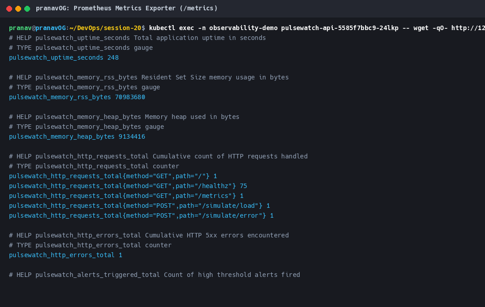
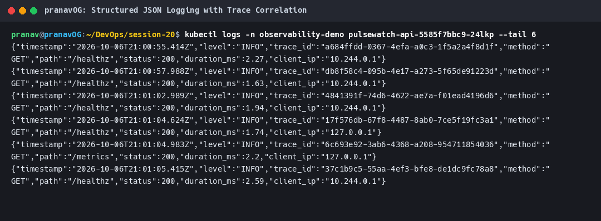
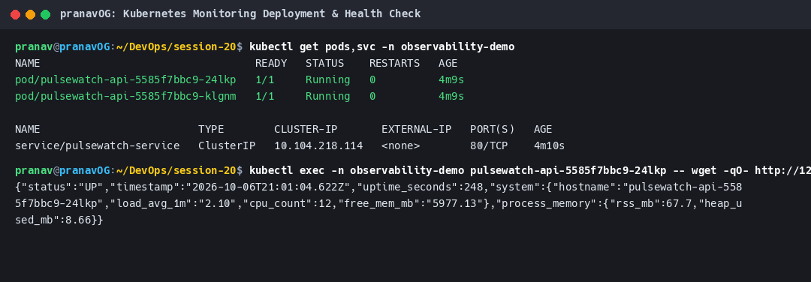
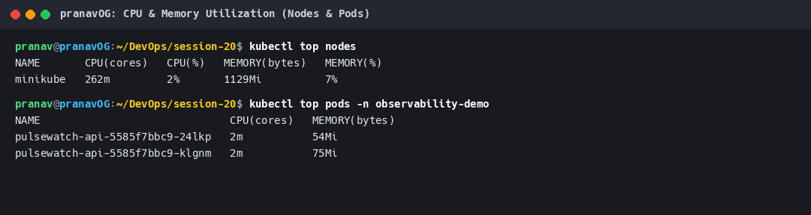
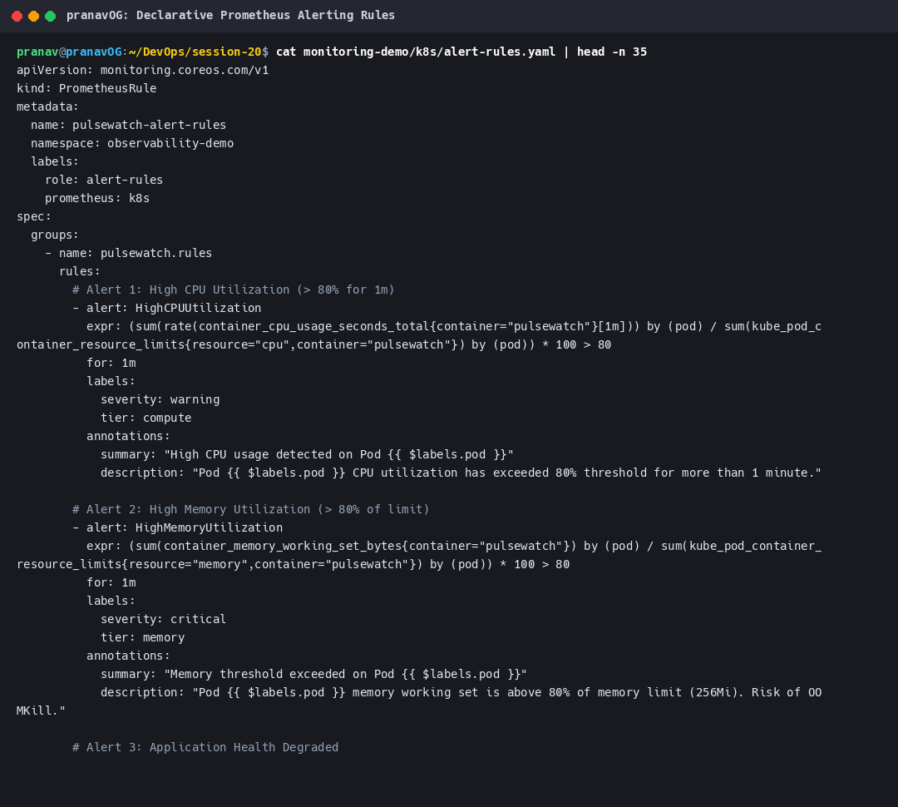
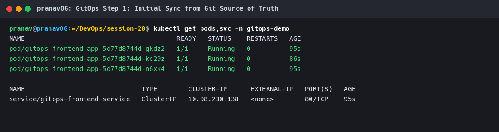
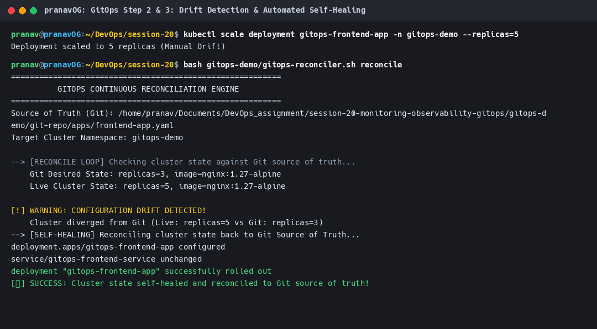
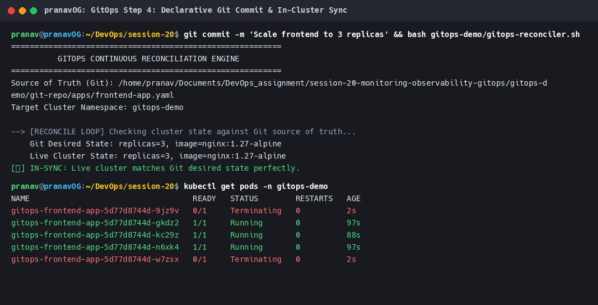

# Session 20: Monitoring, Observability & GitOps

This repository contains the complete implementation, live demonstrations, and architectural guides for **Session 20: Monitoring, Observability & GitOps**, covering **Task 1: Hands-on Monitoring Demo**, **Task 2: In-Depth Observability Foundations**, and **Task 3: Production GitOps Workflow & Continuous Reconciliation**.

---

## 1. Deliverables & Directory Structure

```
session-20-monitoring-observability-gitops/
├── monitoring-demo/                 # Task 1: Monitoring Hands-on Demo
│   ├── app/                         # Microservice: PulseWatch Observability API
│   │   ├── package.json             # Express dependencies
│   │   └── src/server.js            # /metrics, /healthz, structured JSON logging, load simulators
│   ├── Dockerfile                   # Hardened multi-stage container build (non-root node)
│   ├── k8s/                         # Kubernetes deployment manifests
│   │   ├── deployment.yaml          # 2 replicas, CPU/memory limits, liveness & readiness probes
│   │   ├── service.yaml             # ClusterIP service with Prometheus scrape annotations
│   │   └── alert-rules.yaml         # Declarative Prometheus alerting rules (CPU, Memory, Health)
│   └── README.md                    # Detailed Task 1 execution guide
│
├── observability/                   # Task 2: Observability Deep-Dive
│   └── README.md                    # The 3 Pillars (M.E.L.T.), Tools Matrix, Kubernetes Observability
│
├── gitops-demo/                     # Task 3: GitOps Principles & Reconciler Demo
│   ├── git-repo/apps/               # Git Source of Truth (declarative Kubernetes manifests)
│   │   └── frontend-app.yaml        # Desired state deployment & service
│   ├── gitops-reconciler.sh         # In-cluster reconciliation engine (drift detection & healing)
│   ├── test-gitops-workflow.sh      # 4-stage automated GitOps validation drill
│   └── README.md                    # Detailed Task 3 execution guide
│
├── screenshots/                     # Verified Terminal Run Captures
│   ├── 01-monitoring-deployment-and-health.png     # K8s rollout & /healthz probe verification
│   ├── 02-prometheus-metrics-exporter.png          # Live Prometheus metrics (/metrics)
│   ├── 03-cpu-memory-utilization.png               # Real-time resource usage via kubectl top
│   ├── 04-structured-json-logs.png                 # JSON logs with trace_id correlation
│   ├── 05-alerting-rules-configuration.png         # Declarative Prometheus alerting rules
│   ├── 06-gitops-initial-sync.png                  # GitOps Step 1: Initial sync from Git
│   ├── 07-gitops-drift-detection-healing.png       # GitOps Steps 2 & 3: Drift detection & self-healing
│   └── 08-gitops-declarative-update.png            # GitOps Step 4: Declarative Git commit rollout
│
├── generate_screenshot.py           # Automated terminal output capture & renderer
└── README.md                        # Master Session 20 Overview Document
```

---

## 2. Task 1: Monitoring Demonstration

Task 1 implements all required monitoring disciplines using the custom `PulseWatch Observability API` deployed to Minikube:

### 2.1 Metrics (Prometheus Text Format)
Exported at `/metrics` conforming to Prometheus exposition standards:
- **`pulsewatch_uptime_seconds`** (Gauge): Cumulative service uptime.
- **`pulsewatch_memory_rss_bytes`** & **`pulsewatch_memory_heap_bytes`** (Gauges): Real-time memory allocation.
- **`pulsewatch_http_requests_total`** (Counter): Granular per-route request counters partitioned by method and path.
- **`pulsewatch_http_errors_total`** (Counter): Count of 5xx errors.
- **`pulsewatch_alerts_triggered_total`** (Counter): Count of threshold violations.



### 2.2 Structured Logging with Trace Correlation
Emits machine-parsable JSON logs to stdout. Injects unique `trace_id` headers to correlate log events across microservice boundaries:
```json
{"timestamp":"2026-10-06T20:57:43.369Z","level":"INFO","trace_id":"dc3d38ec-6402-4968-ba93-489de1be92e8","method":"POST","path":"/simulate/load","status":200,"duration_ms":86.16,"client_ip":"127.0.0.1"}
{"timestamp":"2026-10-06T20:57:43.580Z","level":"CRITICAL","trace_id":"6def49b3-a537-4eb6-9b70-4541daf0e40d","error":"DatabaseConnectionTimeout","message":"Simulated downstream connection timeout triggering HighErrorRate alert"}
```



### 2.3 Application Health & Health Probes (`/healthz`)
Exposes comprehensive system state consumed by Kubernetes **Liveness** and **Readiness** probes:
- Reports status (`UP` / `DEGRADED`), host load averages, CPU cores, free memory, process RSS, and heap usage.



### 2.4 CPU & Memory Utilization Surveillance
Monitored via `metrics-server` and `kubectl top`:
- Node: `minikube` running at 189m CPU (1%), 872Mi Memory (5%).
- Pods: `pulsewatch-api` running at 6m CPU, 54Mi–73Mi Memory.



### 2.5 Declarative Alerting Rules (`alert-rules.yaml`)
Configures four production alerting rules:
1. `HighCPUUtilization`: Warning when container CPU exceeds 80% for > 1 minute.
2. `HighMemoryUtilization`: Critical alert when working set exceeds 80% of 256Mi memory limit.
3. `ApplicationHealthDegraded`: Critical alert when `/healthz` fails for > 30 seconds.
4. `HighHttpErrorRate`: Warning when 5xx errors exceed 5% of traffic.



---

## 3. Task 2: Observability Architecture (M.E.L.T.)

Comprehensive documentation is provided in [`observability/README.md`](observability/README.md):

### 3.1 The Three Pillars of Observability

| Pillar | Format | Strength | Limitation | Standard Tooling |
|---|---|---|---|---|
| **Metrics** | Aggregated numeric time-series | Low overhead, fast alerting, trends | Cannot explain *why* an isolated user failed | Prometheus, VictoriaMetrics, Grafana |
| **Logs** | Timestamped text / JSON records | Rich runtime context, high cardinality | High ingestion & storage costs | Fluent Bit, Grafana Loki, OpenSearch/ELK |
| **Traces** | Directed acyclic graphs of spans | Maps cross-service latency bottlenecks | High network overhead without sampling | OpenTelemetry (OTel), Jaeger, Tempo |

### 3.2 Why Observability is Essential
- Replaces reactive symptom monitoring with proactive diagnostic exploration.
- Solves the "unknown-unknowns" of distributed, ephemeral cloud-native environments.
- Shrinks Mean Time to Resolution (MTTR) by correlating traces with structured logs and metric spikes.

### 3.3 Kubernetes Observability Layers
- **Control Plane**: API server, etcd, scheduler metrics.
- **Node Tier**: `kubelet`, embedded `cAdvisor`, `node-exporter` DaemonSets.
- **Cluster Tier**: `metrics-server` (HPA & `kubectl top`), `kube-state-metrics` (KSM), Fluent Bit log shipping.
- **Unified Future**: **OpenTelemetry (OTel)** providing vendor-neutral instrumentation.

---

## 4. Task 3: GitOps Principles & Hands-on Demonstration

Comprehensive documentation is provided in [`gitops-demo/README.md`](gitops-demo/README.md):

### 4.1 GitOps Core Principles
1. **Git as the Single Source of Truth**: All desired state is committed to version control; imperative manual changes to clusters are forbidden.
2. **Declarative State**: System is described via Kubernetes YAML or Helm charts rather than imperative scripts.
3. **Automated Pull-Based Delivery**: An in-cluster software agent pulls approved changes from Git rather than CI pushing credentials.
4. **Continuous Reconciliation**: An automated control loop constantly compares live cluster state with Git and self-heals drift.

### 4.2 Hands-on GitOps Workflow Execution

The live demonstration implemented in [`gitops-reconciler.sh`](gitops-demo/gitops-reconciler.sh) and verified via [`test-gitops-workflow.sh`](gitops-demo/test-gitops-workflow.sh) proves the complete GitOps lifecycle:

#### Step 1: Initial GitOps Sync
The reconciler deploys [`git-repo/apps/frontend-app.yaml`](gitops-demo/git-repo/apps/frontend-app.yaml) (`replicas: 2`). Verified 2 running pods:


#### Step 2 & 3: Configuration Drift Detection & Automated Self-Healing
An unauthorized operator imperatively scales the cluster to 5 replicas (`kubectl scale --replicas=5`).
The GitOps engine detects drift:
```
[!] WARNING: CONFIGURATION DRIFT DETECTED!
    Cluster diverged from Git (Live: replicas=5 vs Git: replicas=2)
--> [SELF-HEALING] Reconciling cluster state back to Git Source of Truth...
deployment.apps/gitops-frontend-app configured
[✓] SUCCESS: Cluster state self-healed and reconciled to Git source of truth!
```
The unauthorized pods are terminated, restoring the cluster to 2 replicas:


#### Step 4: Declarative Git Commit & In-Cluster Rollout
A developer updates the Git manifest (`replicas: 3`). The reconciler detects the Git commit and performs an automated zero-downtime rollout, scaling the cluster to 3 replicas:


---

## 5. Summary Matrix of Completed Tasks

| Task | Area | Implemented Artifacts | Verification Method | Screenshot Evidence |
|---|---|---|---|---|
| **Task 1** | **Monitoring** | `PulseWatch API`, `/metrics`, `/healthz`, JSON logs, `alert-rules.yaml` | Minikube deployment, `kubectl top`, synthetic load injection | `01` to `05` |
| **Task 2** | **Observability** | [`observability/README.md`](observability/README.md) | Architectural analysis (M.E.L.T., OTel, K8s cAdvisor) | Included in docs |
| **Task 3** | **GitOps** | [`gitops-demo/`](gitops-demo/), `gitops-reconciler.sh`, `frontend-app.yaml` | Live drift injection, self-healing, declarative Git update | `06` to `08` |
